# Product pipeline personas

Claude Code subagent files for a four-stage agentic pipeline that turns a raw idea into a gated, implementation-ready backlog:

**Idea → Discovery → PRD → Architecture → Tasks** (→ implementation run, an extension point).

Each stage is run by its own **orchestrator** as the **main thread of a fresh session** (`claude --agent <stage>-orchestrator`). Subagents cannot spawn subagents, so only orchestrators delegate, through `tools: Agent(<worker names>)`. Stages share no chat context; they communicate **only through handoff files** under `docs/pipeline/<run-id>/`. A cross-cutting **shared pool** (`shared-*`) of six lens reviewers plus a traceability keeper is defined once and invoked by any stage orchestrator.

The roster has **35 personas**: per stage 1 orchestrator + 5 specialists + 1 critic (28), plus 7 shared. Every persona preloads the [`product-pipeline-conventions`](skills/product-pipeline-conventions/SKILL.md) skill, which holds the shared contracts (run layout, handoff schemas, ID scheme, refusal taxonomy, severity, gate verdicts, return-brief format, ledger). When a persona file and that skill disagree on a shared contract, the skill wins.

Sources of truth:

- Integrated report: [2026-10-02-agentic-pipeline-personas-research.md](../../../dev/research/2026-10-02-agentic-pipeline-personas-research.md) (topology, catalog, RACI, schemas, refusal framework, limitations)
- Per-stage syntheses (full persona specs, handoff schemas, gates, delegation plans): [Discovery](../../../dev/research/agentic-pipeline-personas/synthesis/discovery.md) · [PRD](../../../dev/research/agentic-pipeline-personas/synthesis/prd.md) · [Architecture](../../../dev/research/agentic-pipeline-personas/synthesis/architecture.md) · [Tasks](../../../dev/research/agentic-pipeline-personas/synthesis/tasks.md) · [Shared pool](../../../dev/research/agentic-pipeline-personas/synthesis/shared.md)
- Subagent format reference: [creating-custom-subagents.md](../../docs/claude-code/subagents/creating-custom-subagents.md)

---

## Contents of this folder

```
product-pipeline/
  README.md                         this file (not installed)
  discovery/      discovery-*.md    7 personas
  prd/            prd-*.md          7 personas
  architecture/   arch-*.md         7 personas
  tasks/          tasks-*.md        7 personas
  shared/         shared-*.md       7 personas
  skills/product-pipeline-conventions/SKILL.md
  scripts/
    install.sh                      install into a target project
    run-stage.sh                    start one stage in a fresh session
    lint_personas.py                persona linter
```

---

## Pipeline topology

```mermaid
flowchart LR
    H((Human<br/>decision owner))

    subgraph S0["00-intake/"]
      IB["idea-brief.md<br/>evidence/"]
    end

    subgraph S1["Session 1: claude --agent discovery-orchestrator"]
      DE{{"ENTRY gate"}}
      DO[discovery-orchestrator]
      DW["discovery-problem-framer<br/>discovery-evidence-synthesizer<br/>discovery-market-analyst<br/>discovery-viability-analyst<br/>discovery-solution-explorer"]
      DC[discovery-critic]
      DX{{"EXIT gate<br/>≤3 critic rounds"}}
      DE --> DO
      DO -->|briefs| DW
      DO -->|frozen package| DC
      DC --> DX
    end

    subgraph S2["Session 2: claude --agent prd-orchestrator"]
      PE{{"ENTRY gate"}}
      PO[prd-orchestrator]
      PW["prd-requirements-engineer<br/>prd-experience-designer<br/>prd-metrics-owner<br/>prd-feasibility-reviewer<br/>prd-acceptance-engineer"]
      PC[prd-critic]
      PX{{"EXIT gate<br/>≤3 critic rounds"}}
      PE --> PO
      PO --> PW
      PO --> PC
      PC --> PX
    end

    subgraph S3["Session 3: claude --agent arch-orchestrator"]
      AE{{"ENTRY gate"}}
      AO[arch-orchestrator]
      AW["arch-quality-attribute-analyst<br/>arch-solution-designer<br/>arch-domain-data-modeler<br/>arch-interface-designer<br/>arch-evolution-engineer"]
      AC[arch-critic]
      AX{{"EXIT gate<br/>≤3 critic rounds"}}
      AE --> AO
      AO --> AW
      AO --> AC
      AC --> AX
    end

    subgraph S4["Session 4: claude --agent tasks-orchestrator"]
      TE{{"ENTRY gate"}}
      TO[tasks-orchestrator]
      TW["tasks-slice-planner<br/>tasks-decomposer xN<br/>tasks-test-strategist<br/>tasks-release-planner<br/>tasks-execution-dry-runner"]
      TC[tasks-critic]
      TX{{"EXIT gate<br/>≤3 critic rounds"}}
      TE --> TO
      TO --> TW
      TO --> TC
      TC --> TX
    end

    subgraph SP["Shared pool (defined once, invoked by any orchestrator)"]
      SEC[shared-security-architect]
      PRV[shared-privacy-compliance]
      A11Y[shared-accessibility-reviewer]
      SRE[shared-sre-operability]
      FIN[shared-finops-analyst]
      ANA[shared-product-analytics]
      TRC[shared-traceability-keeper]
    end

    subgraph DISK["docs/pipeline/RUN-ID/ (the only inter-stage channel)"]
      H1["01-discovery/handoff.md<br/>+ handoff.data.json + gate/verdict.json"]
      H2["02-prd/handoff.md<br/>+ requirements/nfr/metrics JSON + gate/"]
      H3["03-architecture/handoff.md<br/>+ ADRs, QAS, contracts, FFs + gate/"]
      H4["04-tasks/handoff.md<br/>+ tasks.json + briefs/ + gate/"]
      TM["traceability.md + trace/*.json"]
      LG["crosscutting/ledger.md"]
    end

    IB --> DE
    DX -->|GO / GO_WITH_CONDITIONS| H1
    H1 --> PE
    PX --> H2
    H2 --> AE
    AX --> H3
    H2 --> TE
    H3 --> TE
    TX --> H4
    H4 -.->|extension point| IMPL[implementation run]

    DO & PO & AO & TO -.->|route by trigger| SP
    TRC -->|single writer| TM
    DO & PO & AO & TO -->|single writer per session| LG

    H -.->|"clarifying round (1 per entry gate)"| DO & PO & AO & TO
    H ==>|"go / pivot / kill (human_decision)"| H1
    H -.->|"HOLD escalation, BLOCKER overrides,<br/>one-way-door ADR ack, risk acceptance,<br/>SLO target, cost ceiling, KILL"| DX & PX & AX & TX
```



**Stage skeleton (identical in every stage).**

1. **ENTRY gate.** Layer 1 is deterministic (files exist, schemas validate, `inputs_hash` recomputes to the upstream `gate/verdict.json` hash, upstream `status ∈ {GO, GO_WITH_CONDITIONS}`, no blocking open questions, upstream conditions and ledger rows for this stage imported). Layer 2 is orchestrator judgment on substance. Outcomes: `accept`, `accept_with_assumptions`, `blocked`, `rejected` (written `REJECTED_UPSTREAM`), `out_of_scope`. Recorded in `gate/entry-gate.md`.
2. **Work phases.** Independent reading, analysis and review run in parallel; coupled decisions (framing, priority, style, slicing) stay in one head, usually the orchestrator's.
3. **EXIT gate.** Deterministic checklist (`gate/verify-report.json`) → `shared-traceability-keeper` in `exit` mode → independent stage critic on frozen artifacts (no worker transcripts) → the orchestrator applies the published decision rule mechanically. At most 3 critic rounds.
4. **Handoff.** Keeper in `final` mode, then `handoff.md` + machine files + `gate/verdict.json`, then ledger rows.

**Human checkpoints.**

| Where | What the human does | Mandatory? |
|---|---|---|
| Every entry gate | Answers at most one clarifying round (`AskUserQuestion`); answers go to `gate/decision-log.md` | When the gate is blocked |
| End of Discovery | Records `human_decision` (go / go_with_conditions / pivot / kill); PRD entry blocks while it is `pending` | Yes |
| PRD, after the problem sub-gate | Problem review sign-off (`DL-P-`) | Optional |
| Architecture, before GO | Acknowledges one-way-door ADRs (`DL-A-`); a pending ack forces GO_WITH_CONDITIONS due at `tasks-entry` | Yes for GO |
| Tasks, after slicing | Plan review | Optional |
| Any stage on HOLD | Chooses an option from the escalation memo (fix, override, descope, return upstream, pivot, kill) | Yes |
| Any stage | Human-only decisions (see [RACI summary](#raci-summary)) | Yes |
| Between stages | Routes `REJECTED_UPSTREAM` rework requests back to the right stage | Yes |

---

## Install

Install the personas and the conventions skill into the project where the pipeline will run:

```bash
ai/agents/product-pipeline/scripts/install.sh <target-project-dir>            # copy
ai/agents/product-pipeline/scripts/install.sh --symlink <target-project-dir>  # symlink (edits here propagate)
```

What it does:

- Copies (or symlinks) **every persona `.md` file flat** into `<target>/.claude/agents/` (for example `<target>/.claude/agents/prd-critic.md`). `README.md` and `scripts/` are excluded.
- Copies (or symlinks) the `skills/product-pipeline-conventions/` folder into `<target>/.claude/skills/product-pipeline-conventions/`.
- Fails if two persona files share a basename, and prints a summary of what was installed.

**Why flat.** The source tree groups personas by stage for readability, but whether Claude Code loads agent files from nested subfolders of `.claude/agents/` is **unverified** for this harness. A flat install avoids depending on it. Names are already stage-prefixed and unique, so flattening loses nothing.

**Why `.claude/agents/` and not a plugin.** Plugin-packaged subagents ignore `hooks`, `mcpServers` and `permissionMode`, so any write-scope or `Stop` enforcement would be lost (report Part I.7, Part VII.1 item 3).

After installing, restart Claude Code (or use `/agents`) so the new agents are picked up. You will also want, in the target project:

- `gates/<stage>-exit-rubric.md` for each stage (versioned rubrics, published before the stage starts; changing one is a human decision);
- optional `org/` static inputs (`tech-radar.*`, `standards.md`, `platform-catalog.md`).

---

## Running the pipeline

Each stage runs **in a fresh session**, at any later time, from the target project root. The run-id ties the stages together. Use `YYYYMMDD-<slug>`, for example `20261002-invoice-reminders`.

```bash
# 1. Discovery: bootstrap the idea brief and start the stage
ai/agents/product-pipeline/scripts/run-stage.sh discovery 20261002-invoice-reminders idea.md
#    -> after GO / GO_WITH_CONDITIONS, record human_decision in 01-discovery/handoff.md

# 2. PRD (new terminal / new session)
ai/agents/product-pipeline/scripts/run-stage.sh prd 20261002-invoice-reminders

# 3. Architecture
ai/agents/product-pipeline/scripts/run-stage.sh architecture 20261002-invoice-reminders

# 4. Tasks (reads both the PRD and the Architecture handoffs)
ai/agents/product-pipeline/scripts/run-stage.sh tasks 20261002-invoice-reminders
```

`run-stage.sh <stage> <run-id> [idea-file]`:

- maps the stage to its orchestrator (`discovery` → `discovery-orchestrator`, `prd` → `prd-orchestrator`, `architecture` → `arch-orchestrator`, `tasks` → `tasks-orchestrator`);
- for `discovery` with an `idea-file`, creates `docs/pipeline/<run-id>/00-intake/idea-brief.md` (and `00-intake/evidence/`) **only if it is missing**. An idea file that already has YAML frontmatter is copied as is; plain text is wrapped in a template with the required fields left as `TODO`, which the orchestrator resolves in its single clarifying round;
- then runs `claude --agent <orchestrator> "Run the <stage> stage for run-id <run-id>."`.

The equivalent manual command is just:

```bash
claude --agent prd-orchestrator "Run the prd stage for run-id 20261002-invoice-reminders."
```

**Idea brief fields** (`00-intake/idea-brief.md`, read by the Discovery entry gate). Required: `problem_hypothesis`, `target_segment_hypothesis`, `business_objective` (or `non_commercial_objective`), `decision_owner` (a named human), `time_box`, `constraints`, `evidence_inventory` (may be empty). Optional: `known_non_goals`. Required when regulated: `domain`, `jurisdiction`. Put raw evidence (interview transcripts, tickets, reviews, exports) in `00-intake/evidence/`; without it Discovery runs in `desk_only` mode and can recommend at most `proceed_with_conditions`.

**Resuming.** A stage may span several sessions. Re-run the same command: the orchestrator reads its plan file (`01-discovery/plan.md`, or `<NN-stage>/work/plan.md`) and skips briefs already marked done.

**Stopping conditions.** A stage ends with one written status: `GO`, `GO_WITH_CONDITIONS`, `HOLD`, `BLOCKED`, `REJECTED_UPSTREAM`, or (PRD onward) `KILL_RECOMMENDED`. Only `GO` and `GO_WITH_CONDITIONS` let the next stage's entry gate pass.

---

## Run directory layout

All paths are relative to the target project root (full layout: conventions §2).

```
docs/pipeline/<run-id>/
  00-intake/            idea-brief.md, evidence/, validation-results/ (re-entry)
  01-discovery/         plan.md, briefs/, work/, reviews/, gate/, rejections/, history/,
                        handoff.md, handoff.data.json
  02-prd/               handoff.md, prd.md, requirements.json, nfr.json, metrics.json, scope.json,
                        ux/, glossary.md, feasibility.json, risks.json, release-criteria.md,
                        open-questions.json, reviews/, gate/, work/
  03-architecture/      handoff.md, architecture.md (arc42), exec-summary.md, drivers/, decisions/,
                        views/, domain/, data/, contracts/, integration/, evolution/, risks.json,
                        open-questions.json, assumptions.json, reviews/, gate/, work/
  04-tasks/             handoff.md, tasks.json, tasks.md, briefs/<task-id>.md, plan/, test/,
                        release/, policy/, open-questions.json, dry-run/, reviews/, gate/, work/
  traceability.md       run-wide matrix              (single writer: shared-traceability-keeper)
  trace/                matrix.json, id-registry.json, report-<stage>-<mode>.json   (keeper only)
  crosscutting/ledger.md carry-forward ledger        (single writer: current stage orchestrator)
gates/<stage>-exit-rubric.md   versioned rubrics (human-owned)
org/                           optional static inputs
```

Every stage `gate/` folder holds at least `entry-gate.md`, `verify-report.json`, `findings.json`, `critique-r<N>.md`, `verdict.json` and `decision-log.md`. `work/` drafts are never consumed downstream. Upstream folders are immutable: no stage edits another stage's folder.

---

## Persona catalog

Model is the frontmatter `model:` of the installed file; the parenthetical notes when the orchestrator should raise the tier (see each stage's effort scaling).

### Stage 1 — Discovery (`discovery/`)

| Persona | Real-world counterpart | Model | Responsibility |
|---|---|---|---|
| `discovery-orchestrator` | Product Manager / Discovery Lead | opus (main thread) | Entry gate, framing decision, delegation, exit decision rule, recommendation; records the human go/kill decision |
| `discovery-problem-framer` | Product/Service Designer (framing), JTBD practitioner | opus | ≥3 solution-free frames, problem statement, segment, jobs, four forces; quarantines the submitted idea as `SOL-000` |
| `discovery-evidence-synthesizer` | UX Researcher (generative) | sonnet | Typed evidence ledger, opportunity nodes (only minter of `OPP-`), glossary seed, interview guide |
| `discovery-market-analyst` | Market Research / Competitive Intelligence Analyst | sonnet | Bottom-up sizing as sourced ranges; all alternatives incl. non-consumption; "why now" |
| `discovery-viability-analyst` | Business Analyst / Strategist + Insights Analyst | sonnet | Lean Canvas, unit economics, strategic fit, outcome metric spec, kill thresholds |
| `discovery-solution-explorer` | Product Designer (concept) + Tech Lead (feasibility flags) | sonnet | ≥3 materially different directions, assumption map, feasibility flags, human validation plan |
| `discovery-critic` | Red team / pre-mortem facilitator / Bar Raiser (finder only) | opus | Blind pre-mortem, then audit against the published rubric |

### Stage 2 — PRD (`prd/`)

| Persona | Real-world counterpart | Model | Responsibility |
|---|---|---|---|
| `prd-orchestrator` | Product Manager / Group PM | opus (main thread) | PM-owned problem content, priorities and cut list; delegation; exit decision rule |
| `prd-requirements-engineer` | Business Analyst / Requirements Engineer | sonnet (opus if regulated/large) | Atomic, verifiable FR/BR/CON/NFR set (EARS, ISO 25010) plus glossary |
| `prd-experience-designer` | Product/Interaction Designer + IA + Content Designer | sonnet | Journeys, flows, state matrix and critical strings mapped to FR IDs |
| `prd-metrics-owner` | Product Analyst / Metrics Owner | sonnet | Primary metric, guardrails, evaluation method, event requirements |
| `prd-feasibility-reviewer` | Tech Lead / Staff Engineer (feasibility only) | opus | Verdict per Must against the appetite, rabbit holes, cut set; no architecture |
| `prd-acceptance-engineer` | QA Engineer / SDET / Test Analyst | sonnet | Example-based ACs, verification method per FR/NFR, binary release criteria |
| `prd-critic` | Group PM review / Bar Raiser / requirements inspector | opus | Judges, against the rubric only, whether the PRD is fit for a cold Architecture session |

### Stage 3 — Architecture (`architecture/`)

| Persona | Real-world counterpart | Model | Responsibility |
|---|---|---|---|
| `arch-orchestrator` | Solution Architect / Lead Architect | opus (main thread) | Drivers sub-gate, style decision, ADR acceptance, arc42 handoff; one-way-door checkpoint |
| `arch-quality-attribute-analyst` | Architect running a QAW / ATAM utility tree | sonnet (opus in large) | 3-7 ranked driving characteristics; six-part QAS for every NFR |
| `arch-solution-designer` | Software / Application Architect | opus | Quanta, style options scored against QASs, C4 L1-L3, build-vs-buy, ownership lanes, proposed ADRs |
| `arch-domain-data-modeler` | Domain Architect (DDD) + Data Architect | opus | Subdomains, bounded contexts, aggregates; logical model, inventory, consistency, migration strategy |
| `arch-interface-designer` | API Designer + Integration Architect | sonnet (opus with cross-BC sagas) | OpenAPI 3.1 / AsyncAPI 3.0 contracts, RFC 9457 errors, versioning, sagas, outbox, DFD |
| `arch-evolution-engineer` | Staff Engineer + Platform Architect | sonnet (opus in large/brownfield) | Fitness functions, deployment view, walking skeleton, spikes, rollout, implementability verdict |
| `arch-critic` | ARB member / ATAM evaluation lead / red team | opus | Typed findings against the rubric and (H,H) scenarios; recommends PASS/REVISE/ESCALATE; never fixes |

### Stage 4 — Tasks (`tasks/`)

| Persona | Real-world counterpart | Model | Responsibility |
|---|---|---|---|
| `tasks-orchestrator` | Technical Program Manager / Delivery Manager | opus (main thread) | Ordered, dependency-mapped, vertically sliced backlog; DoR, DoD, execution policy |
| `tasks-slice-planner` | Product Owner + Tech Lead at story mapping | opus | Story map, milestones, vertical slices, walking-skeleton slice 1, risk-first spikes, file lanes |
| `tasks-decomposer` | Tech Lead doing task breakdown (INVEST, SPIDR) | sonnet (opus for skeleton/high-risk slices) | Per slice: small, test-first, path-exact, self-contained task contracts (fanned out) |
| `tasks-test-strategist` | QA Lead / Test Architect + SDET | sonnet | Risk-based test strategy and quadrants; AC → test matrix; test-first tasks |
| `tasks-release-planner` | Release Manager / Release Engineer | sonnet | Flags with removal tasks, expand/contract migrations, rollback and signals, trunk safety |
| `tasks-execution-dry-runner` | Developer at refinement + cold reader | sonnet (match executor tier) | Executes sampled briefs cold on paper; reports blocking questions and hidden design decisions |
| `tasks-critic` | Plan reviewer / staff design review / Fagan inspection | opus | Judges whether the backlog is fit for coding agents |

### Shared pool (`shared/`)

| Persona | Real-world counterpart | Model | Responsibility |
|---|---|---|---|
| `shared-security-architect` | Security Architect / AppSec / threat-modeling lead | opus | Threats at stage depth, ASVS-tied security requirements; humans accept risk |
| `shared-privacy-compliance` | Privacy Engineer + GRC/Compliance Analyst | opus | Data minimization, privacy by default, regimes turned into obligations; legal calls routed to humans |
| `shared-accessibility-reviewer` | Accessibility Specialist (IAAP CPACC/WAS) | sonnet | WCAG 2.2 AA by design; design-reviewed vs verified-in-build split |
| `shared-sre-operability` | SRE + Observability + Performance & Capacity Engineer | sonnet (opus for large/critical) | User-centric SLOs, graceful degradation, PII-safe telemetry, capacity sanity, operability tasks |
| `shared-finops-analyst` | FinOps Practitioner / Cloud Economist | sonnet | Unit economics at expected and peak scale with dated prices; cheaper alternatives, not vetoes |
| `shared-product-analytics` | Product Analytics Engineer / tracking-plan owner | sonnet | Precise metric formulas; fully specified events; nothing instrumented "just in case" |
| `shared-traceability-keeper` | Requirements / Configuration Manager owning the RTM | sonnet | Run-wide trace chain; ID registry; single writer of `traceability.md` and `trace/**` |

---

## Shared pool invocation matrix

M = mandatory every run; C = conditional (otherwise the plan file records `not triggered: <reason>`); N = never at that stage (wrong-stage depth becomes `out_of_scope` + a carry-forward row). Depth `light | full` is set in the brief.

| Persona | Discovery | PRD | Architecture | Tasks |
|---|---|---|---|---|
| `shared-security-architect` | C light (sensitive assets, new trust boundary, high-value target); N threat model | M light; full with authN/Z, non-public data, external exposure, payments, multi-tenancy | M full (STRIDE on the shared DFD) under those conditions or ASVS ≥ L2; light otherwise | M light (SSDF pipeline tasks); full when the threat model has `mitigate` dispositions |
| `shared-privacy-compliance` | C (M if regulated): screening only | C: personal data in FRs, flows or events | C: personal/regulated data in inventory, events, telemetry; LINDDUN | C: personal data in model, events, logs, fixtures |
| `shared-accessibility-reviewer` | C: UI direction and an a11y trigger | C: any user-facing UI | C: UI present (architecture-level SCs) | C: any UI task |
| `shared-sre-operability` | C (rare): availability/latency claims | C (usual): critical journeys, external dependencies | M for networked/deployed services | C (usual): SLOs, dependencies, deployed service |
| `shared-finops-analyst` | C: run cost drives viability | C: cost flagged or unit-of-value metric needed | C: paid infra, per-call/LLM fees, egress | C: cost flagged or tasks create cloud resources |
| `shared-product-analytics` | M: outcome metric and kill criteria; N tracking plan | M once `metrics.json` has events (checker) | C: PRD defines events | C: events exist |
| `shared-traceability-keeper` | M: `reserve`, `exit`, `final` (`entry` on re-entry) | M: `entry`, `exit` (every round), `final` | M: `entry`, `exit`, `final` | M: `entry`, `exit`, `final` |

**Ordering** (the pool cannot delegate, so the orchestrator sequences it): keeper before lenses in `entry`, after them in `exit`; privacy → security; SRE → FinOps; analytics and SRE → privacy (narrow second pass); everything else in parallel on the frozen draft. Re-invoke a reviewer in a revision round only when new content touches its lens. Reviewers **propose**; the authoring worker integrates; the critic judges.

---

## Refusal taxonomy (summary)

Every persona return carries `status: done | blocked | rejected | out_of_scope` (conventions §5).

| Status | When | Who acts next |
|---|---|---|
| `done` | Work ran to its done criteria (a reviewer may be `done` with `lens_verdict: fail`) | Orchestrator consolidates or routes findings |
| `blocked` | A required input is missing or insufficient; the persona will not run on guesses | Orchestrator answers from files, asks the human once, or writes `BLOCKED` with `missing: [...]` |
| `rejected` | Present work fails a quality bar the persona owns | Inside a stage: recycle to the author. At entry: `REJECTED_UPSTREAM` + `upstream_rework_request`; a human routes it |
| `out_of_scope` | Belongs to another stage, lens, a human, or an extension point (e.g. GTM) | Logged with `owner`; wrong-stage depth becomes carry-forward, never a blocker |

Not refusals: `accept_with_assumptions` (defaults recorded as `ASM-` items), reclassification (Discovery turns unsupported claims into hypotheses), and `KILL_RECOMMENDED` (PRD onward; the human confirms).

**Severity:** BLOCKER (deterministic, must-meet or refusal-criterion failure) · MAJOR (≤3 may be carried as conditions with `owner_stage` + `due_gate`) · MINOR (never triggers a round) · NOTE/observation (not gating).

**Decision rule** (applied mechanically by the orchestrator; the critic's PASS/REVISE/ESCALATE is advisory): `GO` = no deterministic failures, no trace blocking gaps, no open BLOCKER or MAJOR · `GO_WITH_CONDITIONS` = no BLOCKER, 1-3 MAJOR as conditions · `RECYCLE` (internal only) while rounds remain · `HOLD` after round 3, on no progress, on unresolved conflicts or pending human-only decisions.

---

## RACI summary

Full matrix: report Part III.4. In short:

- **Stage workers are R** for their own artifacts (one writer per file); the **stage orchestrator is A** for everything in its stage and is the only writer of `handoff.md`, `gate/verdict.json`, `gate/decision-log.md` and the carry-forward ledger.
- **Stage critics are R** for `critique-r<N>.md` and `gate/findings.json`; they find, they never fix and never decide.
- **Shared lenses are C** on stage artifacts (they write only `reviews/<persona>.md` and `reviews/<persona>/`); in `author-assist` mode they are R for lens artifacts (threat model, failure-mode table, cost model) and never re-judge them in the same stage.
- **`shared-traceability-keeper` is R and A** for `traceability.md` and `trace/**` (single writer); orchestrators accept drops with a human approver.
- **Humans are A** for: the idea brief; Discovery go/pivot/kill; kill thresholds; one-way-door ADRs; risk acceptance for security/privacy blockers; the business SLO target; cost ceiling and margin target; legal-basis and DPIA/RIPD determinations; BLOCKER overrides; HOLD resolutions; rubric changes; any downstream KILL.

---

## Lite mode for small ideas

Every orchestrator sets a scale mode before delegating and spawns only what that mode and the routing triggers call for (over-delegation is an anti-pattern). For a small idea (internal tool, ≤1-2 weeks of appetite, not regulated, one segment, greenfield, ≤2 containers):

| Stage | Mode | Reduced roster |
|---|---|---|
| Discovery | `lite` | problem-framer + evidence-synthesizer + solution-explorer + critic; **market analyst skipped** (viability analyst writes the cost-of-problem estimate); shared: analytics + keeper + any triggered lens |
| PRD | `small` (appetite ≤2 weeks) | **acceptance engineer merged into requirements engineer**; ≤15 FRs, ≤3 ACs per FR, 1 critic sample |
| Architecture | `small` (1 quantum, greenfield, no external consumers) | domain-data-modeler passes A+B in one call; **interface designer skipped** when no boundary is crossed; ≤5 ADRs, ≤8 QAS, 1 critic sample; shared reviewers only when routing fires |
| Tasks | `small` (≤2 weeks, ≤2 containers) | **release planner merged into the decomposer** unless there is a migration; one decomposer call (≤3 slices); ≤12 tasks; dry-run sample = 3 |

The keeper and the critic are never skipped, and the gates are the same in every mode. In large modes the orchestrators instead raise model tiers, fan out more, and run two critic samples (a BLOCKER stands only if both raise it or one cites a deterministic failure). All budgets are `[heuristic]` and should be tuned on first runs.

---

## Limitations

- **Subagents cannot nest.** Only the orchestrator (main thread, `claude --agent`) can delegate. Workers cannot call each other or ask questions mid-run; cross-lens dependencies are sequenced by the orchestrator and gaps come back as `blocked` + `open_questions`. The `Agent(...)` allowlist only takes effect for a main-thread agent, so do not invoke an orchestrator as a subagent.
- **Write scopes are instruction-level.** The `tools` field cannot path-restrict `Write`/`Edit`, and the installed persona files ship without hooks. Each persona's write scope (conventions §2) is stated in its prompt, not enforced. To enforce it, add a `PreToolUse` hook to a persona's frontmatter, for example:

  ```yaml
  # in .claude/agents/prd-metrics-owner.md frontmatter
  hooks:
    PreToolUse:
      - matcher: "Write|Edit"
        hooks:
          - type: command
            command: "./.claude/hooks/write-scope.sh 'docs/pipeline/*/02-prd/work/metrics/*'"
  ```

  ```bash
  #!/usr/bin/env bash
  # .claude/hooks/write-scope.sh <glob>...  (exit 2 blocks the tool call)
  path=$(python3 -c 'import json,sys; print(json.load(sys.stdin)["tool_input"].get("file_path",""))')
  path=${path#"$PWD/"}
  for pattern in "$@"; do
    # shellcheck disable=SC2053
    [[ $path == $pattern ]] && exit 0
  done
  echo "Write outside allowed scope: $path" >&2
  exit 2
  ```

  The same mechanism can implement the stage `Stop` hook (refuse to end unless `gate/verdict.json` exists and `handoff.md` `status` equals its `verdict`). Hooks only work when agents are installed in `.claude/agents/`, not as a plugin.
- **Cross-model critique is not available.** `model:` selects Claude tiers only. Critics run as fresh-context Opus with rationale-blind ordering and a skepticism clause; the residual self-enhancement risk should be recorded in each handoff. True cross-family review would need an external tool or MCP server (unverified for this harness).
- **Nested agent folders** are unverified, hence the flat install.
- **No real users.** Discovery cannot interview anyone; without supplied evidence it runs `desk_only` and outputs a human validation plan.
- **Human decision capture across sessions** (for example recording `human_decision` after Discovery ends) has no dedicated mode; edit the handoff frontmatter and log it in `gate/decision-log.md`.
- **Curated allow-lists** (ASVS IDs, GDPR/LGPD articles, WCAG SCs, price sources) and the `gates/<stage>-exit-rubric.md` files must be supplied by a human; unlisted references are tagged `UNVERIFIED`.
- **Cost.** Four stages × (workers + critic rounds + routed lenses) is token-heavy; use the small/lite modes for small ideas.

See report Part VII for the full list and the claims that remain UNVERIFIED.

---

## Lint

From this folder:

```bash
cd ai/agents/product-pipeline
python3 scripts/lint_personas.py
```

Run it after editing any persona or the conventions skill, and before reinstalling into a target project.
