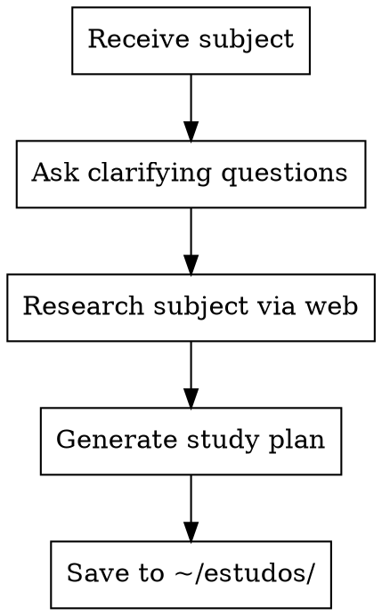

# Study Plan Generator

## Overview

Generates comprehensive study plans with NotebookLM-optimized prompts for any subject. Applies cognitive science methods (Active Recall, Spaced Repetition, Feynman Technique, Interleaving, Dual Coding, Bloom's Taxonomy, SuperMemo principles) to maximize retention.

## When to Use

- User wants to study any subject (certification, technology, language, science, etc.)
- User asks for a study plan or learning roadmap
- User wants NotebookLM prompts for a topic
- User mentions preparing for an exam or certification

## Process Flow



## Execution Steps

### Step 1: Receive Subject

The subject comes as the skill argument. Examples:
- `/study-plan-generator AWS Solutions Architect SAA-C03`
- `/study-plan-generator Kubernetes para iniciantes`
- `/study-plan-generator Cálculo Diferencial`

### Step 2: Ask Clarifying Questions (Interactive)

Use AskUserQuestion to gather context. Ask ONE question at a time:

**Question 1 — Study Type:**
```
"Qual o tipo de estudo?"
Options:
- Certificação/Exame (tem estrutura formal, domínios, pesos)
- Conhecimento Técnico (aprender uma tecnologia ou ferramenta)
- Conhecimento Acadêmico (disciplina, ciência, teoria)
- Projeto Prático (aprender fazendo um projeto específico)
```

**Question 2 — Current Level:**
```
"Qual seu nível atual no assunto?"
Options:
- Iniciante (nunca estudei isso)
- Básico (conheço o básico, quero aprofundar)
- Intermediário (tenho experiência, quero dominar)
- Avançado (quero preencher lacunas específicas)
```

**Question 3 — Timeline:**
```
"Qual seu prazo estimado?"
Options:
- 2-4 semanas (intensivo)
- 1-2 meses (ritmo moderado)
- 3-6 meses (ritmo confortável)
- Sem prazo definido (aprendizado contínuo)
```

### Step 3: Research Authoritative Sources via Web

**PURPOSE: Find and curate ONLY authoritative, high-quality sources for the subject.** This is the core value of the research step — everything else (topic structure, key concepts) can be derived from the user's input and your knowledge.

Use WebSearch with MULTIPLE parallel queries to find sources across these categories:

**3A. Academic Papers (search arxiv, semantic scholar, ACM, IEEE):**
- Original/seminal papers that introduced key concepts in the field
- Recent survey papers that consolidate the state of the art
- Search pattern: `"[concept] original paper [author if known] arxiv"` or `"[field] survey paper [year] arxiv"`

**3B. Official Documentation & Guides:**
- Official docs from tool/platform creators (e.g., OpenAI docs, AWS docs, MDN, Python docs)
- Official best practices and guides from authoritative organizations
- Search pattern: `"[tool/platform] official documentation guide"`

**3C. University Courses & Lectures (free/open):**
- MIT OCW, Stanford Online, Coursera from top universities
- YouTube lectures from recognized professors/researchers
- Search pattern: `"[subject] course MIT Stanford free official [year]"`

**3D. Reference Books & Textbooks:**
- Standard textbooks in the field, preferably freely available online
- Search pattern: `"[subject] textbook reference book free online [author]"`

**3E. Recognized Educators/Researchers:**
- Content from people with verifiable credentials (professors, research leads, original paper authors)
- Search pattern: `"[known expert name] [subject] lecture tutorial"`

**SOURCE QUALITY FILTER — reject sources that:**
- Come from personal blogs without academic/institutional affiliation
- Are Medium/Towards Data Science articles without citing primary sources
- Are from "influencers" without research credentials
- Oversimplify without referencing original material
- Cannot be traced back to a peer-reviewed paper, official doc, or recognized institution

**Build two outputs from research:**

1. A topic structure table (from user input + your knowledge + source content):
```
| Domain/Area | Weight/Importance | Key Topics |
|-------------|-------------------|------------|
| ...         | ...               | ...        |
```

2. A curated source list with EVERY source found, categorized and with direct URLs (this becomes Section 6 of the output)

### Step 4: Generate Study Plan

Create the file at `~/estudos/<subject-slug>.md` following the EXACT template structure below. Replace all placeholders with subject-specific content derived from the research.

**CRITICAL**: Every prompt must be specifically tailored to the subject. Do NOT use generic placeholders like `[TÓPICO]` in the final output — fill them with actual topics from the research. Where the template says `[TÓPICO]`, generate multiple concrete versions for the subject's main areas.

### Step 5: Save and Confirm

1. Ensure `~/estudos/` directory exists (create if needed)
2. Save file as `~/estudos/<subject-slug>.md` where slug is lowercase-hyphenated subject name
3. Confirm to user with file path and summary of what was generated

---

## Output Template

The generated file MUST follow this exact structure. Adapt all content to the specific subject.

```markdown
# Prompts para NotebookLM - Estudo [SUBJECT NAME]

## Contexto

[1-2 paragraphs describing the subject, why it matters, and what the study plan covers. If certification, include exam details.]

### Estrutura [do Exame / do Assunto]

| Domínio/Área | Peso/Importância | Foco |
|--------------|------------------|------|
| [filled from research] | ... | ... |

### Métodos Científicos Aplicados

Cada prompt foi desenhado incorporando:
- **Active Recall** — forçar recuperação ativa da memória
- **Spaced Repetition** — intervalos crescentes entre revisões
- **Testing Effect** — auto-teste como ferramenta de aprendizado
- **Elaborative Interrogation** — perguntas "por quê?" e "como?"
- **Dual Coding** — combinar verbal + visual/áudio
- **Feynman Technique** — explicar de forma simples revela lacunas
- **Interleaving** — misturar tópicos para melhorar discriminação
- **Bloom's Taxonomy** — escalar de "lembrar" até "criar/avaliar"
- **SuperMemo 20 Rules** — cards atômicos, mínimo de informação, cloze deletion

---

## 1. Instrução de Notebook (Notebook-Level Custom Instruction)

> Cole isso nas configurações do notebook:

[Generate a custom instruction specific to the subject. Include:
- Role definition (tutor especializado em [subject])
- Rules for answering (source-based, Portuguese, clear language)
- How to present key concepts (always include: what it is, when to use, how it differs)
- Analogies requirement
- Area/domain tagging
- Bold key terms
- Subject-specific rules (e.g., for tech: always compare tools; for science: always show formulas + intuition)]

---

## 2. Prompts para Audio Overview

### 2A. Audio Overview — Resumo por Área

[Generate one detailed audio prompt PER domain/area from the structure table. Each should:
- List specific subtopics to cover
- Set the tone/level based on user's level
- Request analogies and real-world examples
- Mention relative importance if applicable]

### 2B. Audio Overview — Revisão Interleaved

[Generate a prompt that mixes topics across ALL areas, creating cross-domain connections. Subject-specific scenarios that touch multiple areas simultaneously.]

### 2C. Audio Overview — Simulação de Cenários

[If certification: exam question patterns and elimination strategies.
If general: practical application scenarios and common misconceptions.]

---

## 3. Prompts para Gerar Testes

### 3A. Teste por Área com Feedback Elaborado

[Generate test prompt with:
- 10 questions (7 single-answer + 3 multi-answer if applicable)
- Scenario-based questions (not just definitions)
- Bloom's taxonomy distribution
- Detailed feedback format with explanation of correct AND incorrect options
- Study tip per question]

### 3B. Teste de Discriminação

[Generate test comparing similar/confusable concepts in the subject.
List specific pairs to compare based on research.]

### 3C. Teste Rápido de Active Recall

[5 open-ended questions format with self-evaluation rubric]

### 3D. Teste Verdadeiro ou Falso com Justificativa

[10 statements format with justification and common pitfall explanation]

---

## 4. Prompts para Flash Cards

### 4A. Flash Cards Atômicos

[20 cards following SuperMemo minimum information principle.
Include cloze deletions and scenario-based fronts.]

### 4B. Flash Cards de Comparação

[15 cards comparing frequently confused concepts.
List specific pairs from the subject.]

### 4C. Flash Cards Temáticos

[15 cards focused on the subject's most critical/hardest area.
Equivalent to the Shared Responsibility Model cards — the "must-know" topic.]

### 4D. Flash Cards de Termos e Definições

[20 cards with key terms, acronyms, and quick definitions.
List mandatory terms from the subject.]

---

## 5. Prompts para Chat Principal (Estudo Ativo)

### 5A. Elaborative Interrogation

[6-question framework (O que é? Por que existe? Como funciona? Quando usar? O que acontece se não usar? Analogia?) applied to the subject's main concepts. Table format.]

### 5B. Feynman Technique

[Explain like I'm 10 format — zero jargon, daily life analogy, then technical definition, then exam/practical tips.]

### 5C. Mapa Mental em Texto

[Tree/mind map format with emojis for visual structure. Subject-specific categories and decision criteria.]

### 5D. Simulação de Cenário Real

[Practical scenario where user must apply knowledge. If tech: architect a solution. If academic: solve a real problem. If certification: workplace scenario.]

### 5E. Revisão de Erros

[Post-test error review format with: why correct is correct, why wrong is wrong, mnemonic tip, 2 practice questions.]

### 5F. Resumo de Página Única

[500-word max summary per area with: top concepts, comparative table, common pitfalls, memorization phrases.]

---

## 6. Fontes para o NotebookLM

### Fontes Primárias (Papers e Documentação Oficial)

[List ALL seminal papers, original documentation, and official guides found in Step 3.
For each source, provide:
- **Title** — Author(s), Year
  - URL (direct link — arxiv, official site, etc.)
  - *1 sentence explaining why this source matters for the subject*

Group by category:
- Papers Fundamentais (seminal papers that introduced core concepts)
- Documentação Oficial (official docs, guides, best practices)
- Surveys e Referências Abrangentes (survey papers, comprehensive reviews)]

### Fontes Didáticas (Cursos, Livros e Séries)

[List ALL educational resources found in Step 3.
Same format as above. Group by:
- Cursos Universitários Abertos (MIT OCW, Stanford, Coursera from universities)
- Livros-Texto de Referência (standard textbooks, preferably free online)
- Séries e Palestras de Especialistas (YouTube lectures from recognized researchers/educators)]

### Prompt para Busca de Fontes Confiáveis no NotebookLM

> Use este prompt quando precisar buscar e validar fontes adicionais diretamente no NotebookLM:

[Generate a SUBJECT-SPECIFIC version of this prompt template. Fill in:
- The specific academic conferences/journals relevant to THIS subject
- The specific recognized authors/researchers in THIS field
- The specific institutions that are authoritative in THIS area
- The specific types of sources to reject for THIS subject

The prompt MUST follow this structure:]

```
Preciso encontrar fontes confiáveis e autoritativas sobre [TÓPICO ESPECÍFICO] para aprofundar meu estudo.

CRITÉRIOS DE CONFIABILIDADE — só aceite fontes que atendam pelo menos 2 destes critérios:

1. **Papers acadêmicos revisados por pares** publicados em venues reconhecidas:
   - Conferências: [LIST SUBJECT-SPECIFIC CONFERENCES — e.g., NeurIPS, ICML for ML; ACL for NLP; USENIX for security; etc.]
   - Journals: [LIST SUBJECT-SPECIFIC JOURNALS]
   - Repositório: arXiv (pré-prints dos autores originais ou de grupos de pesquisa conhecidos)

2. **Autores reconhecidos na área**:
   - Pioneiros: [LIST 5-8 RECOGNIZED PIONEERS IN THIS SPECIFIC FIELD]
   - Pesquisadores ativos: [LIST 5-8 ACTIVE RESEARCHERS]

3. **Instituições de pesquisa reconhecidas**:
   - Empresas: [LIST RELEVANT COMPANIES WITH RESEARCH IN THIS AREA]
   - Universidades: [LIST TOP UNIVERSITIES FOR THIS SUBJECT]
   - Documentação oficial: [LIST OFFICIAL DOC SITES]

4. **Livros-texto de referência** publicados por editoras acadêmicas:
   - [LIST 2-3 RELEVANT PUBLISHERS]
   - Autores que são professores ou pesquisadores ativos

FONTES A REJEITAR:
- Blogs pessoais sem afiliação acadêmica ou institucional
- Artigos do Medium/Towards Data Science sem referências a papers originais
- Conteúdo de "influenciadores" sem credenciais de pesquisa
- Tutoriais que simplificam demais sem citar fontes originais
- Qualquer fonte que não cite papers ou documentação oficial

Para o tópico solicitado:
1. Liste as 5 fontes mais relevantes e confiáveis disponíveis neste notebook
2. Para cada fonte, indique: tipo (paper/curso/livro/docs), autores, ano, e por que é confiável
3. Se algum tópico não estiver coberto pelas fontes do notebook, indique explicitamente: "LACUNA: [tópico] não está coberto — recomendo adicionar [fonte específica]"
4. Ordene por relevância direta ao tópico solicitado
```

---

## 7. Estratégia de Estudo Integrada

### Ciclo de Estudo Semanal Recomendado

| Dia | Atividade | Prompt a Usar | Método Científico |
|-----|-----------|---------------|-------------------|
| Seg | Estudo de nova área | 5A + 5B | Elaborative Interrogation + Feynman |
| Ter | Gerar e fazer flash cards | 4A ou 4B | Active Recall + Minimum Information |
| Qua | Audio overview da área | 2A | Dual Coding (áudio) |
| Qui | Teste prático | 3A | Testing Effect |
| Sex | Revisão de erros + interleaving | 5E + 3B | Spaced Repetition + Interleaving |
| Sáb | Audio interleaved + cenário | 2B + 5D | Interleaving + Elaboration |
| Dom | Resumo + revisão flash cards | 5F + cards antigos | Spaced Repetition + Active Recall |

### Intervalos de Revisão (Spaced Repetition)

[Adapt intervals based on user's timeline:
- Intensive (2-4 weeks): Days 1, 2, 4, 8, 14
- Moderate (1-2 months): Days 1, 2, 7, 16, 35
- Comfortable (3-6 months): Days 1, 3, 10, 30, 60, 120
- Continuous: Days 1, 3, 7, 21, 60, 180]

---

## Checklist de Implementação

- [ ] Copiar a instrução de notebook (seção 1) e colar nas configurações do NotebookLM
- [ ] Carregar as fontes primárias (seção 6 — Papers e Docs) no notebook
- [ ] Carregar as fontes didáticas (seção 6 — Cursos, Livros e Séries) no notebook
- [ ] Usar o prompt de busca de fontes confiáveis (seção 6) para validar/encontrar fontes adicionais
- [ ] Testar cada categoria de prompt (áudio, teste, flash card, chat) com um tópico
- [ ] Ajustar os prompts conforme necessário
- [ ] Seguir o ciclo semanal por pelo menos 2 semanas antes de avaliar progresso
```

## Common Mistakes

| Mistake | Fix |
|---------|-----|
| Generic prompts with `[TÓPICO]` placeholders left in | Fill ALL placeholders with actual subject content from research |
| Researching general topic info instead of sources | Step 3 is ONLY for finding authoritative sources — topic structure comes from user input + your knowledge |
| Including non-authoritative sources | Apply the quality filter: peer-reviewed, official docs, recognized researchers ONLY |
| Missing source URLs | Every source MUST have a direct, working URL |
| Sources without context | Every source needs: title, author, year, 1-sentence why it matters |
| Generic "search for sources" prompt | The prompt for finding more sources must be CUSTOMIZED to the specific subject's conferences, researchers, and institutions |
| Same prompts for certification vs general study | Adapt: certifications need exam-style questions; general needs practical scenarios |
| Ignoring user's level | Beginner needs more analogies and Feynman; advanced needs more discrimination tests |
| Too many flash card items per card | Enforce atomic principle: ONE fact per card, always |

## Quality Checklist

Before saving the file, verify:
- [ ] All 7 sections are present and filled (not templated)
- [ ] Structure table reflects actual subject domains/areas
- [ ] **Section 6 has categorized sources with direct URLs** (papers, docs, courses, books)
- [ ] **Every source has: title, author(s), year, URL, 1-sentence description**
- [ ] **Sources are ONLY from authoritative origins** (peer-reviewed, official, recognized researchers)
- [ ] **Prompt for finding more sources is customized** with subject-specific conferences, researchers, institutions
- [ ] Audio prompts reference specific topics, not generic placeholders
- [ ] Test prompts include subject-specific pairs for discrimination
- [ ] Flash card prompts list actual terms and concepts
- [ ] Spaced repetition intervals match user's timeline
- [ ] Language is Portuguese Brazilian throughout
