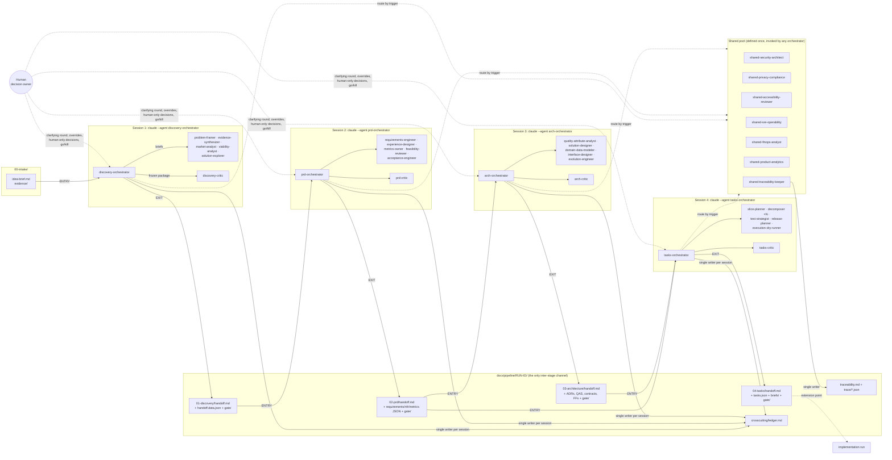
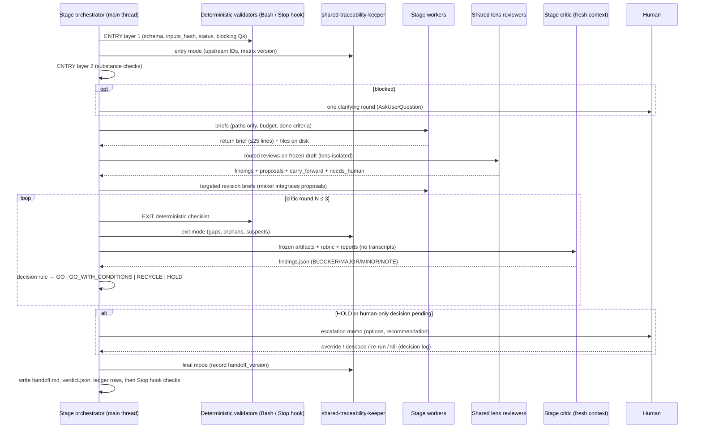

# Agentic Pipeline Personas: Reference Design and Research Integration

**Date:** 2026-10-02

## Research Question

How should an agentic pipeline in Claude Code turn a raw idea into (1) a validated problem/opportunity (Discovery), (2) a complete PRD, (3) an architecture and (4) implementation tasks, when **each stage is run by its own orchestrator persona in a fresh session, at a different time and in a different window**, and the stages may communicate **only through handoff files on disk**?

Specifically:

- Which **specialist personas** should each stage orchestrator delegate to, given that subagents cannot spawn subagents?
- Which **real-world enterprise roles, literature and mindsets** should ground each persona?
- What does each persona **accept** and what does it **refuse** (blocked / rejected / out_of_scope)?
- What **entry and exit gates** keep a stage from consuming or emitting bad work, and how do they terminate?
- How is a **shared cross-cutting pool** (security, privacy/compliance, accessibility, SRE/operability, FinOps, product analytics) plus a **traceability owner** defined once and invoked by any stage?
- What **handoff schemas** let a cold-started downstream orchestrator trust what it reads?

## Summary

The pipeline is a **workflow of agents**: the inter-stage path is fixed (Discovery → PRD → Architecture → Tasks) and gated, while each stage is internally an orchestrator-workers system [WEB:https://www.anthropic.com/engineering/building-effective-agents]. Every stage has one orchestrator that runs as the **main thread** of its own session (`claude --agent <stage>-orchestrator`). The orchestrator is the only agent that can delegate, because "Subagents cannot spawn other subagents" [LOCAL:ai/docs/claude-code/subagents/creating-custom-subagents.md:664-666]. It therefore owns every fan-out: stage workers, the stage critic, and invocations of the shared pool. Because the four orchestrators never share a context, **files are the only memory**: a handoff `handoff.md` (YAML frontmatter + a short cold-read summary) with machine-readable companions, a run-wide traceability matrix, a carry-forward ledger for cross-cutting items, and per-stage gate records (`entry-gate.md`, `findings.json`, `verdict.json`, `decision-log.md`).

The integrated roster has **35 personas**: 7 per stage (1 orchestrator + 5 specialists + 1 critic) and 7 shared (6 cross-cutting lenses + 1 traceability keeper). Three design rules drove almost every choice:

1. **Split by context need, incentive and tool privilege, not by job title.** Role labels alone do not improve accuracy [WEB:https://arxiv.org/abs/2311.10054 (via raw/08)], and title-based subagent splits failed in practice [LOCAL:ai/docs/harness-engineering/skill-issue-harness-engineering-for-coding-agents.md:388-392]. A persona file should be roughly 10% identity and 90% contract: scope, SOP, checklists, refusal rules, tools, output schema [RAW:08 §11].
2. **Keep the maker, the checker and the decider apart.** Self-evaluation is lenient [WEB:https://www.anthropic.com/engineering/harness-design-long-running-apps]; intrinsic self-correction without an external signal fails or degrades [WEB:https://arxiv.org/abs/2310.01798]; LLM judges show self-enhancement and verbosity bias [WEB:https://arxiv.org/abs/2306.05685]. So every stage has an independent, rationale-blind **critic** (Black hat) that finds, and an orchestrator (Blue hat) that applies a **pre-published decision rule** mechanically [BOOK:de Bono, Six Thinking Hats, 1985] [RAW:09 §Implications].
3. **Deterministic first, judgment second; bounded loops; humans own the irreversible.** Scripts and hooks check structure (schemas, IDs, trace coverage, lints) before any critic tokens are spent, because an LLM eyeballing structure is MAST failure mode FM-3.3 [WEB:https://github.com/roanbrasil/agents-integration-patterns/blob/main/patterns/FAILURE-MAP.md (via raw/08)]. Critic loops are capped at 3 rounds (2 revision loops) with severity-gated looping, a monotonic finding set and a no-progress detector [RAW:09 §12]. Legal basis, risk acceptance, SLO targets, cost ceilings and KILL are human-only decisions [RAW:06 "Hard gates"].

The **universal refusal taxonomy** is `blocked` (input missing or insufficient), `rejected` (present work fails a quality bar) and `out_of_scope` (belongs to another stage, lens, human or the GTM extension point). Written gate statuses are `GO | GO_WITH_CONDITIONS | HOLD | BLOCKED | REJECTED_UPSTREAM` plus `KILL_RECOMMENDED` from PRD onward; `RECYCLE` is internal only. Severities are BLOCKER (a refusal or must-meet criterion was hit), MAJOR (an acceptance or should-meet criterion failed; ≤3 may be carried as conditions), MINOR (never loops) and NOTE/observation (not gating) [RAW:09 "Severity scale"] [WEB:https://www.wellspring.com/blog/how-to-manage-your-innovation-process-the-stage-gate-framework].

This integration pass cross-checked the five per-stage syntheses and **fixed 21 inconsistencies in place** (listed in Part VI): shared-persona names that did not resolve in the orchestrators' `Agent(...)` allowlists, a broken Discovery → PRD handoff chain (field names, enum spellings, the missing human-decision check), Architecture file paths that the Tasks entry gate did not recognize, ID-prefix collisions across stages, trace-file write scopes that broke the single-writer rule, and diverging voting and severity vocabulary.

Full persona specifications live in the per-stage synthesis files; this document is the authoritative overview, the cross-stage contract, and the record of how the pieces fit:

- [Discovery](agentic-pipeline-personas/synthesis/discovery.md) · [PRD](agentic-pipeline-personas/synthesis/prd.md) · [Architecture](agentic-pipeline-personas/synthesis/architecture.md) · [Tasks](agentic-pipeline-personas/synthesis/tasks.md) · [Shared pool](agentic-pipeline-personas/synthesis/shared.md)

---

## Method

### Research axes

The research was split into nine axes. Each produced a raw file with literature, real-world roles (with acceptance and refusal criteria), LLM-specific failure modes, and implications for personas.

| # | Axis | Raw file | Main literature families |
|---|---|---|---|
| 1 | Discovery & product strategy | `raw/01-discovery.md` | Cagan, Torres (OST), Fitzpatrick (Mom Test), JTBD (Christensen / Ulwick / Moesta), Maurya, Osterwalder & Bland, Blank, Ries, Savoia, Dorst, Klein, NN/g on synthetic users |
| 2 | PRD & requirements | `raw/02-prd.md` | Cagan's PRD critique, Yien/Square template, Working Backwards PR/FAQ, Shape Up, Lean UX, Wiegers & Beatty, ISO/IEC/IEEE 29148, Volere, EARS, ISO/IEC 25010, HEART/North Star, MoSCoW/RICE/Kano/WSJF |
| 3 | UX, design & accessibility | `raw/03-ux.md` | Nielsen heuristics, Patton story mapping, service blueprints, IA (Rosenfeld/Covert), UI state stack, content design (Richards, GOV.UK), WCAG 2.2, inclusive design, design systems |
| 4 | Software architecture | `raw/04-architecture.md` | Richards & Ford, *The Hard Parts*, Bass/Clements/Kazman (QAS, ATAM), Rozanski & Woods, C4, arc42, Nygard/MADR, *Building Evolutionary Architectures*, Hohpe, Conway/Team Topologies |
| 5 | Domain, data, API & integration | `raw/05-domain-data-api.md` | Evans, Vernon, Khononov, EventStorming, Kleppmann, ODCS, OpenAPI 3.1 / AsyncAPI 3.0, RFC 9457, EIP, sagas & outbox |
| 6 | Cross-cutting quality | `raw/06-crosscutting.md` | OWASP ASVS 5.0 / Top 10:2025, Shostack, NIST SSDF, GDPR, LGPD/ANPD, Privacy by Design, Google SRE books, observability, capacity, FinOps, Well-Architected, tracking plans |
| 7 | Delivery planning, tasks & test strategy | `raw/07-delivery-test.md` | Patton, Cohn, INVEST, Lawrence & SPIDR splitting, walking skeleton, BDD/SbE, DoR/DoD, WBS/critical path, Reinertsen, DORA, ISO 29119, Spec Kit |
| 8 | Multi-agent role design & Claude Code subagents | `raw/08-multiagent.md` | MetaGPT, ChatDev, CAMEL, AgentVerse, Anthropic engineering posts, MAST, LLM-as-judge, self-correction evidence, persona-prompting evidence, Cognition, local Claude Code docs |
| 9 | Review, challenge & quality gates | `raw/09-review-gates.md` | Klein pre-mortem, Zenko & UK red teaming, disagree-and-commit, Six Hats, design reviews/RFCs/ARBs, Bar Raiser, Cooper Stage-Gate, Scrum DoD, Fagan, Kahneman, evaluator-optimizer, binary evals |

Five syntheses then turned the axes into rosters: one per stage, plus one for the shared pool. Each synthesis gives, per persona: real-world counterparts and sources; model tier, tools, `maxTurns`; mission; mindset; OWNS / DOES NOT OWN; inputs; SOP; output contract; acceptance criteria; refusal criteria; anti-patterns; collaboration. Each stage synthesis also gives the handoff schema, entry gate, exit gate, delegation plan, shared-pool routing and effort scaling.

### Verification approach

- **Raw research.** Each raw file was produced with web search/fetch through a proxy that blocked several publishers (hbr.org, svpg.com, nngroup.com, gov.uk PDFs, cognitect.com and others). Blocked pages were confirmed through search summaries where possible, and each raw file ends with a **verifier pass log (2026-10-02)** recording what was confirmed, corrected, upgraded from UNVERIFIED, or left UNVERIFIED. Examples of corrections made by the verifier: Klein's pre-mortem "~30%" figure is about the *number of reasons generated* in Mitchell, Russo & Pennington (1989), not project success [RAW:09 §1]; checklist reading does **not** consistently beat ad-hoc reading (Porter, Votta & Basili 1995 favored scenario-based reading) [RAW:09 §9]; Huang et al.'s exact GPT-3.5 flip rates could not be confirmed and must not be cited [RAW:08 §10].
- **Syntheses.** They carry the raw files' tags rather than re-fetching (marked "via raw/NN"). A few claims were freshly checked in the synthesis pass (risk-storming, Mermaid C4, Structurizr, ArchUnit in Architecture; Gotel & Finkelstein, DOORS suspect links, FinOps unit economics, LBI Art. 63 and WCAG "complete processes" in the shared pool).
- **Local corpus.** Claude Code mechanics were read directly from `ai/docs/claude-code/subagents/creating-custom-subagents.md` and re-checked in this pass (lines 186-189, 293-295, 574-580, 664-666).
- **Integration pass (this document).** No new external research; the job was cross-checking the five syntheses against each other and against the raw files, fixing inconsistencies in place, and consolidating. No web calls were needed for the claims made here; all `[WEB:]` tags below are carried from the verified raw or synthesis files.

### Confidence tags legend

| Tag | Meaning |
|---|---|
| `[WEB:<url>]` | Confirmed online in the raw research or verifier pass (sometimes via search summary when the page was blocked; the raw files record which). |
| `[BOOK:<author, title, year, section>]` | From a well-known book, paper or standard, cited from knowledge. Chapter numbers flagged `[UNVERIFIED]` where uncertain. |
| `[LOCAL:<path>]` | Read in the local corpus (`ai/docs/...`, `dev/research/...`). |
| `[RAW:NN §x]` | A design recommendation from raw file `NN`, which carries its own sources. |
| `[SYN:<stage>]` | A design decision taken in a stage synthesis. |
| `[heuristic]` | A design rule proposed by this research, not taken from a source (thresholds, budgets). |
| `[UNVERIFIED]` | Plausible but not confirmed. Do not present as fact. |

---

## Part I — Pipeline Topology

### I.1 Execution model

- **One orchestrator per stage, each in a fresh session.** `claude --agent discovery-orchestrator`, `claude --agent prd-orchestrator`, `claude --agent arch-orchestrator`, `claude --agent tasks-orchestrator`. With `--agent`, the agent's prompt **replaces** the default Claude Code system prompt, while `CLAUDE.md` and project memory still load [LOCAL:ai/docs/claude-code/subagents/creating-custom-subagents.md:574-580]. The stages run at different moments in new windows, so an orchestrator knows nothing about earlier sessions except what is on disk.
- **The orchestrator is the only delegator.** "Subagents cannot spawn other subagents. If your workflow requires nested delegation, use Skills or chain subagents from the main conversation" [LOCAL:creating-custom-subagents.md:664-666]. `Agent(worker-a, worker-b)` in a main-thread agent's `tools` restricts which subagents it may spawn; the restriction "only applies to agents running as the main thread with `claude --agent`" and has no effect in subagent definitions [LOCAL:creating-custom-subagents.md:293-295]. Consequences:
  - every worker, critic and shared reviewer is invoked by the stage orchestrator;
  - when one lens needs another lens's output (privacy's data classification feeds security; SRE's capacity model feeds FinOps), the orchestrator **sequences** them and passes file paths [SYN:shared §1.6];
  - workers cannot ask the orchestrator questions mid-run, so ChatDev's "communicative dehallucination" becomes a structured `open_questions` / `blocked` field in the return contract [WEB:https://alphaxiv.org/paper/2307.07924 (via raw/08)];
  - the orchestrator's `Agent(...)` allowlist is the real routing control; its names must match the agent files exactly (this was broken before the integration pass, fix F1).
- **Orchestrators are interactive; workers are not.** Only the main thread has `AskUserQuestion`, so each orchestrator runs **at most one clarifying round** with the human at its entry gate and records answers as decision-log entries. Background subagents auto-deny non-pre-approved permissions and cannot ask clarifying questions [LOCAL:creating-custom-subagents.md:601 (via raw/08)].
- **A stage may itself span several sessions** (crash, context reset, human pause). Each orchestrator keeps a resumable plan file (`plan.md` in Discovery, `work/plan.md` elsewhere) with a status per brief, guarding against MAST FM-1.3 step repetition and FM-1.4 loss of history [SYN:architecture "Execution model"] [WEB:https://arxiv.org/abs/2503.13657 (via raw/08)].

### I.2 Why the stage split is sound

MetaGPT's assembly line (Product Manager → Architect → Project Manager → Engineer → QA) maps almost one-to-one onto PRD → Architecture → Tasks → implementation, and its central claim is that SOPs encoded as prompt sequences, with **structured document handovers**, counter the cascading hallucinations of naive chaining [WEB:https://arxiv.org/abs/2308.00352 (via raw/08)] [BOOK:Hong et al., MetaGPT, ICLR 2024, §3.1-3.2]. Spec Kit's `/specify → /plan → /tasks` sequence mirrors the same split [LOCAL:ai/docs/spec-driven-development/README.md:12-14 (via raw/08)]. Discovery is added in front because the largest agentic risk upstream is building on unvalidated, possibly synthetic, evidence [RAW:01 §A].

### I.3 Gates and handoffs

Each stage runs the same skeleton:

1. **ENTRY gate** (orchestrator-owned). Layer 1 is a deterministic script (files exist, schemas validate, `inputs_hash` recomputes to the hash in the upstream `gate/verdict.json`, upstream `status ∈ {GO, GO_WITH_CONDITIONS}`, no blocking open questions, upstream conditions and ledger rows targeted at this stage are imported). Layer 2 is orchestrator judgment on substance (evidence integrity, measurability, contradictions, scope). Outcomes: `accept`, `accept_with_assumptions` (defaults recorded as `ASM-` items), `blocked`, `rejected` (written as `REJECTED_UPSTREAM` with an `upstream_rework_request`), `out_of_scope`. **The orchestrator never edits upstream files**; a human routes rework [RAW:08 "Upstream immutability"].
2. **Work phases.** Coupled decisions run serially in one head; independent reading, analysis and review run in parallel (sectioning) [WEB:https://cognition.com/blog/dont-build-multi-agents (via raw/08)] [WEB:https://www.anthropic.com/engineering/building-effective-agents].
3. **EXIT gate.** (a) deterministic checklist via Bash/`Stop` hook; (b) `shared-traceability-keeper` report; (c) independent stage critic on frozen artifacts with no worker transcripts; (d) the orchestrator applies the decision rule. Up to 3 critic rounds.
4. **Handoff.** `handoff.md` + machine files + `gate/verdict.json`; `traceability.md` updated by the keeper (`final` mode); ledger rows appended by the orchestrator. A `Stop` hook refuses to end the session unless `gate/verdict.json` exists and `handoff.md`'s `status` equals it (MAST FM-3.1 premature termination) [SYN:prd, architecture, tasks].

The downstream entry gate re-checks the minimum subset of the upstream exit gate, the consumer-side "Definition of Ready" [WEB:https://www.scrum.org/forum/scrum-forum/46113/if-product-backlog-item-does-not-meet-definition-done-it-cannot-be-released (via raw/09)]. Each exit gate also writes `expected_at_next_gate`: following Cooper, the next gate's deliverables are declared at the current gate [WEB:https://www.wellspring.com/blog/how-to-manage-your-innovation-process-the-stage-gate-framework (via raw/09)].

### I.4 Topology diagram



Intra-stage gate sequence (same in every stage):



### I.5 The shared pool and the traceability keeper

Seven personas are defined once in [`synthesis/shared.md`](agentic-pipeline-personas/synthesis/shared.md) and invoked by any orchestrator as ordinary worker subagents:

- **Six lens reviewers** (security, privacy/compliance, accessibility, SRE/operability, FinOps, product analytics). They are invoked by **routing triggers** (an invocation matrix of M = mandatory / C = conditional / N = never per stage, Part III.3). They work at **stage depth**: asking for a threat model at Discovery or a tracking plan at PRD-entry is wrong-stage depth and becomes `out_of_scope` + carry-forward, never a blocker [RAW:06 "Stage-depth profiles", LLM-failure 6]. They **propose**; the stage's authoring worker integrates; the stage critic judges (maker/checker) [RAW:06 "Keep reviewers separate from authors"]. They have no `Edit` on stage artifacts.
- **One traceability keeper** that runs at every boundary (`reserve` at Discovery P0, `entry`, `exit` before every critic round, `final` before the handoff). It is the **single writer** of `traceability.md` and `trace/**`, and it is mostly deterministic: a `trace-check` script computes gaps, orphans, suspect links and ID integrity; the LLM only reviews justifications [RAW:09 R5] [RAW:08 Role F].
- **A carry-forward ledger** (`crosscutting/ledger.md`) is how a lens remembers across sessions; without it the Tasks-stage security reviewer cannot know what the Architecture-stage reviewer accepted [RAW:06 "Fresh-session constraint"]. The **stage orchestrator** is its single writer (parallel reviewers would collide); an unaddressed ledger row targeted at the current stage is a MAJOR finding [SYN:shared §1.5].

### I.6 Run directory

```
docs/pipeline/<run-id>/
  00-intake/            idea-brief.md, evidence/, validation-results/ (re-entry)
  01-discovery/         plan.md, briefs/, work/, reviews/, gate/, rejections/, history/, handoff.md, handoff.data.json
  02-prd/               handoff.md, prd.md, requirements.json, nfr.json, metrics.json, scope.json, ux/, glossary.md,
                        feasibility.json, risks.json, release-criteria.md, open-questions.json, reviews/, gate/, work/
  03-architecture/      handoff.md, architecture.md (arc42), exec-summary.md, drivers/, decisions/, views/, domain/, data/,
                        contracts/, integration/, evolution/, risks.json, open-questions.json, assumptions.json, reviews/, gate/, work/
  04-tasks/             handoff.md, tasks.json, tasks.md, briefs/<task-id>.md, plan/, test/, release/, policy/,
                        open-questions.json, dry-run/, reviews/, gate/, work/
  traceability.md       run-wide human matrix            (single writer: shared-traceability-keeper)
  trace/                matrix.json, id-registry.json, report-<stage>-<mode>.json   (keeper only)
  crosscutting/ledger.md carry-forward ledger            (single writer: the stage orchestrator of the current session)
gates/<stage>-exit-rubric.md   versioned rubrics; changing one is a human decision outside the loop
org/                           optional static inputs: tech-radar.*, standards.md, platform-catalog.md
```

### I.7 Common agent-file contract

All 35 personas share a file contract, derived from the Claude Code frontmatter fields (`name`, `description`, `tools`, `disallowedTools`, `model`, `permissionMode`, `maxTurns`, `skills`, `mcpServers`, `hooks`, `memory`, `background`, `effort`, `isolation`) [LOCAL:creating-custom-subagents.md:213-232 (via raw/08)]:

- **Ship in `.claude/agents/`, not a plugin**, because plugin subagents ignore `hooks`, `mcpServers` and `permissionMode` [LOCAL:creating-custom-subagents.md:186-189]. All write-scope and Stop enforcement depends on hooks.
- **No `memory` field.** Handoffs are the memory, and `memory` silently enables Read/Write/Edit and injects `MEMORY.md` [LOCAL:creating-custom-subagents.md:387-391 (via raw/08)].
- **Preload skills explicitly** (`skills:`), because subagents do not inherit them [LOCAL:creating-custom-subagents.md:226,358]. Stage SOPs, handoff schemas, rubrics, templates and lens checklists live in skills; reference allow-lists (ASVS IDs, GDPR/LGPD articles, WCAG SCs, price sources) live in skill `refs/` files [SYN:shared §1.7].
- **Least privilege.** Workers get `Read, Grep, Glob` plus `Write` scoped by a `PreToolUse` hook to their own output paths; web tools only for web-heavy workers (Discovery evidence synthesizer and market analyst, FinOps for dated prices, critics for citation spot-checks); Bash only for validators and hashing. Orchestrators get no WebSearch/WebFetch, to keep research noise out of the decider's context [SYN:discovery, prd, architecture].
- **Model tiers.** Opus for orchestrators, critics and high-judgment authors (framing, solution design, domain modeling, security, privacy); Sonnet for volume and criterion-driven work; never Haiku, because every persona makes judgment calls [SYN:shared Rationale 7] [RAW:08 §Subagent file contract]. Critics should be a different model family where the harness allows it; Claude Code `model:` selects Claude tiers only, so true cross-family review needs an external tool or MCP [UNVERIFIED availability] [SYN:discovery Open issue 5].
- **Descriptions and tone.** Delegation is driven by `description`; aggressive "CRITICAL/MUST" language over-triggers on newer models; every agent needs an output format and a `maxTurns` bound [LOCAL:ai/docs/analysis/analysis-research-subagent-best-practices.md:157-178 (via raw/08)].
- **Brief contract (orchestrator → worker):** `objective, stage/role, inputs (paths only), output (path + template skill + ID prefixes), boundaries, tools_guidance, budget, done_criteria, known_context, return_format` [RAW:08 "Brief contract"]. Revision briefs add only `finding_ids` + `fix_condition`, to prevent scope creep.
- **Return contract (worker → orchestrator):** status from the refusal taxonomy, a ≤25-line summary, artifact paths, counts, open questions, assumptions, risks and a machine-readable refusal block `{status, rule_id, evidence, needed_from, suggested_question}` [RAW:05 "Refusal output format"] [SYN:shared §1.3]. Workers write files and return pointers, avoiding the "telephone game" [WEB:https://www.anthropic.com/engineering/multi-agent-research-system].

---

## Part II — Findings per Axis (literature → principles → persona decisions)

Each axis is condensed to the principles that actually shaped personas, gates or schemas. Full literature notes, role write-ups and source lists are in the raw files.

### II.1 Discovery & product strategy (raw/01)

**Literature.** Cagan's four risks (value, usability, feasibility, viability) frame what discovery must retire [WEB:https://www.svpg.com/four-big-risks/] [BOOK:Cagan, Inspired, 2nd ed., 2017, Part IV]. Torres' Opportunity Solution Tree (outcome → opportunities → solutions → assumption tests) and her warning about "solutions in disguise" give the structure [BOOK:Torres, Continuous Discovery Habits, 2021, ch. 3]. The Mom Test forbids compliments, generalities and hypothetical futures as evidence [BOOK:Fitzpatrick, The Mom Test, 2013, ch. 2]. JTBD has three schools that must not be mixed: narrative jobs (Christensen), ODI outcome statements (Ulwick) and the four forces of progress (Moesta) [BOOK:Christensen et al., Competing Against Luck, 2016] [WEB:https://en.wikipedia.org/wiki/Outcome-Driven_Innovation] [WEB:https://jobstobedone.org/radio/unpacking-the-progress-making-forces-diagram/]. Lean Canvas, Testing Business Ideas' evidence-strength hierarchy, Ries' pivot/persevere on pre-agreed criteria and Savoia's "skin in the game" data complete the toolkit [BOOK:Maurya, Running Lean, 3rd ed., 2022] [BOOK:Bland & Osterwalder, Testing Business Ideas, 2019] [BOOK:Ries, The Lean Startup, 2011, ch. 8] [WEB:https://www.buildtherightit.com/]. NN/g found synthetic users sycophantic and idealized and recommends them for hypotheses and desk research only [WEB:https://www.nngroup.com/articles/synthetic-users/].

**Principles adopted.**
- **Evidence is a typed field, not prose.** Every evidence item carries `evidence_type ∈ {real_primary, real_secondary, desk_research, synthetic, assumption}` and `strength ∈ {say, do, pay/commit}`. Synthetic evidence may *generate* hypotheses and interview guides but may **never** raise an assumption's status. Statuses are `untested | assumed | supported_by_desk | supported_by_real | refuted`; `supported_by_real` needs `real_*` evidence of `do`/`commit` strength [RAW:01 §A].
- **No real users in the loop** means the honest deliverable for untested leaps of faith is a **human validation plan** plus a re-entry path, and a `desk_only` run caps the recommendation at `proceed_with_conditions` [RAW:01 §A.5, §D].
- **Divergence before convergence**: ≥3 frames, ≥3 opportunities, ≥3 materially different solution directions plus a quarantined `SOL-000` (the idea as submitted) [RAW:01 §B].
- **Gate verdict ≠ product decision.** A well-evidenced KILL recommendation is a successful Discovery; the gate judges the package, the human judges the bet [SYN:discovery §3.4].

**Persona consequences.** The PM/Discovery Lead becomes the orchestrator; the UX researcher becomes the only worker allowed to mint `OPP-` nodes from evidence (`discovery-evidence-synthesizer`); the product designer is split into a framing pass before research (`discovery-problem-framer`) and a concept pass after it (`discovery-solution-explorer`), because concepts generated first anchor everything [RAW:01 §C.7]; business analyst and insights analyst merge into `discovery-viability-analyst`; the red team / pre-mortem facilitator becomes `discovery-critic`. The domain SME is **not** a standing persona: a live SME agent invents domain rules [RAW:05 "Inventing domain rules"].

### II.2 PRD & requirements (raw/02)

**Literature.** Cagan's critique of the heavy PRD and the modern lean templates (Yien/Square's staged Problem → Solution → Launch alignment) [WEB:https://www.prodmgmt.world/blog/prd-template-guide]; Amazon's PR/FAQ and its Internal FAQ as a risk prompt [BOOK:Bryar & Carr, Working Backwards, 2021, ch. 5] [WEB:https://www.koji.so/docs/working-backwards-pr-faq-guide]; Shape Up's appetite, rabbit holes and no-gos [BOOK:Singer, Shape Up, 2019, ch. 3-6]; Lean UX hypotheses [BOOK:Gothelf & Seiden, Lean UX, 3rd ed., 2021]; requirements engineering from Wiegers & Beatty (ambiguous-term lists, one requirement per statement) [BOOK:Wiegers & Beatty, Software Requirements, 3rd ed., 2013, ch. 11] [WEB:https://github.com/craigtp/BookDigests/blob/master/BookDigests/SoftwareRequirements.md], ISO/IEC/IEEE 29148 attributes [BOOK:ISO/IEC/IEEE 29148:2018], Volere snow cards with fit criteria [WEB:https://bacoach.nl/2026/03/the-volere-snow-card/], EARS sentence patterns [WEB:https://www.incose.org/docs/default-source/working-groups/requirements-wg/rwg_iw2022/mav_ears_incoserwg_jan22.pdf], ISO/IEC 25010:2023's nine quality characteristics [WEB:https://www.tiespecialistas.com.br/en/iso-iec-25010-software-quality-characteristics-examples/], HEART/North Star metrics with guardrails [WEB:https://ixdf.org/literature/topics/heart-framework], and MoSCoW/RICE/Kano/WSJF prioritization [WEB:https://www.agilebusiness.org/dsdm-project-framework/moscow-prioritisation.html].

**Principles adopted.**
- **Problem alignment before solution alignment** (an internal sub-gate): no requirement work until problem, goals, ≥3 plausible non-goals, primary metric and appetite exist [RAW:02 §2].
- **Atomic, verifiable requirements in JSON**: EARS statement with exactly one `shall`, a fit criterion, priority under one declared method, ≥1 positive and ≥1 negative/boundary AC per Must, verification method, trace links [SYN:prd "Atomic requirement schema"].
- **Deterministic lints catch most LLM failures**: banned-adjective list (fast, seamless, robust…) unless quantified; implementation-noun lint (technology names only with a `constraint_source`); Must share ≤60%; proportionality budgets tied to the appetite to stop spec bloat [RAW:02 "What an LLM tends to get wrong"] [LOCAL:ai/docs/spec-driven-development/spec-driven-development-main.md:40,82].
- **Every number traces to Discovery or is `assumption: true`** (RICE confidence capped at 50% when reach is not from evidence) [RAW:02 §12].

**Persona consequences.** PM → `prd-orchestrator` (writes the PM-owned problem content itself); BA/requirements engineer → `prd-requirements-engineer`; designer + IA + content designer (as a dedicated second pass) → `prd-experience-designer`; product analyst → `prd-metrics-owner` (author of the tracking plan, checked by the shared analytics lens); tech lead → `prd-feasibility-reviewer` (must **not** merge into the BA: different incentive and codebase context); QA/SDET "three amigos" tester → `prd-acceptance-engineer` (merged into the BA only for small batches); PRD critic/editor → `prd-critic`.

### II.3 UX, design & accessibility (raw/03)

**Literature.** Nielsen's heuristics and severity ratings [WEB:https://www.koji.so/docs/usability-issue-severity-ratings]; Patton's story mapping [BOOK:Patton, User Story Mapping, 2014]; service blueprints [WEB:https://www.nngroup.com/articles/service-blueprints-definition/]; IA [BOOK:Covert, How to Make Sense of Any Mess, 2014]; the UI state stack (ideal, empty, loading, partial, error); content design [WEB:https://thedutchess.be/2017-11-16-creating-govuk-with-content-design/]; WCAG 2.2 and the "complete processes" conformance requirement [WEB:https://w3.org/WAI/WCAG21/Understanding/conformance (via shared)]; inclusive design [WEB:https://inclusive.microsoft.design/articles/inclusive-101-guidebook].

**Principles adopted.**
- **State completeness is machine-checkable**: a screen × state matrix with no empty cells, every error class mapped to a recovery path and a string key [RAW:03 "Hard gates" 1, 4].
- **An LLM can design-review accessibility but cannot verify a rendered build**: success criteria are marked `design-reviewed` at PRD/Architecture and converted to `verified-in-build` tasks (automated checks in CI plus a manual screen-reader pass on critical flows) at Tasks [RAW:03 "What LLMs typically get wrong"].
- **Accessibility constrains architecture** (authentication without cognitive-function tests, SC 3.3.8; timeouts; SPA focus management; status messages, SC 4.1.3), so it cannot be a checklist appended at the end [RAW:03 §7].
- **Synthetic usability "findings" are not evidence**; evaluative research is a human-run plan [WEB:https://www.nngroup.com/articles/synthetic-users/].

**Persona consequences.** Designer/IA/content merge into `prd-experience-designer` (two passes); the service designer is conditional (blueprint only with backstage/human/third-party steps); the evaluative UX researcher is dropped as a persona (its heuristic inspection moves into the designer's self-review and the critic's S7); the accessibility specialist lives once in the shared pool (`shared-accessibility-reviewer`); DesignOps/design-systems lead becomes harness (templates, DoR/DoD) rather than a persona.

### II.4 Software architecture (raw/04)

**Literature.** Driving characteristics ("the fewest that matter") and architecture quanta [BOOK:Richards & Ford, Fundamentals of Software Architecture, 2020, ch. 4-5] [BOOK:Ford et al., Software Architecture: The Hard Parts, 2021, ch. 7, 15]; six-part quality attribute scenarios and ATAM utility trees with (importance, difficulty) ratings and sensitivity/trade-off points [BOOK:Bass, Clements & Kazman, Software Architecture in Practice, 4th ed., 2021, ch. 3] [WEB:https://en.wikipedia.org/wiki/Architecture_tradeoff_analysis_method]; viewpoints and perspectives [BOOK:Rozanski & Woods, Software Systems Architecture, 2nd ed., 2011]; C4 and arc42 (with "n/a — reason" instead of filler) [WEB:https://arc42.org/overview/]; ADRs (Nygard; MADR 4 with a Confirmation section) [WEB:https://github.com/adr/madr/blob/main/template/adr-template.md]; fitness functions [BOOK:Ford, Parsons, Kua & Sadalage, Building Evolutionary Architectures, 2nd ed., 2022, ch. 2] [WEB:https://github.com/TNG/archUnit]; Type 1/Type 2 (one-way/two-way door) decisions [BOOK:Bezos, 2015 Letter to Shareholders]; Conway and Team Topologies [BOOK:Skelton & Pais, Team Topologies, 2019]; boring technology [BOOK:McKinley, "Choose Boring Technology", 2015].

**Principles adopted.**
- **Fix the yardstick before scoring options** (QASs first, the "sprint contract" logic) so scenarios are not back-fitted to a favorite style [WEB:https://www.anthropic.com/engineering/harness-design-long-running-apps].
- **Quanta first; hype default blocked**: with one quantum the style is a modular monolith or service-based unless an ADR cites a specific granularity disintegrator [RAW:04 "Hype default"].
- **ADRs are MADR-valid and machine-checked**: ≥2 considered options (≥3 and a human acknowledgment for one-way doors), ≥1 bad consequence, drivers, reversibility, Confirmation = a fitness function ID [SYN:architecture D4].
- **Diagrams as code** whose element IDs equal trace IDs; enterprise standards and tech radars are **static files**, never a live "EA agent" that invents standards; absence becomes an explicit assumption [RAW:04 R2].
- **Every fitness function and risk mitigation is a candidate task**, so the architecture is executable downstream [RAW:04 "Handoff file contents for Tasks"].

**Persona consequences.** Solution architect → `arch-orchestrator` (accepts or rejects ADRs; workers only propose); QAW/utility-tree analyst → `arch-quality-attribute-analyst`; software/application architect → `arch-solution-designer`; DDD + data architect → `arch-domain-data-modeler`; API designer + integration architect → `arch-interface-designer`; staff engineer (implementability) + platform architect (deployment view) + fitness-function designer → `arch-evolution-engineer`; ARB/ATAM evaluator + pre-mortem facilitator → `arch-critic`.

### II.5 Domain, data, API & integration (raw/05)

**Literature.** Strategic DDD (subdomains, bounded contexts, context-map patterns) [BOOK:Evans, Domain-Driven Design, 2003]; aggregate rules (protect true invariants, small aggregates, reference by ID, eventual consistency between aggregates) [WEB:https://www.dddcommunity.org/wp-content/uploads/files/pdf_articles/Vernon_2011_2.pdf]; subdomain-driven pattern choice [BOOK:Khononov, Learning Domain-Driven Design, 2021]; EventStorming; consistency and replication [BOOK:Kleppmann, Designing Data-Intensive Applications, 2017]; ODCS data contracts [WEB:https://github.com/bitol-io/open-data-contract-standard/blob/main/README.md]; OpenAPI 3.1 / AsyncAPI 3.0 [WEB:https://www.asyncapi.com/docs/reference/specification/v3.0.0]; RFC 9457 problem details [WEB:https://datatracker.ietf.org/doc/html/rfc9457]; idempotency keys [WEB:https://datatracker.ietf.org/doc/html/draft-ietf-httpapi-idempotency-key-header-07]; sagas and transactional outbox [BOOK:Richardson, Microservices Patterns, 2018, ch. 4].

**Principles adopted.**
- **Order matters**: aggregates and context map before contracts, otherwise the model produces CRUD over tables [RAW:05 "Persona prompt hints"].
- **Vague consistency words are linted** (eventually consistent, ACID, real-time, exactly-once must be qualified by a guarantee or a numeric bound); dual writes require an outbox/CDC reference [RAW:05 §9].
- **Specs are validated by tools, not judged by an LLM** (OpenAPI/AsyncAPI/ODCS validators; AsyncAPI 3.0 `operations.action` only) [RAW:05].
- **Invented domain rules are refused**: every invariant cites a PRD/Discovery ID or is a typed `assumption` routed as an open question; core-domain assumptions are capped [RAW:05 "Inventing domain rules"].
- **Retention covers every copy** (logs, backups, events, analytics) [RAW:05 R2].

**Persona consequences.** Raw/05 proposed four architecture workers; the synthesis merged domain + data (two fresh-context passes; data ownership follows the BCs) and API + integration (they co-own AsyncAPI). The DBA design-review checklist goes to the modeler, physical DDL to Tasks; the data steward merges into `shared-privacy-compliance`; the data engineer is deferred to Tasks (extension `tasks-data-pipeline-planner`). The machine-readable refusal block `{status, rule_id, evidence, needed_from, suggested_question}` from this axis became the pipeline-wide refusal format.

### II.6 Cross-cutting quality (raw/06)

**Literature.** OWASP ASVS 5.0 (levels; CWE mappings removed) [WEB:https://softwaremill.com/whats-new-in-asvs-5-0/] and Top 10:2025 [WEB:https://top10.owasp.org/2025/]; Shostack's four questions and STRIDE-per-element [BOOK:Shostack, Threat Modeling, 2014]; NIST SSDF SP 800-218 [WEB:https://www.nist.gov/news-events/news/2025/12/secure-software-development-framework-ssdf-version-12-available-public]; GDPR and LGPD/ANPD, DPIA/RIPD screening [WEB:https://ico.org.uk/for-organisations/uk-gdpr-guidance-and-resources/accountability-and-governance/data-protection-impact-assessments-dpias/what-is-a-dpia/] [WEB:https://portal.fgv.br/sites/default/files/uploads/2024.11.05-guia-de-relatorio-de-impacto-a-protecao-de-dados-pessoais-ripd.pdf]; Privacy by Design's seven principles [WEB:https://www.sfu.ca/~palys/Cavoukian-2011-PrivacyByDesign-7FoundationalPrinciples.pdf]; LINDDUN [WEB:https://linddun.org/linddun-go-categories/]; SLOs below 100% and error budgets [WEB:https://sre.google/sre-book/embracing-risk/]; launch checklists/PRR [WEB:https://sre.google/sre-book/launch-checklist/]; observability via structured events [WEB:https://www.honeycomb.io/resources/webinars/structured-events-are-the-basis-of-observability]; FinOps unit economics [WEB:https://www.finops.org/framework/capabilities/unit-economics/ (via shared)]; Well-Architected pillars [WEB:https://aws.amazon.com/blogs/apn/the-6-pillars-of-the-aws-well-architected-framework/]; tracking-plan practice [WEB:https://www.twilio.com/docs/segment/protocols/tracking-plan/best-practices] [WEB:https://amplitude.com/docs/data/data-planning-playbook].

**Principles adopted.**
- **Stage-depth tables** are the core device: each lens has a row per stage stating required checks and allowed refusals; wrong-stage requests are `out_of_scope` + carry-forward [RAW:06].
- **Operational severity**: BLOCKER = a refusal criterion was hit; MAJOR = an acceptance criterion failed. Every BLOCKER carries a recommendation (positive-sum, never veto-only) [RAW:06 "Severity must be defined operationally"].
- **Anti-hallucination allow-lists** for standard IDs and legal articles; numbers (SLOs, prices, capacity) must be sourced or labelled `assumption`; a lint catches legal conclusions ("is compliant", "não há necessidade de RIPD") [RAW:06 LLM-failures 2, 3, 5].
- **Hard dependencies are sequenced**: telemetry and analytics designs always pass through privacy; privacy's classification feeds security; SRE's capacity model feeds FinOps [RAW:06 LLM-failure 8].
- **Human-only gates**: legal-basis confirmation, DPIA/RIPD necessity, risk acceptance of security blockers, the SLO business target and the cost ceiling are surfaced as `blocked: awaiting human decision` [RAW:06 "Hard gates"].

**Persona consequences.** Raw/06 recommended six reviewers including a separate performance reviewer; the shared synthesis merged performance/capacity and observability into `shared-sre-operability` (one owner of the capacity model FinOps consumes, with an explicit split trigger), merged GRC into `shared-privacy-compliance` as a separate output section, and replaced a Well-Architected reviewer with a coverage index used by the Architecture critic.

### II.7 Delivery planning, tasks & test strategy (raw/07)

**Literature.** Story mapping and the walking skeleton / tracer bullet [BOOK:Patton, 2014, ch. 1-2] [BOOK:Cockburn, Crystal Clear, 2004] [BOOK:Freeman & Pryce, GOOS, 2009, ch. 4]; INVEST and story splitting (SPIDR, Lawrence patterns) [WEB:https://ascendle.com/ideas/spidr-an-alternative-method-for-splitting-user-stories/]; BDD, Example Mapping "red cards", Specification by Example [WEB:https://cucumber.io/blog/bdd/example-mapping-introduction/] [BOOK:Adzic, Specification by Example, 2011]; DoR/DoD [BOOK:Scrum Guide 2020]; WBS 100% rule [BOOK:PMI, PMBOK Guide, 6th ed., 2017, §5.4]; flow, WIP and cost of delay [BOOK:Reinertsen, Principles of Product Development Flow, 2009]; trunk-based delivery and DORA [BOOK:Forsgren, Humble & Kim, Accelerate, 2018]; test quadrants and pyramid [WEB:https://www.pmi.org/disciplined-agile/agile/testingquadrants]; ISO/IEC/IEEE 29119-3; Spec Kit's task format, `[P]` parallel marker and `/analyze` ambiguity lint [WEB:https://raw.githubusercontent.com/github/spec-kit/main/templates/commands/tasks.md] [WEB:https://raw.githubusercontent.com/github/spec-kit/main/templates/commands/analyze.md]; long-running harness `feature_list.json` with `passes` and the rule that removing or editing tests is unacceptable [WEB:https://www.anthropic.com/engineering/effective-harnesses-for-long-running-agents].

**Principles adopted.**
- **Vertical slices, walking skeleton first, risk-first sequencing**; spikes are timeboxed and produce a decision or ADR request [RAW:07 §6, §12].
- **Mechanically detectable LLM failures are scripted**: invented paths (glob against `base_ref`), fake parallelism (disjoint file sets for concurrent `parallel_safe` tasks), DAG cycles, coverage gaps, flags without removal tasks [RAW:07 LLM-failures 3, 4].
- **No hidden design decisions**: any decision absent from the ADRs becomes a spike or an `adr_request` [RAW:07 LLM-failure 6].
- **Test-first and immutable tests**; `passes` flips only with recorded command evidence (the Iron Law) [LOCAL:dev/research/2026-04-25-harness-engineering-research.md:688-705].
- **Size caps replace story points** for agents (≈≤400 changed LOC, ≈≤8 files, one owner boundary, fits one fresh context) [heuristic; numbers UNVERIFIED].

**Persona consequences.** TPM → `tasks-orchestrator` (absorbing EM policy and Scrum Master DoR/DoD stewardship as policy files and gates); story mapper/slicer → `tasks-slice-planner` (serial, single head); tech lead decomposition → `tasks-decomposer` (fanned out per slice after the walking-skeleton slice is frozen); QA lead + SDET → `tasks-test-strategist` (two passes); release manager → `tasks-release-planner`; editor's cold-read test specialized for a coding-agent reader → `tasks-execution-dry-runner`; task critic → `tasks-critic`.

### II.8 Multi-agent role design & Claude Code subagents (raw/08)

**Literature and evidence.**
- MetaGPT: SOPs as prompt sequences; structured handovers counter cascading hallucination; publish-subscribe on typed messages [WEB:https://arxiv.org/abs/2308.00352].
- ChatDev: communicative dehallucination (ask before solving); pairwise chat is token-heavy and loop-prone [WEB:https://alphaxiv.org/paper/2307.07924].
- CAMEL: role flipping, flake replies and infinite loops; mitigated by hard role constraints and fixed reply formats [WEB:https://github.com/microsoft/autogen/issues/514].
- AgentVerse: dynamic recruitment (→ routing of shared reviewers) and conformity (critics must not see the producer's self-justification first) [BOOK:Chen et al., AgentVerse, ICLR 2024, §4].
- Anthropic patterns: prompt chaining with gates, routing, sectioning/voting, orchestrator-workers, evaluator-optimizer; start simple; poka-yoke interfaces [WEB:https://www.anthropic.com/engineering/building-effective-agents].
- Anthropic research system: detailed briefs (objective, output format, tool guidance, boundaries); effort scaling in the lead prompt; ~15× tokens for multi-agent; outputs to the filesystem; early failures such as 50 subagents for a simple query [WEB:https://www.anthropic.com/engineering/multi-agent-research-system].
- Anthropic harness design: self-evaluation leniency; a separate skeptical evaluator; hard per-criterion thresholds; sprint contracts agreed before work [WEB:https://www.anthropic.com/engineering/harness-design-long-running-apps].
- MAST: 14 failure modes in 3 categories (specification/system design ~41.8%, inter-agent misalignment ~36.9%, verification & termination ~21.3%; shares from a secondary source) [WEB:https://arxiv.org/abs/2503.13657 (via raw/08)] [WEB:https://futureagi.substack.com/p/why-do-multi-agent-llm-systems-fail (secondary)].
- LLM-as-judge biases (position, verbosity, self-enhancement) [WEB:https://arxiv.org/abs/2306.05685]; intrinsic self-correction without external feedback often fails [WEB:https://arxiv.org/abs/2310.01798].
- Personas in system prompts do not improve factual accuracy (Findings of EMNLP 2024) [WEB:https://aclanthology.org/2024.findings-emnlp.888/] [WEB:https://arxiv.org/abs/2311.10054], while Anthropic's prompting guide still recommends a role for focus and tone [LOCAL:ai/docs/claude-code/claude-prompting-best-practices.md].
- Cognition: share context; actions carry implicit decisions; parallel agents without each other's decisions conflict [WEB:https://cognition.com/blog/dont-build-multi-agents].

**Principles adopted.**
- **Workflow of agents**: fixed, gated inter-stage chain; agentic only inside a stage.
- **Persona ≈ 10% identity, 90% contract.** Real-world roles ground scope, vocabulary, literature and refusal rules; the label itself is cheap framing [RAW:08 §11].
- **Parallelize reading, analysis and review; keep coupled decisions in one head** (framing decision, style decision, slicing) [RAW:08 §12].
- **Every MAST mode maps to a gate or contract field**: briefs and handoff schemas address specification failures; files-not-messages and the brief/return contracts address misalignment; deterministic validators, Stop hooks and the critic address verification and termination [RAW:08 "What LLMs get wrong here"].
- **Synthesizer optional**: add a stage synthesizer only if consolidation pushes the orchestrator past ~40% context use (the "smart zone") [RAW:08 "Synthesizer is optional"] [LOCAL:dev/research/2026-04-25-harness-engineering-research.md].
- **Effort scaling is explicit** in every stage (`lite/standard/deep` in Discovery, `small/standard/large` elsewhere), to avoid over-delegation [WEB:https://www.anthropic.com/engineering/multi-agent-research-system].

### II.9 Review, challenge & quality gates (raw/09)

**Literature.** Klein's pre-mortem (independent writing before discussion; failure reasons mapped to plan change / tripwire / acceptance) [BOOK:Klein, "Performing a Project Premortem", HBR, 2007] [WEB:https://get-alfred.ai/blog/pre-mortem-technique]; red teaming as a mindset and "red team just enough" [BOOK:Zenko, Red Team, 2015, ch. 1] [WEB:https://www.civilserviceworld.com/news/article/mod-updates-guidance-on-red-teaming-for-problemsolvers]; disagree-and-commit [WEB:https://quarterdeck.co.uk/articles/leadership-principles-amazon/]; Six Thinking Hats; design docs, RFC Final Comment Periods and ARBs [WEB:https://github.com/rust-lang/rfcs/blob/master/README.md]; the Amazon Bar Raiser's structural independence [WEB:https://www.carrus.io/blog/all-about-bar-raisers-amazons-essential-element-to-the-hiring-process]; Cooper's Stage-Gate (Go/Kill/Hold/Recycle; must-meet vs should-meet; next gate's deliverables declared now) [WEB:https://www.wellspring.com/blog/how-to-manage-your-innovation-process-the-stage-gate-framework]; Scrum's binary DoD; Fagan inspections with entry and exit criteria [BOOK:Fagan, IBM Systems Journal 15(3), 1976]; Bacchelli & Bird on understanding intent [WEB:https://www.microsoft.com/en-us/research/publication/expectations-outcomes-and-challenges-of-modern-code-review/]; Kahneman (WYSIATI, outside view) and the decision-quality checklist [BOOK:Kahneman, Thinking, Fast and Slow, 2011, ch. 7, 23] [BOOK:Kahneman, Lovallo & Sibony, HBR, 2011]; Duke's kill criteria [BOOK:Duke, Quit, 2022]; binary pass/fail evals over Likert [WEB:https://hamel.dev/blog/posts/evals-faq/evals-faq.pdf].

**Principles adopted.**
- **A criterion is blocking only if** it was published before the work, is binary and testable, its failure stops or misleads the next stage, and the gate owner has authority to stop [RAW:09 §13]. LLM-judged must-meet criteria are kept to ≤8 per stage, each with a pass definition and a fail example.
- **Finder ≠ decider.** The critic finds; the orchestrator applies the decision rule with no fresh judgment (the bar-raiser *decision* collapses into a mechanical rule plus the human) [RAW:09 §Implications].
- **Loop termination**: contract first; severity-gated loops; monotonic findings after round 1; ≤3 rounds; disagree-and-commit overrides never re-raised; no-progress detector [RAW:09 §12].
- **Gate amnesia is solved by files**: overrides, conditions, kill criteria and `inputs_hash` live in `gate/*` and the handoff frontmatter [RAW:09 "Gate amnesia"].
- **Kill criteria are written at Discovery and re-checked at every exit gate**; a triggered criterion yields a recommendation the human confirms [RAW:09 "Hard gates" 6].
- **The cold-read test** (a fresh reader reconstructs goal, scope, decisions and open questions from the handoff alone) simulates the next stage's fresh session and became must-meet M8 in every stage (specialized into an execution dry-run at Tasks) [RAW:09 R6].

**Deviation recorded.** Raw/09 recommends a **separate** pre-mortem subagent for independence. All four stages instead fold the pre-mortem into the critic as a blind first step (Discovery and Architecture read a stripped brief before the package; Tasks writes its pre-mortem before reading the authors' summary; PRD uses the Internal-FAQ lens because raw/09 marks the pre-mortem optional there). The trade-off is weaker independence; the mitigation is the second critic sample in `deep`/`large` mode. Splitting it out (`<stage>-premortem` or a shared `shared-premortem`) is an open design question (Part VII).

---

## Part III — Persona Catalog, Invocation Matrix and RACI

### III.1 Full persona catalog (35 personas)

Names are unique across the pipeline and are the exact agent-file names (`.claude/agents/<name>.md`). Stage prefixes (`discovery-`, `prd-`, `arch-`, `tasks-`, `shared-`) prevent collisions and make `Agent(...)` allowlists readable. Full specs: see the linked synthesis files.

**Stage 1 — Discovery** ([spec](agentic-pipeline-personas/synthesis/discovery.md))

| Persona | Real-world counterpart | Mission (condensed) | Model |
|---|---|---|---|
| `discovery-orchestrator` | Product Manager / Discovery Lead (Cagan PM; Blue hat) | Turn the idea brief into a gated Discovery handoff from which a fresh PRD session can decide whether, for whom and against which outcome the problem is worth specifying; owns the framing decision and the recommendation | opus (main thread) |
| `discovery-problem-framer` | Product/Service Designer (framing half), JTBD practitioner, frame-creation (Dorst) | Produce ≥3 solution-free frames, problem statement, segment, jobs, four forces and research questions; quarantine the submitted idea as `SOL-000` | opus |
| `discovery-evidence-synthesizer` | UX Researcher (generative) + light domain-glossary pass | Build the typed evidence ledger and derive opportunity nodes (the only worker allowed to mint `OPP-`), glossary seed and human interview guide | sonnet |
| `discovery-market-analyst` | Market Research / Competitive Intelligence Analyst | Size the opportunity bottom-up as sourced ranges and map all alternatives including non-consumption; "why now" | sonnet |
| `discovery-viability-analyst` | Business Analyst / Strategist + Product/Insights Analyst | Make the business case falsifiable: Lean Canvas, unit economics, strategic fit, outcome metric spec, kill thresholds | sonnet |
| `discovery-solution-explorer` | Product Designer (concept half) + Tech Lead (feasibility flags) + experiment designer | Generate and compare ≥3 materially different directions, map assumptions, flag feasibility questions, write the human validation plan | sonnet |
| `discovery-critic` | Red team / devil's advocate / pre-mortem facilitator / Bar Raiser (finder only) | Try to kill the opportunity on paper: blind pre-mortem, then audit against the published rubric with evidence-pointed findings | opus |

**Stage 2 — PRD** ([spec](agentic-pipeline-personas/synthesis/prd.md))

| Persona | Real-world counterpart | Mission (condensed) | Model |
|---|---|---|---|
| `prd-orchestrator` | Product Manager / Group PM (PRD owner; Blue hat) | Turn a gated Discovery handoff into a bounded, prioritized, measurable, testable PRD; writes PM-owned problem content, owns priority and the cut list | opus (main thread) |
| `prd-requirements-engineer` | Business Analyst / Requirements Engineer (IIBA, ISO 29148, Volere, EARS) | Atomic, unambiguous, verifiable, traceable FR/BR/CON/NFR set plus glossary; reconciles flow candidates; adds unwanted-behaviour FRs | sonnet (opus if regulated/large) |
| `prd-experience-designer` | Product/Interaction Designer + IA + Content Designer (+ Service Designer when backstage exists) | Journeys, flows, state matrix and critical strings mapped to FR IDs, without freezing UI; blueprint when needed | sonnet |
| `prd-metrics-owner` | Product Analyst / Metrics Owner | Primary metric, guardrails and evaluation method defined before build; event requirements keyed to FRs | sonnet |
| `prd-feasibility-reviewer` | Tech Lead / Staff Engineer (feasibility only) | Verdict per Must against the appetite; rabbit holes; cut set; no architecture design | opus |
| `prd-acceptance-engineer` | QA Engineer / SDET / Test Analyst ("Three Amigos" tester) | Example-based ACs (positive + negative/boundary), verification method per FR/NFR, binary release criteria | sonnet |
| `prd-critic` | Group PM review / Bar Raiser / Fagan–Gilb requirements inspector / red team | Judge, against the rubric only, whether the PRD is fit for a cold-start Architecture session | opus |

**Stage 3 — Architecture** ([spec](agentic-pipeline-personas/synthesis/architecture.md))

| Persona | Real-world counterpart | Mission (condensed) | Model |
|---|---|---|---|
| `arch-orchestrator` | Solution Architect / Lead Architect (decision owner; gatekeeper with a published rule) | Own drivers sub-gate, style decision and ADR acceptance; consolidate the arc42 handoff Tasks can trust | opus (main thread) |
| `arch-quality-attribute-analyst` | Architect running a Quality Attribute Workshop / ATAM utility tree (SEI) | 3-7 ranked driving characteristics and six-part QASs for every NFR; the yardstick fixed before options are scored | sonnet (opus in large) |
| `arch-solution-designer` | Software / Application Architect; Staff Engineer (architect archetype) | Quanta analysis, style options scored against QASs, C4 L1-L3, build-vs-buy, ownership lanes, proposed ADRs, runtime views | opus |
| `arch-domain-data-modeler` | Domain Architect (DDD) + Data Architect (+ DBA design-review checklist) | Subdomains, BCs, context map, aggregates with real invariants; logical model, inventory, consistency/storage, ODCS, migration strategy | opus |
| `arch-interface-designer` | API Designer / API Product Owner + Integration Architect | Consumer-centric OpenAPI 3.1 / AsyncAPI 3.0 contracts, RFC 9457 errors, versioning, idempotency, sagas, outbox, DFD with trust boundaries | sonnet (opus with cross-BC sagas) |
| `arch-evolution-engineer` | Staff Engineer (implementability) + Platform Architect + evolutionary-architecture practitioner | Fitness functions per characteristic, deployment view, walking skeleton, spikes, rollout/migration plan, implementability verdict | sonnet (opus in large/brownfield) |
| `arch-critic` | ARB member / ATAM evaluation lead / red team + pre-mortem facilitator | Find every way the architecture fails its rubric or (H,H) scenarios; typed findings; recommend PASS/REVISE/ESCALATE; never fix | opus |

**Stage 4 — Tasks** ([spec](agentic-pipeline-personas/synthesis/tasks.md))

| Persona | Real-world counterpart | Mission (condensed) | Model |
|---|---|---|---|
| `tasks-orchestrator` | Technical Program Manager / Delivery Manager (absorbs EM autonomy/review policy and Scrum Master DoR/DoD stewardship) | Turn PRD + Architecture handoffs into an ordered, dependency-mapped, vertically sliced backlog executable by coding agents in fresh contexts | opus (main thread) |
| `tasks-slice-planner` | Product Owner + Tech Lead at story mapping; Release Train Engineer for milestones | Story map, milestones, vertical slices, walking-skeleton slice 1, risk-first spikes, file-lane map; serial, single head | opus |
| `tasks-decomposer` | Tech Lead / Staff Engineer doing task breakdown (INVEST, SPIDR, Spec Kit format) | For one slice, small, test-first, path-exact, self-contained task contracts; fanned out per slice after SL-01 is frozen | sonnet (opus for skeleton/high-risk slices) |
| `tasks-test-strategist` | QA Lead / Test Architect + SDET (ISO 29119-3, ATDD) | Pass A: risk-based strategy, levels, quadrants, contract-test decisions; pass B: AC → test matrix and test-first tasks | sonnet |
| `tasks-release-planner` | Release Manager / Release Engineer | Flags with removal tasks, expand/contract migrations, rollback and signals per milestone, trunk safety | sonnet |
| `tasks-execution-dry-runner` | Developer at backlog refinement (DoR check) + editor's cold-read, playing the consuming coding agent | Execute sampled briefs cold on paper and report blocking questions, guesses, unreachable pointers and hidden design decisions | sonnet (match executor tier) |
| `tasks-critic` | Plan reviewer / staff design review; Spec Kit `/analyze`; red team with pre-mortem lens; Fagan inspection | Judge whether the backlog is fit for coding agents: vertical, no hidden design, test-anchored, risk-first, trunk-safe, faithful | opus |

**Shared pool** ([spec](agentic-pipeline-personas/synthesis/shared.md))

| Persona | Real-world counterpart | Mission (condensed) | Model |
|---|---|---|---|
| `shared-security-architect` | Security Architect / AppSec Engineer / threat-modeling lead | Realistic threats for the risk tier identified at stage depth and dispositioned before build; security requirements as verifiable ASVS-tied statements traced to tasks and tests; humans accept risk | opus |
| `shared-privacy-compliance` | Privacy Engineer + GRC/Compliance Analyst supporting the DPO/Encarregado | Data collected only for stated requirements, protected by default, rights operable by design; regimes turned into evidence-backed obligations; legal determinations routed to humans | opus |
| `shared-accessibility-reviewer` | Accessibility Specialist / Digital Accessibility Engineer (IAAP CPACC/WAS) | Conformance to the target (default WCAG 2.2 AA) by design; honest split between design-reviewed and verified-in-build | sonnet |
| `shared-sre-operability` | SRE / Production Engineer + Observability Engineer + Performance & Capacity Engineer | Explicit, user-centric SLOs; graceful degradation per dependency; telemetry without PII leaks; capacity sanity; operability tasks | sonnet (opus for large/critical architectures) |
| `shared-finops-analyst` | FinOps Practitioner / Cloud Cost Engineer / Cloud Economist | Cost as a designed quality attribute: unit economics tied to a PRD goal at expected and peak scale with dated prices; cheaper alternatives instead of vetoes | sonnet |
| `shared-product-analytics` | Product Analytics Engineer / tracking-plan owner | Every outcome measurable with a precise formula; every event specified (trigger, naming, typed properties, PII flags, QA test); nothing instrumented "just in case" | sonnet |
| `shared-traceability-keeper` | Requirements / Configuration Manager owning the RTM; V&V engineer | One run-wide bidirectional chain opportunity → requirement → QAS/ADR → task → test; prove at every boundary that commitments are carried or explicitly dropped and IDs never silently change | sonnet |

**Not personas, by design:** the deterministic verifier (scripts + `Stop`/`PreToolUse` hooks), the enterprise architect and tech radar (static `org/*` files), the synthesizer (merged into orchestrators unless context exceeds ~40%), the Engineering Manager and Scrum Master (policy and gate definitions), estimators (size caps replace story points), and PMM/GTM (extension point).

### III.2 Shape of a stage roster

Every stage converged on the same 1 + 5 + 1 shape for the same reasons:

- **One orchestrator** owns integrative decisions that must stay coherent (framing, priority, style, slicing). Coupled decisions in one head [WEB:https://cognition.com/blog/dont-build-multi-agents].
- **Five specialists**, each split from the others because it needs different inputs, a different incentive, or different tool privileges (web vs no web, codebase vs no codebase), and because their outputs are disjoint files the orchestrator can parallelize.
- **One critic**, structurally independent (fresh context, frozen artifacts, rationale-blind, ideally another model family), carrying the stage's red-team, pre-mortem, decision-quality and cold-read lenses in one rubric rather than separate "hat" personas, which would multiply cost and contradictions [RAW:09 §Implications].

### III.3 Shared-pool invocation matrix

M = mandatory every run; C = conditional (otherwise `not triggered: <reason>` is written in the stage plan file); N = never at that stage (wrong-stage depth → `out_of_scope` + carry-forward). Depth (`light | full`) is passed in the brief.

| Persona | Discovery | PRD | Architecture | Tasks |
|---|---|---|---|---|
| `shared-security-architect` | **C** light: sensitive assets, new trust boundary (third parties or autonomous agents acting for users), high-value target. **N**: threat model, ASVS level | **M** light: ASVS level + security NFRs + abuse cases; full with authN/Z, non-public data, external exposure, payments, multi-tenancy. **N**: threat model | **M**: full (STRIDE-per-element on the shared DFD) under the same conditions or ASVS ≥ L2; light otherwise | **M** light: SSDF build-pipeline tasks; full when the threat model has `mitigate` dispositions |
| `shared-privacy-compliance` | **C** (**M** if regulated domain): personal/special-category data, cross-border, FLAG-PRIV. Screening only | **C**: personal data in FRs, flows or events (any user-level tracking plan) or upstream flags | **C**: personal/regulated data in `data/inventory.csv`, events, telemetry; LINDDUN on the same DFD | **C**: personal data in model, events, logs, fixtures; ledger items |
| `shared-accessibility-reviewer` | **C**: UI direction **and** (older/disabled users, obligated markets, single-modality direction, FLAG-A11Y) | **C**: any user-facing UI | **C**: UI present; architecture-level SCs (auth 3.3.8, timeouts, focus, 4.1.3) | **C**: any UI task (a11y DoD, verified-in-build tasks) |
| `shared-sre-operability` | **C** (rare): availability/latency/real-time claims or contractual uptime | **C** (usual): critical journeys with availability/latency expectations, external dependencies | **M** for networked/deployed services (includes performance and capacity) | **C** (usual): SLOs, dependencies or a deployed service; reviews `release-plan.md` |
| `shared-finops-analyst` | **C**: run cost is a viability driver (LLM inference, heavy compute, per-transaction fees, thin margin) | **C**: cost flagged, or a unit-of-value metric is needed | **C**: paid infra, managed services, per-call/LLM fees, egress/retention volume | **C**: cost flagged, or tasks create cloud resources |
| `shared-product-analytics` | **M**: outcome metric and kill criteria. **N**: tracking plan | **M** once `metrics.json` has events (checker; `prd-metrics-owner` authors) | **C**: PRD defines events (emission points, identity, delivery guarantees) | **C**: events exist (instrumentation and event-QA tasks) |
| `shared-traceability-keeper` | **M**: `reserve` (P0), `exit` (P4), `final` (P6); `entry` on re-entry | **M**: `entry` (P0), `exit` (P6, every round), `final` (P9) | **M**: `entry` (P0), `exit` (P7), `final` (P10) | **M**: `entry` (P0), `exit` (P5), `final` (P9) |

**Ordering rules** (the pool cannot delegate): the keeper runs before lens reviewers in `entry` mode and after them in `exit` mode; privacy (classification) → security; SRE (capacity, telemetry volume) → FinOps; analytics and SRE (PII-flagged attributes) → privacy (second, narrow pass); all others in parallel on the frozen draft; re-invoke a reviewer in a revision round only when new content touches its lens [SYN:shared "Invocation matrix"].

### III.4 RACI matrix (artifacts × personas)

R = responsible (writes it), A = accountable (decides/accepts; exactly one), C = consulted (reviews or supplies input before it is final), I = informed (consumes it downstream). "Stage orch." means the orchestrator of the stage named in the row. Humans appear where a decision is human-only.

| Artifact | R | A | C | I |
|---|---|---|---|---|
| Idea brief (`00-intake/idea-brief.md`) | Human (or `discovery-orchestrator` capturing the clarifying round) | Human decision owner | — | `discovery-orchestrator` |
| Problem frame, segment, JTBD (`work/problem-frame.md`) | `discovery-problem-framer` | `discovery-orchestrator` (framing decision DEC-*) | `discovery-evidence-synthesizer`, `discovery-critic` | PRD stage |
| Evidence ledger + OPP nodes | `discovery-evidence-synthesizer` | `discovery-orchestrator` | `shared-traceability-keeper` (IDs), `discovery-critic` | PRD, Architecture (glossary seed) |
| Market landscape & sizing | `discovery-market-analyst` | `discovery-orchestrator` | `discovery-critic` (citation spot-check) | PRD |
| Viability, outcome metric, kill criteria | `discovery-viability-analyst` | `discovery-orchestrator` (proposes); human sets kill thresholds | `shared-product-analytics`, `shared-finops-analyst`, `shared-privacy-compliance` | All later exit gates |
| Solution directions + human validation plan | `discovery-solution-explorer` | `discovery-orchestrator` | `shared-accessibility-reviewer`, `shared-security-architect` (screens) | Human (runs tests), PRD |
| Discovery recommendation / go-kill | `discovery-orchestrator` (recommendation) | **Human** (`human_decision`) | `discovery-critic` (stance) | PRD entry gate |
| PRD problem, goals, non-goals, appetite, priorities | `prd-orchestrator` | `prd-orchestrator` (human sign-off optional) | `prd-metrics-owner`, `prd-feasibility-reviewer` | Architecture, Tasks |
| `requirements.json`, `nfr.json`, `glossary.md` | `prd-requirements-engineer` | `prd-orchestrator` | `prd-experience-designer`, `prd-acceptance-engineer`, `shared-security-architect`, `shared-privacy-compliance`, `shared-sre-operability`, `shared-finops-analyst` | Architecture, Tasks |
| `ux/flows.md`, state matrix, strings, blueprint | `prd-experience-designer` | `prd-orchestrator` | `shared-accessibility-reviewer`, `prd-requirements-engineer` | Architecture, Tasks |
| `metrics.json` (metrics + event requirements) | `prd-metrics-owner` | `prd-orchestrator` | `shared-product-analytics`, `shared-privacy-compliance` | Architecture, Tasks |
| `feasibility.json` (verdicts, rabbit holes, cut set) | `prd-feasibility-reviewer` | `prd-orchestrator` (cut list is a PM decision) | — | Architecture |
| ACs, verification methods, `release-criteria.md` | `prd-acceptance-engineer` | `prd-orchestrator` | `prd-requirements-engineer` | Tasks |
| Drivers, QASs, utility tree, scale envelope | `arch-quality-attribute-analyst` | `arch-orchestrator` (drivers sub-gate) | `shared-sre-operability`, `shared-security-architect` (PRD-stage outputs) | Architecture workers, Tasks |
| Style/quanta ADRs, C4, ownership lanes | `arch-solution-designer` (proposes) | `arch-orchestrator` (accepts); **human** acknowledges one-way doors | `arch-quality-attribute-analyst`, `arch-critic` | Tasks |
| Domain model, data model, inventory, migration strategy | `arch-domain-data-modeler` | `arch-orchestrator` | `shared-privacy-compliance` (inventory, retention, legal basis proposed) | Tasks |
| Contracts (OpenAPI/AsyncAPI), errors, sagas, DFD | `arch-interface-designer` | `arch-orchestrator` | `shared-security-architect`, `shared-privacy-compliance` (DFD), `shared-product-analytics` | Tasks |
| Threat model / failure-mode table / cost model (lens artifacts) | Shared persona in `author-assist` mode | `arch-orchestrator`; **human** for risk acceptance, SLO target, cost ceiling | `arch-critic` (judges; maker/checker) | Tasks |
| Fitness functions, deployment view, walking skeleton, spikes, rollout | `arch-evolution-engineer` | `arch-orchestrator` | `shared-sre-operability`, `shared-finops-analyst` | Tasks |
| Story map, milestones, slices, spikes schedule, file lanes | `tasks-slice-planner` | `tasks-orchestrator` (optional human plan review) | `tasks-test-strategist` | Implementation run |
| Task contracts (`tasks.json`, `briefs/`) | `tasks-decomposer` (per slice) | `tasks-orchestrator` | `tasks-test-strategist`, `tasks-release-planner`, shared lenses (proposed tasks/DoD items) | Implementation run |
| Test strategy, test matrix, test-first tasks | `tasks-test-strategist` | `tasks-orchestrator` | `tasks-decomposer` | Implementation run |
| Release plan, flags, migrations | `tasks-release-planner` | `tasks-orchestrator` | `shared-sre-operability`, `shared-privacy-compliance` (deletion/migration) | Implementation run |
| Dry-run report | `tasks-execution-dry-runner` | `tasks-orchestrator` | — | `tasks-critic` (M3 evidence) |
| DoR, DoD, execution policy | `tasks-orchestrator` | `tasks-orchestrator` | shared lenses (DoD items), `tasks-critic` | Implementation run |
| Lens findings (`reviews/<persona>.md`) | The shared persona | Stage orchestrator (disposition) | — | Stage critic, next stages via ledger |
| Carry-forward ledger (`crosscutting/ledger.md`) | Stage orchestrator of the current session (single writer) | Stage orchestrator | Shared lenses (return `carry_forward`, `needs_human`) | Every later entry gate and lens |
| `traceability.md` + `trace/**` | `shared-traceability-keeper` (single writer) | `shared-traceability-keeper` (integrity); stage orchestrator (accepting drops, with human approver) | Stage workers (`traces_to`), lenses (`trace_links`) | Stage critic, every entry gate |
| Stage critique + `gate/findings.json` | Stage critic | Stage critic (findings); orchestrator (dispositions) | Deterministic validators, keeper report, lens findings | Stage orchestrator |
| `gate/verdict.json`, `handoff.md` | Stage orchestrator | Stage orchestrator (mechanical decision rule); **human** on HOLD, overrides and KILL | Stage critic | Next stage's entry gate |
| Gate rubrics (`gates/<stage>-exit-rubric.md`) | Human / harness author | **Human** (changes are out-of-loop decisions) | Critics (may propose changes as observations) | All personas of the stage |

---

## Part IV — Handoff Artifact Schemas

### IV.1 Design rules for every handoff

- **Self-contained for a cold reader.** The next orchestrator reads only the upstream `handoff.md`, its machine companions, the run-level trace and ledger, and files those cite. Anything that exists only in chat does not exist [RAW:09 "Gate amnesia"].
- **Machine files are the source of truth; Markdown is a view.** JSON/YAML is preferred for state because models are less likely to overwrite it inappropriately [WEB:https://www.anthropic.com/engineering/effective-harnesses-for-long-running-agents]. Downstream gates parse JSON instead of reinterpreting prose [RAW:02 "Hard gates"].
- **Short human entry point.** `handoff.md` body ≤2 pages (Discovery ≤~8 pages excluding tables, BLUF ≤15 lines), written as a cold-read summary [RAW:09 R6].
- **Link, don't copy.** Upstream content is referenced by ID and path; only constraints (contract fragments, data-model rules) are quoted verbatim, as Spec Kit requires for tasks [WEB:https://raw.githubusercontent.com/github/spec-kit/main/templates/commands/tasks.md].
- **Version and hash.** `handoff_version` increments on every re-issue; `inputs_hash` covers every file in `artifacts`; the next entry gate recomputes it and compares it with `gate/verdict.json.inputs_hash` [RAW:09 "Verdict schema"].
- **IDs are immutable.** Never renumbered or reused across versions; dropped items keep their ID with `status: dropped`, a rationale and an approver [RAW:09 R5].

### IV.2 Common envelope (all four `handoff.md` frontmatters)

Fixed in this integration pass (fixes F3 and F16): every stage writes these fields with these names, so every entry gate can run the same Layer-1 script.

```yaml
stage: discovery | prd | architecture | tasks
run_id: <run-id>
schema_version: "1.0"
handoff_version: <int>                 # increments on every re-issue; IDs never renumbered
status: GO | GO_WITH_CONDITIONS | HOLD | BLOCKED | REJECTED_UPSTREAM | KILL_RECOMMENDED   # KILL_RECOMMENDED: PRD onward only
created_at: <ISO-8601>
rubric_version: <stage>-exit-<x.y>
rounds_used: <n>                       # (Discovery: exit_gate.rounds)
max_rounds: 3                          # initial critic round + max 2 revision loops
upstream: {...}                        # stage-specific: path(s), status read, handoff_version read, inputs_hash read
inputs_hash: "sha256:..."              # over all files in `artifacts`
conditions:                            # only with GO_WITH_CONDITIONS, <= 3
  - {id: CND-<infix>-NNN, finding: <STAGE>-G-NNN, owner_stage: <stage|implementation|human>, due_gate: <gate|milestone>, text: "..."}
expected_at_next_gate: ["<deliverable the next exit gate must show>", ...]   # Cooper
carry_forward: [<ledger IDs deferred, with target stage>]
kill_criteria: [<KILL-NNN + status: not_triggered | triggered | unknown>]
human_decisions_pending: []            # must be empty unless status is HOLD/BLOCKED
known_issues: [<MINOR finding IDs>]
open_questions_blocking: 0
artifacts:                             # every file the handoff relies on
  - {path: <relative path>, sha256: "..."}
```

### IV.3 Stage-specific schemas (summary; full schemas in the synthesis files)

**Discovery → PRD** (`01-discovery/handoff.md` + `handoff.data.json`) [SYN:discovery §3]

- Extra frontmatter: `exit_gate {verdict, rounds, max_rounds, verdict_path, findings_path, open_major_ids}`; `evidence_mode: real_evidence | desk_only`; `effort_tier: lite | standard | deep`; `recommendation: proceed | proceed_with_conditions | pivot | kill`; `recommendation_confidence`; `critic_stance: concur | dissent`; `decision_owner`; `human_decision {status: pending | go | go_with_conditions | pivot | kill, by, date, note}`; `time_box`; `primary_outcome`, `target_segment`, `target_opportunity`, `leading_direction`; `must_answer_before {prd: [Q-*], architecture: [Q-*]}`; `shared_reviews [{persona, status, lens_verdict, path}]`; `carry_forward_ledger`; `trace_report`; `non_goals`; `id_prefixes`.
- 21 body sections: BLUF; outcome; problem and frame; segment and JTBD (four forces); evidence summary; OST; solution directions; assumption & risk register (category, importance, evidence type/strength, status, leap-of-faith, test, owner stage); market & alternatives; viability; metrics & kill criteria; glossary/constraints/hotspots; feasibility flags (as questions); cross-cutting screening; pre-mortem & critic verdict; ≥3 non-goals; open questions; human validation plan; guidance for PRD; changes since previous version; artifact manifest.
- `handoff.data.json` mirrors every register; every item has `id, statement, traces_to, source`.

**PRD → Architecture and Tasks** (`02-prd/`) [SYN:prd]

- Files: `handoff.md`, `prd.md` (Yien-style narrative), `requirements.json` (Volere/EARS snow cards with ACs and trace), `nfr.json` (ISO/IEC 25010:2023, 9 rows, target or `n/a` + reason), `metrics.json` (primary/guardrails, event requirements, evaluation plan), `scope.json` (goals, typed non-goals, appetite, method, cut list), `ux/flows.md`, `ux/state-matrix.csv`, `ux/strings.csv`, optional `ux/blueprint.md`, `glossary.md`, `feasibility.json`, `risks.json`, `release-criteria.md`, `open-questions.json`, `reviews/`, `gate/`.
- Extra frontmatter: `upstream {path, upstream_status, upstream_handoff_version, human_decision, inputs_hash, evidence_mode, discovery_recommendation}`, `scale_mode`, `appetite {budget, source}`, `prioritization_method` (exactly one), `id_prefixes`, `counts`.
- Body: cold-read summary; changes from Discovery; scope summary; **inputs for Architecture** (NFR highlights, rabbit holes, constraints, external systems, personal-data classes, API consumers, volumes); **inputs for Tasks** (priorities, ACs per Must, release criteria, event requirements); gate record; open questions and assumptions; artifact index.

**Architecture → Tasks** (`03-architecture/`) [SYN:architecture]

- arc42 skeleton (`architecture.md`, 12 sections, `n/a — reason` allowed) generated from machine files: `drivers/` (characteristics, `qas.yaml`, utility tree, constraints, scale envelope), `decisions/ADR-NNNN-*.md` + `index.json` (MADR 4 + `drivers`, `reversibility`, `confirmation`), `views/` (C4 as code, runtime, deployment, DFD, ownership), `domain/`, `data/` (logical model, inventory, consistency and storage, migration strategy, ODCS contracts), `contracts/` (OpenAPI 3.1, AsyncAPI 3.0, goals canvas, RFC 9457 errors, versioning), `integration/` (integration view, sagas, outbox/CDC), `evolution/` (fitness functions, walking skeleton, spikes, rollout, implementability), `risks.json` (incl. ATAM sensitivity `SP-` and trade-off `TP-` points), `open-questions.json`, `assumptions.json`, `exec-summary.md`.
- Extra frontmatter: `greenfield`, `architecture_style`, `style_adr`, `quanta`, `driving_characteristics`, `scale_envelope`, `org_constraints {provided, absent_assumed}`, `one_way_doors [{adr, human_ack}]`, `walking_skeleton`, `slicing_units`, `frozen_contracts`, `id_prefixes`, `counts`.
- Body: cold-read summary; deltas against the PRD (architecture never changes scope); decisions at a glance; **inputs for Tasks** (walking skeleton, slicing units, frozen contracts, migration ordering, fitness functions to ticket, spikes with ADRs they unblock, ownership lanes, per-component concern tags for routing Tasks-stage reviews); gate record; open items; artifact index.

**Tasks → implementation run** (`04-tasks/`) [SYN:tasks]

- `tasks.json` is the source of truth; `tasks.md` (Spec Kit-style view) and `briefs/<task-id>.md` (one self-contained execution brief per task) are rendered from it; plus `plan/` (story map, slices, DAG + Mermaid render, spikes, RAID), `test/` (strategy, AC → test matrix, contract decisions), `release/` (plan, flags, migrations), `policy/` (DoD, DoR, execution policy), `dry-run/report.md`.
- Extra frontmatter: `upstream {prd, arch}` (both statuses and hashes), `codebase {mode, repo_root, base_ref, has_walking_skeleton}`, `scale_mode`, `appetite`, `counts`, `critical_path`, `max_parallel_agents` (WIP limit), `first_executable`.
- **Task contract** (one object per task): `id, title, kind, phase, slice, milestone, traces_to {fr, ac, nfr, adr, component, contract_op, fitness_fn, ledger, risk}, objective, split_pattern, scope {in, out}, files {modify, create, must_not_change}, context_pointers, quoted_constraints, acceptance [GWT bound to a named test], test_first, verification [{cmd, expect}], depends_on [{id, type FS|SS, reason}], parallel_safe, size, nfr_constraints, concerns, release {flag, migration, rollback}, dod, stop_conditions, autonomy, owner_boundary, status, passes, evidence` [RAW:07 "what a task must contain"].

### IV.4 Chain check: what each entry gate reads vs. what upstream writes

This is the table the integration pass used to verify the chain. Every row is now consistent (fixes F2-F8).

| Entry gate check | Reads (field / file) | Written upstream by |
|---|---|---|
| PRD E1 | Discovery envelope + `exit_gate`, `evidence_mode`, `recommendation`, `human_decision`, `must_answer_before`, `open_questions_blocking`; `handoff.data.json` | `discovery-orchestrator` (§3.1, §3.3) |
| PRD E2 | `status ∈ {GO, GO_WITH_CONDITIONS}` **and** `recommendation ∈ {proceed, proceed_with_conditions}` **and** `human_decision.status ∈ {go, go_with_conditions}`; `pending` → blocked; `pivot` → blocked (Discovery re-entry); `kill` → stop | `discovery-orchestrator` + human |
| PRD E3 | `inputs_hash` vs `01-discovery/gate/verdict.json.inputs_hash` | `discovery-orchestrator` |
| PRD E5 | `traceability.md`, `trace/matrix.json` records Discovery `handoff_version` | `shared-traceability-keeper` (Discovery `final`, P6) |
| PRD E6 | `must_answer_before.prd` all answered; `open_questions_blocking = 0` | `discovery-orchestrator` |
| PRD E7 / E8 | `conditions[].due_gate = prd-*`; ledger rows with `target_stage = prd` | `discovery-orchestrator` |
| PRD S-E3 / S-E4 | `evidence_mode: real_evidence \| desk_only`; no `supported_by_real` resting on synthetic/opinion evidence | `discovery-evidence-synthesizer` (ledger), orchestrator |
| Architecture E1 / E2 | PRD envelope; `status`; `human_decisions_pending = []`; `inputs_hash` vs `02-prd/gate/verdict.json` | `prd-orchestrator` |
| Architecture E3 | `requirements.json`, `nfr.json`, `scope.json`, `glossary.md`, `feasibility.json`, `risks.json`, `metrics.json`, `open-questions.json`, `release-criteria.md` (+ `ux/flows.md` with UI) | PRD workers |
| Architecture E4 | `traceability.md` + `trace/matrix.json` record PRD `handoff_version` | keeper (PRD `final`) |
| Architecture E6 / E7 | PRD `conditions[owner_stage=architecture]`, `expected_at_next_gate` → imported as must-meet M9+ | `prd-orchestrator` |
| Tasks E1 / E2 | PRD and Architecture envelopes; both statuses; Architecture's `upstream.inputs_hash` equals the current PRD hash | `prd-orchestrator`, `arch-orchestrator` |
| Tasks E3 | PRD JSON (requirements with ACs per Must, NFRs, events, scope, release criteria, UI state matrix/strings) | PRD workers |
| Tasks E4 | `views/c4/*`, `decisions/*`, `drivers/qas.yaml`, `evolution/fitness-functions.yaml`, `contracts/openapi\|asyncapi/*`, `data/logical-model.md`, `data/migration-strategy.md`, `risks.json`, `views/deployment.md`, `views/ownership.md`, `evolution/walking-skeleton.md`, `evolution/spikes.json`, `open-questions.json`, pending `one_way_doors` | Architecture workers |
| Tasks E5 / E6 | Contracts re-validated; every Must FR → component; acyclic components | Architecture workers, keeper |
| Tasks E9 / E10 | `conditions[due_gate=tasks-*]`; ledger rows targeted at `tasks` | `arch-orchestrator`, `prd-orchestrator` |

### IV.5 Gate records (all stages)

From raw/09, used by every stage [RAW:09 "Finding schema", "Verdict schema"]:

```json
// gate/findings.json — one entry per finding, stable IDs across rounds
{ "id": "PRD-G-007", "round_raised": 1, "reviewer": "prd-critic | deterministic | shared-<lens> | dry-run",
  "severity": "BLOCKER | MAJOR | MINOR | NOTE", "criterion": "M2",
  "location": "requirements.json#FR-012", "evidence": "AC says 'search should be fast'",
  "failure_scenario": "Architecture cannot size the search tier; tasks get no testable AC.",
  "suggested_direction": "State p95 latency at a given corpus size.",   // <= 2 sentences, never replacement text
  "refusal_class": "rejected | blocked | null",
  "status": "open | fixed_verified | overridden | downgraded | withdrawn",
  "history": [{"round": 2, "status": "open", "note": "..."}] }

// gate/verdict.json
{ "stage": "prd", "gate": "exit", "round": 2, "max_rounds": 3,
  "verdict": "GO | GO_WITH_CONDITIONS | HOLD | BLOCKED | REJECTED_UPSTREAM | KILL_RECOMMENDED",
  "refusal_class": null, "blocking_ids": [], "conditions": [ ... canonical condition objects ... ],
  "expected_at_next_gate": [ ... ], "escalation_memo": null, "rubric_version": "prd-exit-1.0",
  "inputs_hash": "sha256:..." }
```

`gate/entry-gate.md` records every entry check as `check | result | evidence`. `gate/decision-log.md` records human answers, overrides (`overridden`, by, reason) and disagree-and-commit decisions so later fresh sessions inherit them. Discovery additionally writes `gate/escalation-memo.md` on HOLD; the other stages embed the memo in `verdict.json.escalation_memo` (both forms are acceptable; the verdict field must point at the memo).

### IV.6 Shared-lens findings contract

`<NN-stage>/reviews/<persona>.md` opens with YAML that gates parse [SYN:shared §1.3]:

```yaml
persona: shared-security-architect
run_id: <run-id>
stage: architecture
mode: review | author-assist | entry | exit | final | reserve
depth: light | full
round: 1
status: done | blocked | rejected | out_of_scope      # the refusal taxonomy
lens_verdict: pass | pass_with_findings | fail | n/a
inputs_hash: sha256:...
findings:
  - {id: SEC-A-003, severity: BLOCKER|MAJOR|MINOR|NOTE, refusal_class: rejected|blocked|null, check: SEC-ACC-04,
     location: "03-architecture/views/dfd.md#flow-F7", evidence: "...", failure_scenario: "...",
     recommendation: "...", framework_ref: "ASVS v5.0.0-<ch>.<sec>.<req> | STRIDE:T | WCAG 2.2 SC 3.3.8 | UNVERIFIED",
     target: current_draft | upstream:<stage>, status: open|fixed_verified|overridden|downgraded|withdrawn}
proposals: [{id, kind: nfr|ac|task|dod|adr_request|spike, text, traces_to}]
carry_forward: [{id, target_stage, reason}]
needs_human: [{id, decision, options, why_it_matters, blocking_stage}]
conflicts_noted: []
trace_links: [{from, to, type}]
```

The return brief to the orchestrator is ≤~25 lines: status, lens verdict, summary, artifact paths, counts, blocking IDs, open questions, assumptions, risks, refusal block.

### IV.7 Traceability matrix schema

Owned by `shared-traceability-keeper` [SYN:shared "shared-traceability-keeper"]:

```json
// trace/matrix.json — machine source of truth for traceability.md
{ "items": [{"id": "FR-012", "type": "FR", "stage": "prd", "version": 3, "sha256": "...", "status": "active | dropped | deferred | superseded"}],
  "links": [{"from": "FR-012", "to": "OPP-003", "type": "derives | satisfies | refines | realizes | verifies | mitigates | implements",
             "source": "02-prd/requirements.json | reviews/shared-security-architect.md",
             "recorded_at_version": 3, "status": "valid | suspect"}] }

// trace/report-<stage>-<mode>.json — one per invocation
{ "coverage": {"must_pct": 100, "...": "..."}, "gaps": [], "orphans": [], "suspects": [], "id_errors": [], "unverifiable": [] }
```

`trace/id-registry.json` holds every ID ever minted (prefix, owner stage, status, version, text hash). `traceability.md` renders: Summary (coverage % per segment, counts of orphans, gaps, suspects); ID conventions; the matrix `| OPP/OUT | G | FR/NFR/AC | QAS/ADR/C/OP | T | TST | cross-cutting (THR/LIN/OBL/SLO/SC) | status |`; dropped/deferred items with approver; suspect links and change impact; coverage by stage; report history.

**Chain segments and blocking gaps by stage** (exit mode):

| Stage | Segment checked | Blocking gap |
|---|---|---|
| Discovery | EVD → OPP/OUT; ASM/RSK → OPP; MET → OUT; SOL → OPP | Target OPP without evidence (or explicit assumption-only status); MET without OUT |
| PRD | OPP/OUT → G → FR/NFR/BR → AC; G → M → EV; FR → FL/J | Must OPP with no G/FR and no drop record; FR without upstream link; Must FR without AC; Must G without M |
| Architecture | FR/NFR → QAS → ADR → C/CMP → OP/MSG; QAS → FF; RSK → ADR/SPK; THR/LIN → control | Must FR without C/OP or "no interface" note; NFR without QAS; ADR without driver; orphan component; `mitigate` threat without control |
| Tasks | FR/AC/NFR/QAS/FF/THR/LIN/OBL/SLO/ledger → T → TST | Must FR/AC without task and test; mitigation/obligation/SLO alert without task; task without upstream link unless typed `enabling`; test without task |

Links are **explicit only** (from `traces_to` fields and reviewer `trace_links`), never inferred by text similarity. When an upstream item's text hash changes, its downstream links become `suspect`, the DOORS-style mechanism [WEB:https://ibm.com/docs/en/ermd/9.7.2?topic=data-suspect-links-changed-objects (via shared)]. The keeper's concern for **pre-RS traceability** (requirements back to their origins in evidence) follows Gotel & Finkelstein, who found most traceability problems there [WEB:https://discovery.ucl.ac.uk/749/ (via shared)].

### IV.8 Carry-forward ledger

`crosscutting/ledger.md` rows: `| ledger_id | lens | source_finding | target_stage | item | status (open/accepted-risk/deferred/resolved) | owner | decision_ref (DEC-…/DL-…) | resolved_by (ID) |`. Single writer: the orchestrator of the current session. Every entry gate lists rows targeted at its stage; every lens dispositions its own rows (resolved with an ID, still open, or re-deferred with a reason); an unaddressed row is MAJOR (`<LENS>-LEDGER`) [SYN:shared §1.5].

### IV.9 ID conventions (owned by `shared-traceability-keeper`)

| Rule | Detail |
|---|---|
| Format | `PREFIX-NNN` (Architecture ADRs `ADR-NNNN`; tasks `T-Snn-NN`); regex per prefix in `trace/id-registry.json` |
| Immutability | No renumbering, no reuse after deletion or supersession; dropped items keep their ID with `status: dropped` + rationale + approver |
| Inheritance | Upstream IDs are referenced, never re-minted |
| Stage infix for shared prefixes (fix F7) | Discovery mints bare IDs. A later stage minting under a prefix an earlier stage already uses adds `-P-` (PRD), `-A-` (Architecture) or `-T-` (Tasks): `RSK-A-004`, `ASM-P-002`, `NG-P-001`, `Q-A-003`, `CON-A-002`, `SPK-T-02`, `TST-T-014`, `DL-P-005`, `CND-A-001`. Known shared prefixes: RSK, ASM, Q, NG, CON, TST, SPK, DL, CND |
| Decision logs | Discovery `DEC-NNN`; PRD/Architecture/Tasks `DL-<infix>-NNN` |
| Gate findings | `DISC-G-NNN`, `PRD-G-NNN`, `ARCH-G-NNN`, `TASKS-G-NNN` |
| Lens findings | `<LENS>-<D\|P\|A\|T>-NNN` (e.g., `SEC-A-003`, `PRV-P-002`, `TRC-T-010`) |
| Stage-first prefixes | Discovery: OUT, PRB, FRM, SEG, JOB, OPP, SOL, ASM, EVD, TST, RSK, MET, KILL, ALT, TERM, FLAG, NG, Q, DEC, CND. PRD: G, J, FL, FR, BR, CON, NFR, AC, M, EV, RC, GL. Architecture: QAS, ADR, C, CMP, BC, AGG, EVT, ENT, OP, MSG, SAGA, FF, SPK, TD, SP, TP. Tasks: MS, SL, T, FLG, MIG, TQ. Cross-cutting: THR, SEC-NFR, ABU, LIN, OBL, SLO, SLI |

---

## Part V — Universal Acceptance & Refusal Framework

### V.1 Refusal taxonomy

| Class | Meaning | Typical triggers | Who acts next |
|---|---|---|---|
| `blocked` | A required input is **missing or insufficient**; the persona will not run on guesses | No problem/segment/objective/decision owner (Discovery); no appetite and no permission to default (PRD); no deployment target or jurisdiction with personal data (Architecture); no `repo_root`/`base_ref` (Tasks); a brief missing required fields; a human-only decision pending | The orchestrator answers from files, asks the human once, or routes upstream; otherwise writes `status: BLOCKED` with `missing: [{item, needed_from, suggested_question}]` |
| `rejected` | Present work **fails a quality bar** the persona owns | Problem stated as a solution; synthetic evidence presented as validation; unmeasurable NFRs with no data to derive a measure; contradictory Musts; destructive migration without expand/contract; unvalidated contracts; duplicate or renumbered IDs | At entry: `REJECTED_UPSTREAM` + `upstream_rework_request` naming each failed check, evidence location and `rerun_stage`; a human routes it. Inside a stage: RECYCLE to the authoring worker |
| `out_of_scope` | The request belongs to **another stage, lens, human or extension point** | Requirements at Discovery; architecture or estimates at PRD; scope changes at Architecture; technology choices outside ADRs or implementation code at Tasks; legal determinations; GTM/positioning/pricing | Logged with `owner: <stage \| lens \| human:<role> \| extension:gtm>`; the in-scope remainder continues; wrong-stage-depth checks become carry-forward |

Not refusals: **`accept_with_assumptions`** (entry passes with recorded defaults, each an `ASM-` item with owner and `confirm_by`), **reclassification** (Discovery turns unsupported "users love it" claims into hypotheses and logs a DEC- entry rather than refusing the run) [SYN:discovery E-S5], and **`KILL_RECOMMENDED`** (an inherited kill criterion triggered; the human confirms).

Machine-readable refusal block (every worker and every entry gate) [RAW:05 "Refusal output format"]:

```yaml
status: blocked | rejected | out_of_scope
rule_id: "<persona refusal criterion ID>"
evidence: "<file#ID or file:line>"
needed_from: "<stage | role | human>"
suggested_question: "..."
```

### V.2 Severity scale

| Severity | Definition (testable) | Gate effect | Loop behaviour | Closes as |
|---|---|---|---|---|
| **BLOCKER** | Deterministic check failed; must-meet criterion failed; a shared lens hit a refusal criterion; concrete failure scenario showing the next stage cannot proceed or would build the wrong thing; triggered kill criterion; undispositioned legal/safety red flag | Verdict cannot be GO / GO_WITH_CONDITIONS | Triggers RECYCLE while loops remain, else HOLD | `fixed_verified` at the cited location, or human `overridden` with rationale |
| **MAJOR** | Should-meet criterion pre-assigned MAJOR failed; a lens acceptance criterion failed; materially raises downstream rework but downstream can proceed under a stated condition | GO_WITH_CONDITIONS allowed if ≤3 and each has `owner_stage` + `due_gate` | Can trigger a revision round; downgrading needs a recorded reason | fixed, carried as a condition, or overridden |
| **MINOR** | Clarity, style, nice-to-have; no downstream impact | Never blocks | **Never** triggers a round | Listed in `known_issues` |
| **NOTE / observation** | Not tied to any rubric criterion (the shared pool says NOTE, stage rubrics say observation; synonyms) | Ignored for gating | — | May feed a proposed rubric change, decided by a human out of loop |
| `out_of_scope` | A classification, not a severity | Routed, not gated | — | Logged with owner |

Rules: severity is assigned **by rubric mapping first, judgment second**. A reviewer may raise severity above the rubric default only with a failure scenario and may never lower a must-meet or refusal-criterion hit below BLOCKER; only a human override can [RAW:09 "Severity scale"] [RAW:06 "Severity must be defined operationally"].

### V.3 Gate rubric template

One versioned file per stage, `gates/<stage>-exit-rubric.md`, published (and preloaded as a skill) **before** the stage starts: the sprint-contract principle [WEB:https://www.anthropic.com/engineering/harness-design-long-running-apps] and Cooper's "deliverables defined at the previous gate" [WEB:https://www.wellspring.com/blog/how-to-manage-your-innovation-process-the-stage-gate-framework].

| Layer | Content | Rules |
|---|---|---|
| Deterministic checklist (D-/X-D- IDs) | Schema validity, required sections, ID regex/uniqueness/resolution, lints (banned adjectives, solution words, implementation nouns, vague consistency, Mom Test phrases), coverage counts, path reality, DAG/parallel safety, finding-location resolution | Script + `Stop` hook; any failure is a BLOCKER and **no critic round is spent** on structurally invalid input |
| Traceability | Keeper report: blocking gaps, orphans, suspects, ID integrity | Blocking gaps are BLOCKERs; the report is a required critic input |
| Must-meet (M1-M8) | ≤8 binary criteria, each with a pass definition and a fail example; M8 is always the cold-read test (an execution dry-run at Tasks) | Each failure is a BLOCKER |
| Inherited must-meet (M9+) | Upstream `conditions` with `due_gate` = this stage, and upstream `expected_at_next_gate` items | Imported at the entry gate; failure is a BLOCKER |
| Should-meet (S-) | Pre-assigned severity per criterion (MAJOR or MINOR) | Never more than the pre-assigned severity without a failure scenario |
| Length budget | `handoff.md` ≤2 pages (Discovery ≤~8 pages), proportionality to appetite | MINOR; the critic is told length is not evidence (verbosity bias) |

**Stage must-meet criteria at a glance** (full pass definitions in the synthesis files):

| | Discovery | PRD | Architecture | Tasks |
|---|---|---|---|---|
| M1 | Solution-free, complete problem statement | Fidelity to Discovery | Few, right drivers | Vertical slices, not layers |
| M2 | One measurable outcome + guardrail | Every Must FR verifiable | Real trade-offs (scored vs QASs) | No hidden design decisions |
| M3 | Evidence integrity | Plausible, enforced non-goals | Every (H,H) scenario walked through | Executable cold (dry-run evidence) |
| M4 | Risk coverage (5 categories) + pre-registered tests | Success defined before build | Domain and data integrity | Acceptance is an oracle |
| M5 | Divergence before convergence | NFRs measurable and design-free | Contracts consumer-centric and evolvable | Sequencing buys information early |
| M6 | Honest numbers | Scope fits appetite | Buildable and governable | Trunk stays releasable |
| M7 | Recommendation follows evidence; kill criteria pre-declared | Unhappy paths covered | Honest risks; one-way doors acknowledged | Fidelity to upstream |
| M8 | Cold-read self-containment | Cold-read | Cold-read | Pre-mortem dispositioned (cold-read via M3) |

### V.4 Decision rule (applied mechanically by the orchestrator)

```yaml
GO:                 0 deterministic failures, 0 trace blocking gaps, 0 open BLOCKER, 0 open MAJOR
                    (Architecture also: no pending one-way-door acknowledgment)
GO_WITH_CONDITIONS: 0 BLOCKER; 1-3 MAJOR, each with owner_stage + due_gate (→ conditions[])
                    (Architecture: pending one-way-door acks listed as conditions due at tasks-entry)
RECYCLE (internal): any open BLOCKER or > 3 MAJOR, and revision loops remain (never written as a final status)
HOLD (escalate):    BLOCKER / over-cap MAJOR still open after the round-3 critique;
                    OR no progress (same open BLOCKER/MAJOR IDs in two consecutive rounds);
                    OR unresolved conflict between reviewers (or critic vs reviewer);
                    OR an unresolved human-only decision; OR (Discovery) critic dissent on a triggered kill criterion
KILL_RECOMMENDED:   an inherited kill criterion has triggered (PRD onward); the human confirms
BLOCKED:            entry gate failed; no exit gate run
REJECTED_UPSTREAM:  entry gate rejected the upstream handoff
```

The stage critic's own recommendation (PASS / REVISE / ESCALATE, or PROCEED / REVISE in raw/02's vocabulary) is advisory input; only the rule above produces the written status (fix F12).

### V.5 Iteration caps and termination rules

From raw/09 §12, adopted identically by all stages:

1. **Contract first.** The critic may fail the artifact only against criteria in the rubric file. A new criterion is a rubric change for a human, outside the loop.
2. **Severity-gated loops.** Only open BLOCKER/MAJOR findings trigger another round; MINORs never do.
3. **Monotonic finding set.** After round 1 a new BLOCKER is admissible only if the revision caused it or new evidence is cited; otherwise the critic may only close or keep existing findings. Findings persist with stable IDs in `gate/findings.json` (the RFC Final-Comment-Period logic) [WEB:https://github.com/rust-lang/rfcs/blob/master/README.md].
4. **Cap.** Critic round 1 → revision 1 → round 2 → revision 2 → round 3 (final). "Red team just enough, but no more" [BOOK:Zenko, Red Team, 2015, ch. 1]. Anthropic's 5-15 iterations apply to aesthetic generation, a different regime [WEB:https://www.anthropic.com/engineering/harness-design-long-running-apps].
5. **Disagree-and-commit.** A human (or orchestrator, where permitted) override with rationale is recorded as `overridden`; the critic never re-raises it, in this stage or in re-entry runs.
6. **No-progress detector.** Unchanged open BLOCKER/MAJOR IDs across two rounds → escalate immediately.
7. **Revision briefs are narrow.** They contain only finding IDs, locations and fix conditions for the owning worker; the worker revises its own file; deterministic checks re-run before the next critique.
8. **Hallucinated evidence guard.** Every finding `location` must resolve (script-checked); a critic citing nonexistent sections is itself a defect [RAW:09 "What LLMs get wrong"].

### V.6 Escalation

On HOLD the orchestrator writes an **escalation memo**: open BLOCKER/MAJOR IDs; the author's and critic's positions; options (fix with more time or a human decision / override with rationale / descope / return upstream / pivot / kill); the orchestrator's recommendation; what re-entry would need. It then asks the human (`AskUserQuestion`). The human's choice goes into `gate/decision-log.md`. The pipeline **never silently passes** [RAW:09 §12] [BOOK:Zenko, 2015].

### V.7 Human-only decisions

No persona or orchestrator may decide [SYN:shared §1.8] [RAW:06 "Hard gates"] [RAW:09 "Human-in-the-loop placement"]:

- legal-basis confirmation; whether a DPIA/RIPD is mandatory; applicability of a regime;
- risk acceptance for security or privacy blockers;
- the business SLO target; the cost ceiling and gross-margin target; product success targets;
- Discovery go / go-with-conditions / pivot / kill; any KILL downstream;
- one-way-door ADR acknowledgment;
- overrides of BLOCKERs; rubric changes; HOLD resolutions.

Each surfaces as `needs_human` with options, and blocks as `blocked: awaiting human decision` when it gates a Must.

### V.8 Effort scaling (prevents over-delegation)

| Stage | Small | Standard | Large |
|---|---|---|---|
| Discovery (`lite / standard / deep`) | ≤1-week appetite, not regulated, 1 segment: market analyst skipped (cost-of-problem by viability analyst); shared = analytics + traceability + triggered | Full roster | External market and (regulated, ≥2 segments, or big bet): market analyst briefed twice in parallel by segment; critic round 1 sampled twice |
| PRD | ≤2 weeks: acceptance engineer merged into requirements engineer; ≤15 FRs, ≤3 ACs/FR | ≤6 weeks: ≤40 FRs, ≤5 ACs/FR | >6 weeks or regulated: propose splitting into increments; requirements engineer on opus; critic voting |
| Architecture | 1 quantum, greenfield, no external consumers: modeler A+B in one call; interface designer skipped when no boundary is crossed; ≤5 ADRs | ≤12 ADRs, ≤20 QAS | Regulated/brownfield/>1 quantum: modeler pass B per BC; evolution engineer on opus; critic voting |
| Tasks | ≤2 weeks and ≤2 containers: release planner merged into decomposer; ≤12 tasks | ≤60 tasks; decomposer fan-out ≤6 | Split into increments; critic voting |

**Voting rule (harmonized, fix F9):** two independent critic samples; a BLOCKER stands only if both samples raise it or one of them cites a deterministic failure (Discovery previously kept a BLOCKER raised by either sample). All budget numbers are [heuristic] and should be tuned per project [WEB:https://www.anthropic.com/engineering/multi-agent-research-system].

---

## Part VI — Integration Pass: Cross-Check Results and Fixes

### VI.1 What was checked

1. **Unique persona names.** 35 names, all unique, all stage-prefixed. ✔ (no change needed)
2. **Name resolution.** Every name in each orchestrator's `Agent(...)` allowlist, routing table and briefs must equal an agent-file name. ✘ before the pass (placeholders), ✔ after F1.
3. **Handoff chain.** For each entry-gate check, the field or file it reads must be written, with the same name and enum spelling, by the upstream exit (table IV.4). ✘ Discovery → PRD and Architecture → Tasks; ✔ PRD → Architecture (already aligned, because the Architecture synthesis read `prd.md`); ✔ after F2-F8.
4. **Responsibility overlaps and gaps.** Every artifact has exactly one R and one A (table III.4). Overlaps found and resolved: spikes (Architecture `SPK-` vs Tasks `SPK-`, F7) and the traceability matrix (stage orchestrators allowed to write `trace/`, F10). Hand-offs confirmed as intended chains rather than overlaps: outcome metric (Discovery viability analyst) → PRD metrics owner (author) → shared analytics (checker); acceptance criteria (PRD acceptance engineer) → test strategy and named tests (Tasks test strategist); glossary seed (Discovery synthesizer) → PRD glossary → per-BC glossary (Architecture modeler); DFD authored by the interface designer, annotated by security (STRIDE) and privacy (LINDDUN); deployment view authored by the evolution engineer, reviewed by SRE and FinOps. Gaps that remain by design are extension points (Part VIII).
5. **Refusal taxonomy.** All five files use `blocked | rejected | out_of_scope` with the same meaning; entry rejection is written as `REJECTED_UPSTREAM`; `accept_with_assumptions` is an acceptance outcome, not a refusal. ✔ after vocabulary fixes F12 and F17.
6. **Shared invocation consistency.** The shared synthesis' invocation matrix was compared row by row with each stage's routing table. Conditions agreed; names, the Discovery keeper modes and the plan-file path did not (F1, F15, F19).

### VI.2 Fixes applied in place

| ID | File(s) | Inconsistency | Fix |
|---|---|---|---|
| F1 | discovery, prd, architecture, tasks, shared | Stage files used placeholder shared names (`shared-security-reviewer`, `shared-security`, `shared-traceability-owner`, `shared-finops-reviewer`, …) that would not resolve against the canonical agent files | Replaced with canonical names (`shared-security-architect`, `shared-privacy-compliance`, `shared-accessibility-reviewer`, `shared-sre-operability`, `shared-finops-analyst`, `shared-product-analytics`, `shared-traceability-keeper`) in allowlists, routing tables, briefs and prose; placeholder notes replaced; shared §0.1 marked as applied |
| F2 | prd | PRD E1 required Discovery fields `version`, `verdict`, `open_blockers` that Discovery does not write | E1 now requires the common envelope + Discovery's real fields (`exit_gate`, `evidence_mode`, `recommendation`, `human_decision`, `must_answer_before`, `open_questions_blocking`) and `handoff.data.json` |
| F3 | discovery | Discovery frontmatter lacked the envelope fields the other stages use (`handoff_version`, `status`, `artifacts`, `carry_forward`, `human_decisions_pending`, `rubric_version`) | Renamed `version` → `handoff_version`, `manifest` → `artifacts`; added `status` (mirrors `exit_gate.verdict`), `rubric_version`, `carry_forward`, `open_questions_blocking`, `human_decisions_pending`; X-D1 validates the envelope and `status = verdict.json.verdict` |
| F4 | prd | PRD E2 ignored the human go/kill decision that Discovery §3.4 says PRD entry must check; recommendation enum spelled `proceed-with-conditions` | E2 now requires `human_decision.status ∈ {go, go_with_conditions}` (pending → blocked; pivot → blocked for Discovery re-entry; kill → stop) and uses `proceed_with_conditions` |
| F5 | prd | Evidence-mode values `real \| desk+synthetic-only` and status `validated` did not exist in Discovery | Now `real_evidence \| desk_only` and `supported_by_real` in frontmatter, S-E3, S-E4 and refusal criteria |
| F6 | prd | E3 hash source and E6 field name (`must-answer-before: prd`) did not match Discovery | E3 compares with `01-discovery/gate/verdict.json.inputs_hash`; E6 reads `must_answer_before.prd` and `open_questions_blocking` |
| F7 | prd, architecture, tasks, shared | ID collisions: `SPK-` (Architecture and Tasks), `TST-` (Discovery validation tests and Tasks tests), `RSK/ASM/Q/NG/CON` re-minted bare by PRD, `DL-` decision logs in three stages; Tasks gate finding prefix undefined | Stage-infix rule made explicit and owned by the keeper (`-P-`, `-A-`, `-T-`); Tasks mints `SPK-T-`, `TST-T-` and schedules inherited Architecture `SPK-NNN`; PRD mints `-P-` for shared prefixes; `DL-A-002` example; `TASKS-G-NNN` defined; keeper's parsed prefixes updated |
| F8 | tasks | Tasks E4, briefs and persona inputs expected raw/04 filenames (`risks.md`, `adr/`, `c4/`, root `qas.yaml`, `fitness-functions.yaml`) that Architecture does not write; example ADR ID `ADR-004` vs Architecture's `ADR-NNNN` | All references now use the Architecture layout (`risks.json`, `decisions/`, `views/c4/`, `drivers/qas.yaml`, `evolution/fitness-functions.yaml`, `evolution/walking-skeleton.md`, `views/ownership.md`, `evolution/spikes.json`, …); example uses `ADR-0004`; pending one-way doors listed at entry |
| F9 | discovery | Deep-tier critic voting kept a BLOCKER raised by *either* sample; the other stages keep it only if *both* agree or one cites a deterministic failure | Harmonized to the majority rule |
| F10 | prd, architecture, tasks | Orchestrator write-scope hooks allowed `trace/`, breaking the keeper's single-writer rule | Hooks now allow only the stage folder and `crosscutting/ledger.md` |
| F11 | discovery | Discovery's hook allowed only `01-discovery/**`, yet the orchestrator is the ledger's single writer and captures the idea brief in the clarifying round | Hook widened to `crosscutting/ledger.md` and `00-intake/idea-brief.md`, still excluding `trace/` |
| F12 | discovery | Gate vocabulary open issue (GO/HOLD vs PROCEED/REVISE vs PASS/REVISE/ESCALATE) | Vocabulary note added: written statuses as in V.4; critic recommendations advisory; Discovery never writes `KILL_RECOMMENDED` (KILL is a recommendation and a human decision there) |
| F13 | discovery, prd, architecture, tasks | Trace paths `trace/matrix.*` and `trace/report-discovery.md` did not match the keeper's `traceability.md`, `trace/matrix.json`, `trace/report-<stage>-<mode>.json` | Directory layouts, frontmatter `trace_report`, PRD E5 and Architecture E4 updated |
| F14 | discovery | Ledger path `reviews/carry-forward.md`; `shared_reviews` used a single `verdict` field instead of the shared contract's `status` + `lens_verdict` | Ledger is `../crosscutting/ledger.md`; `shared_reviews` items are `{persona, status, lens_verdict, path}` |
| F15 | discovery, shared | Discovery never ran the keeper in `final` mode, so PRD's entry check "matrix records this handoff version" could not pass | Phase 6 runs the keeper in `final`; routing table, invocation matrix and keeper collaboration list updated |
| F16 | discovery, prd, architecture, tasks | Condition objects differed (`{id, text, source, …}` vs `{finding, …}` vs `{finding, owner, due}`) | Canonical `{id: CND-<infix>-NNN, finding, owner_stage, due_gate, text}` everywhere (Discovery keeps `source`) |
| F17 | shared | Severity level named NOTE in the shared pool and "observation" in stage rubrics | Declared synonyms |
| F18 | discovery | Discovery briefs to shared personas lacked the shared §1.1 invocation fields and a rubric path | Briefs now carry `mode`, `depth`, `trigger_reason`, `round`, `rubric: gates/discovery-exit-rubric.md`, `output_dir`; `rubric_version` added to frontmatter |
| F19 | shared | Invocation-matrix legend pointed to `work/plan.md` for every stage; Discovery's plan is `01-discovery/plan.md` | Legend names both paths |
| F20 | prd, architecture, tasks | Open questions on names, Discovery filenames, Architecture filenames and the performance reviewer were still open; Architecture/Tasks E1 did not check `human_decisions_pending` | Marked resolved with pointers; E1 in both now requires an empty `human_decisions_pending` |
| F21 | shared | Two stage-depth tables (privacy, accessibility) had unescaped `\|` inside code spans, which split Markdown table columns | Pipes inside code spans escaped; all five syntheses re-checked for column consistency |

**Documented, not changed:** Discovery writes the escalation memo as `gate/escalation-memo.md`, the other stages inside `verdict.json.escalation_memo`; both are acceptable as long as `verdict.json` points at the memo (IV.5). Backups of the pre-integration syntheses were kept only in the session scratchpad.

---

## Part VII — Known Limitations and UNVERIFIED Claims

### VII.1 Design limitations

1. **Pre-mortem independence is weaker than raw/09 recommends.** It is folded into each critic with an enforced read order rather than run as a separate subagent. Mitigation: second critic sample in `deep`/`large` mode. Open option: a `<stage>-premortem` persona or a reusable `shared-premortem`.
2. **Cross-family critique may be unavailable.** Claude Code `model:` selects Claude tiers; true cross-family review needs an external tool or MCP [UNVERIFIED for this harness]. Fallback: fresh-context Opus with a skepticism clause and blind ordering, with the residual self-enhancement risk recorded in the handoff.
3. **Hooks require `.claude/agents/`.** Plugin-packaged agents ignore `hooks`, so all write-scope and Stop enforcement is lost if the personas are distributed as a plugin [LOCAL:creating-custom-subagents.md:186-189].
4. **No real users.** Discovery cannot interview anyone; its honest output for untested leaps of faith is a human validation plan and a re-entry path. `desk_only` runs can never recommend an unconditional `proceed`.
5. **Human-decision capture across sessions.** If the decision owner is absent, `human_decision` stays `pending` and PRD entry blocks. The mechanism for recording it later (frontmatter edit vs a "decision-only" orchestrator mode) is not specified.
6. **Optional human checkpoints.** Problem-review sign-off (PRD), one-way-door acknowledgment before GO (Architecture) and plan review (Tasks) are optional to allow unattended runs; whether to make them mandatory is a human policy decision.
7. **Curated allow-lists are a prerequisite.** ASVS 5.0 IDs, Top 10:2025, SSDF practices, GDPR/LGPD articles, ANPD resolutions, WCAG 2.2 SCs and pricing sources must be curated and versioned by a human; no synthesis provides them.
8. **All thresholds are heuristics.** Proportionality budgets, size caps (~400 LOC, ~8 files), WIP limits, the core-domain assumption cap (≤3), the SRE split trigger (>8 containers / >2 regions), web-call caps and the ~40% context "smart zone" must be calibrated on first runs.
9. **Persona effect sizes are not established.** The literature shows personas do not raise factual accuracy; the claim that contract-heavy persona files improve pipeline outcomes is a design hypothesis to be measured with evals, not a finding.
10. **Token cost.** Multi-agent systems use ~15× chat tokens [WEB:https://www.anthropic.com/engineering/multi-agent-research-system]; four stages × (5 workers + critic rounds + routed lenses) is expensive. Effort tiers exist to contain it, but no cost model has been run.

### VII.2 Claims that remain UNVERIFIED (do not present as fact)

| Claim | Where | Status |
|---|---|---|
| Bottom-up sizing beats top-down as a universal rule | raw/01, Discovery | Kept as a falsifiable rule; UNVERIFIED as universal |
| Exact Huang et al. GPT-3.5 self-correction flip rates | raw/08 §10 | Could not be confirmed; do not cite numbers |
| ChatDev's per-framework MAST failure figure | raw/08 §2 | UNVERIFIED |
| MAST category shares (41.8 / 36.9 / 21.3%) | raw/08 §8 | From a secondary source; magnitude of prompt-fix gains UNVERIFIED |
| Persona-prompting preprint counts (3 LLMs, 2,457 questions) | raw/08 §11 | UNVERIFIED (published version: 4 families, 2,410 questions confirmed) |
| SmartBear/Cisco review-size thresholds (~200-400 LOC, ~500 LOC/hour) | raw/09 §9, Tasks size cap | UNVERIFIED exact numbers |
| Porter/Votta/Basili and Basili et al. reading-technique specifics | raw/09 §9 | UNVERIFIED specifics (direction corrected by the verifier) |
| Kahneman/Lovallo/Sibony checklist exact wording | raw/09 §10 | UNVERIFIED wording |
| UK Red Teaming Handbook technique list; TOGAF ARB chapter; Harmel-Law advice process | raw/09 §2, §5 | UNVERIFIED (sources blocked) |
| Bar Raiser veto "never overridden" | raw/09 §6 | Secondary sources differ |
| Cooper's named gate failure modes (exact list) | raw/09 §7 | UNVERIFIED |
| Nygard's "keep ADRs short" wording; several Hohpe/Fowler chapter locations | raw/04 | UNVERIFIED (sites blocked) |
| SSDF v1.2 finalization status as of Oct 2026 | raw/06, shared | UNVERIFIED |
| Threat Modeling Manifesto exact wording | raw/06, shared | UNVERIFIED |
| Headroom figure (≤60-70% at peak) | raw/06 | UNVERIFIED as universal |
| AT/browser test matrix combinations; automated a11y coverage percentages; text-expansion ~30-40% | raw/03, shared | UNVERIFIED |
| Lawrence story-splitting heuristics as cited; DoR typical list source; several DORA/Cucumber/Kent C. Dodds pages | raw/07, Tasks | UNVERIFIED (pages blocked; recalled) |
| `permissionMode: plan` blocking for local unattended subagents | raw/08 | Documented for remote child sessions; UNVERIFIED locally |
| Availability of a non-Claude critic model in this harness | Discovery, PRD, Architecture | UNVERIFIED |
| Job titles of traceability engineers at specific firms | raw/04, shared | UNVERIFIED |

The raw files' verification logs list every correction and every claim left UNVERIFIED; this table keeps those that influence persona or gate design.

---

## Part VIII — Extension Points

| Extension | Status | Interface it plugs into |
|---|---|---|
| **GTM / PMM** (positioning, messaging, pricing pages, launch communications, API monetization) | Out of scope; every stage refuses with `out_of_scope`, `owner: extension:gtm` and logs the request | Discovery `market-landscape.md` (alternatives, why now), PRD `scope.json`, Tasks `release/release-plan.md`; a future `gtm-orchestrator` would read the Discovery and PRD handoffs and must not alter scope |
| **Implementation stage** (`implementation-orchestrator` + coding workers) | Consumer of `04-tasks/`; not designed here | `first_executable`, `briefs/<id>.md`, `policy/execution-policy.md` (autonomy per task class, WIP, stop conditions, immutable tests), `passes` + `evidence`; `expected_at_next_gate` lists what implementation must prove (walking skeleton deployed with E2E green, `passes` flipped only with command output) |
| **QA / verification stage** (exploratory testing, UAT, accessibility verified-in-build, release go/no-go) | Partly covered by Tasks DoD and the test strategy's human Q3 quadrant | `test/test-strategy.md`, `test/test-matrix.csv`, `release-criteria.md`, a11y `verified-in-build` tasks; a QA orchestrator would gate on the PRD release criteria |
| `discovery-domain-sme` (parametrized per domain) | Optional for heavily specialized domains | Glossary seed and constraints; must cite sources and route legal judgment to humans |
| `shared-premortem` / `<stage>-premortem` | Optional (Part VII.1 item 1) | Stripped brief written by the orchestrator before the critic runs |
| `shared-platform-reviewer` | Optional when a real platform team and catalog exist | `views/deployment.md`, `org/platform-catalog.md` |
| `tasks-data-pipeline-planner` | Optional when the PRD has analytics/ETL scope | ODCS contracts, migration strategy, backfill tasks |
| `<stage>-synthesizer` | Optional when consolidation pushes an orchestrator past ~40% context | Worker files → `handoff.md` draft |
| Separate content-design worker (PRD) | Optional for UI-heavy or multi-locale products | `ux/strings.csv`, glossary |
| Separate performance reviewer (shared) | Optional; split trigger recorded in `shared.md` | Capacity model consumed by FinOps |

---

## Sources

Consolidated and deduplicated from the nine raw files (298 entries, numbered in axis order; first occurrence wins). Tags and access notes are as recorded by the raw research and its 2026-10-02 verifier pass; "(via search summary)" means the page itself was blocked. Local corpus files cited in this document but not listed below: `ai/docs/claude-code/subagents/creating-custom-subagents.md` (lines 186-189, 213-232, 273-295, 387-391, 574-580, 601, 664-666), `ai/docs/claude-code/claude-prompting-best-practices.md`, `ai/docs/analysis/analysis-research-subagent-best-practices.md`, `ai/docs/harness-engineering/*.md`, `ai/docs/spec-driven-development/*.md`, `ai/docs/agentic-engineering/research-plan-implement-*.md`, `dev/research/2026-04-25-harness-engineering-research.md`. Sources newly checked in the shared-pool synthesis pass (Gotel & Finkelstein; IBM DOORS suspect links; FinOps unit economics; LBI Art. 63; WCAG "complete processes") are listed at the end of `synthesis/shared.md`.

**Discovery & product strategy** (from `raw/01`)

1. [WEB:https://www.svpg.com/four-big-risks/] — Cagan, "The Four Big Risks" (content via search summary; direct fetch blocked).
2. [WEB:https://roadmap.one/blog/posts/blog6-6-svpg-product-risks/] — secondary summary of the four risks.
3. [BOOK:Cagan, Inspired: How to Create Tech Products Customers Love, 2nd ed., 2017]
4. [BOOK:Cagan & Jones, Empowered, 2020]
5. [BOOK:Cagan, Transformed, 2024]
6. [BOOK:Torres, Continuous Discovery Habits, 2021]
7. [WEB:https://www.producttalk.org/2021/04/no-single-right-way-3/] — five assumption types (via search summary).
8. [WEB:https://www.chameleon.io/blog/opportunity-solution-tree] — OST structure.
9. [WEB:https://maze.co/blog/making-better-product-decisions-with-teresa-torres/] — continuous discovery definition.
10. [WEB:https://www.shortform.com/blog/teresa-torres-customer-interviews/] — story-based interviewing.
11. [WEB:https://andrewclark.co.uk/product-book-summaries/continuous-discovery-habits] — interview snapshot.
12. [BOOK:Fitzpatrick, The Mom Test, 2013]
13. [WEB:https://www.lesswrong.com/posts/fuktKYSvzFMTfPpeT/the-mom-test-summary-and-thoughts] — Mom Test rules.
14. [WEB:https://hatrabbits.com/en/the-mom-test/] — Mom Test rules.
15. [BOOK:Christensen, Hall, Dillon & Duncan, Competing Against Luck, 2016]
16. [BOOK:Ulwick, Jobs to be Done: Theory to Practice, 2016; What Customers Want, 2005]
17. [WEB:https://en.wikipedia.org/wiki/Outcome-Driven_Innovation] — ODI outcome statement grammar.
18. [WEB:https://strategyn.com/jobs-to-be-done-template/] — Strategyn JTBD template.
19. [WEB:https://bradenbuchanan.substack.com/p/outcome-driven-innovation-a-critique] — opportunity score formula and critique.
20. [BOOK:Moesta & Engle, Demand-Side Sales 101, 2020]
21. [WEB:https://jobstobedone.org/radio/unpacking-the-progress-making-forces-diagram/] — four forces.
22. [WEB:https://elementalconcept.com/insights/moesta-four-forces-of-progress-jtbd/] — four forces / switch timeline.
23. [BOOK:Maurya, Running Lean, 2nd ed. 2012; 3rd ed. 2022]
24. [BOOK:Osterwalder, Pigneur, Bernarda & Smith, Value Proposition Design, 2014]
25. [BOOK:Bland & Osterwalder, Testing Business Ideas, 2019]
26. [BOOK:Blank, The Four Steps to the Epiphany, 2005; Blank & Dorf, The Startup Owner's Manual, 2012]
27. [BOOK:Ries, The Lean Startup, 2011]
28. [BOOK:Savoia, The Right It, 2019]
29. [WEB:https://www.shortform.com/summary/the-right-it-summary-alberto-savoia] — MEH / XYZ hypothesis.
30. [WEB:https://www.linkedin.com/posts/albertosavoia_10-the-xyz-hypothesisten-minutes-that-activity-7008129136330207233-0cDA] — Savoia on XYZ hypothesis.
31. [WEB:https://www.buildtherightit.com/] — Savoia site (YODA, skin in the game).
32. [BOOK:Porter, Competitive Strategy, 1980]
33. [BOOK:Dunford, Obviously Awesome, 2019]
34. [BOOK:Dorst, Frame Innovation: Create New Thinking by Design, MIT Press, 2015]
35. [WEB:https://oxd.com/insights/how-frame-creation-can-inspire-innovation/] — frame creation.
36. [WEB:https://www.penguinrandomhouse.com/books/657088/frame-innovation-by-kees-dorst/] — publisher page.
37. [BOOK:Wedell-Wedellsborg, What's Your Problem?, 2020]
38. [BOOK:Knapp, Zeratsky & Kowitz, Sprint, 2016]
39. [BOOK:Klein, "Performing a Project Premortem", Harvard Business Review, Sept 2007]
40. [WEB:https://nesslabs.com/pre-mortem-anticipate-failure-with-prospective-hindsight] — pre-mortem, prospective hindsight.
41. [BOOK:Kahneman, Thinking, Fast and Slow, 2011]
42. [WEB:https://www.nngroup.com/articles/synthetic-users/] — NN/g synthetic users (via search summary; direct fetch blocked).
43. [WEB:https://www.nngroup.com/articles/ai-simulations-studies/] — NN/g AI simulation studies.
44. [BOOK:Rumelt, Good Strategy Bad Strategy, 2011]
45. [BOOK:IIBA, A Guide to the Business Analysis Body of Knowledge (BABOK Guide) v3, 2015]
46. [BOOK:Croll & Yoskovitz, Lean Analytics, 2013]
47. [BOOK:Portigal, Interviewing Users, 2nd ed., 2023]
48. [BOOK:Evans, Domain-Driven Design, 2003]
49. Local: /home/user/ai-study-library/dev/research/2026-04-25-harness-engineering-research.md (§11 Critic/Review patterns: plan-critic skepticism safeguard; cross-model review).
50. Local: /home/user/ai-study-library/ai/docs/spec-driven-development/spec-driven-development-variant.md (Spec Kit checklists as per-step "definition of done").

**PRD & requirements** (from `raw/02`)

51. Cagan PRD debate / "Revisiting the Product Spec" (SVPG, 2006) — https://www.svpg.com/revisiting-the-product-spec/ ; summary https://uservoice.com/blog/is-the-product-requirements-document-dead [WEB]
52. Cagan discovery vs. delivery prototypes — https://enterprisezone.cc/distinguishing-product-discovery-prototypes-from-delivery-products-according-to-marty-cagan/ [WEB]
53. Marty Cagan, *Inspired: How to Create Tech Products Customers Love*, 2nd ed., Wiley, 2017 [BOOK]
54. Kevin Yien PRD template — https://docs.google.com/document/d/1mEMDcHmtQ6twzNlpvF-9maNlAcezpWDtCnyIqWkODZs/edit (title confirmed via search); structure summary https://www.prodmgmt.world/blog/prd-template-guide [WEB]
55. Lenny Rachitsky, "My favorite templates" — https://www.lennysnewsletter.com/p/my-favorite-templates-issue-37 (blocked; seen in search results only)
56. Atlassian, Agile requirements / PRD — https://www.atlassian.com/agile/product-management/requirements (blocked; [UNVERIFIED])
57. Colin Bryar & Bill Carr, *Working Backwards*, St. Martin's Press, 2021 [BOOK]; PR/FAQ structure summaries https://www.koji.so/docs/working-backwards-pr-faq-guide and https://summaries.com/blog/working-backwards [WEB]
58. Ryan Singer, *Shape Up: Stop Running in Circles and Ship Work that Matters*, Basecamp, 2019 — https://basecamp.com/shapeup (blocked; [BOOK])
59. Jeff Gothelf & Josh Seiden, *Lean UX*, 3rd ed., O'Reilly, 2021 [BOOK]; Josh Seiden, *Outcomes Over Output*, 2019 [BOOK]
60. Karl Wiegers & Joy Beatty, *Software Requirements*, 3rd ed., Microsoft Press, 2013 [BOOK]; digest https://github.com/craigtp/BookDigests/blob/master/BookDigests/SoftwareRequirements.md [WEB]
61. ISO/IEC/IEEE 29148:2018 — https://standards.ieee.org/ieee/29148/6937/; characteristics summary https://www.researchgate.net/publication/385802396 ; templates https://www.reqview.com/doc/iso-iec-ieee-29148-templates/ [WEB via search]
62. James & Suzanne Robertson, *Mastering the Requirements Process*, 3rd ed., 2012 [BOOK]; Volere template https://www.volere.org/templates/volere-requirements-specification-template/ and https://www.reqview.com/doc/volere-template/ ; Snow Card https://bacoach.nl/2026/03/the-volere-snow-card/ [WEB via search]
63. Alistair Mavin et al., "Easy Approach to Requirements Syntax (EARS)", IEEE RE'09, 2009; INCOSE RWG intro https://www.incose.org/docs/default-source/working-groups/requirements-wg/rwg_iw2022/mav_ears_incoserwg_jan22.pdf ; https://www.braingrid.ai/blog/ears-notation [WEB via search]
64. ISO/IEC 25010:2023 — https://www.tiespecialistas.com.br/en/iso-iec-25010-software-quality-characteristics-examples/ ; https://quality.arc42.org/standards/iso-25010 [WEB via search]
65. Rodden, Hutchinson & Fu, "Measuring the User Experience on a Large Scale: User-Centered Metrics for Web Applications", CHI 2010 — summary https://ixdf.org/literature/topics/heart-framework [WEB via search]
66. Ron Kohavi, Diane Tang, Ya Xu, *Trustworthy Online Controlled Experiments*, Cambridge UP, 2020 (guardrail metrics: ch. 6, ch. 21) [BOOK]
67. John Doerr, *Measure What Matters*, 2018 [BOOK]; Amplitude, *North Star Playbook* [BOOK, UNVERIFIED edition]
68. RICE (Sean McBride, Intercom) — https://kayako.com/blog/rice-prioritization/ [WEB via search]
69. SAFe WSJF — https://framework.scaledagile.com/wsjf/ [WEB via search]; Donald Reinertsen, *The Principles of Product Development Flow*, 2009 [BOOK]
70. Noriaki Kano et al., "Attractive Quality and Must-Be Quality", 1984 [BOOK/paper]
71. Gojko Adzic, *Specification by Example*, 2011 [BOOK]; Lisa Crispin & Janet Gregory, *Agile Testing*, 2009 [BOOK]
72. Tom Gilb & Dorothy Graham, *Software Inspection*, 1993; Tom Gilb, *Competitive Engineering*, 2005 [BOOK]
73. Bass, Clements & Kazman, *Software Architecture in Practice*, 4th ed., 2021 [BOOK]

**UX, design & accessibility** (from `raw/03`)

74. [WEB:https://principles.design/examples/10-usability-heuristics-for-user-interface-design] Nielsen's 10 heuristics list.
75. [WEB:https://blog.uxtweak.com/usability-heuristics/] Heuristic descriptions (system status, error prevention, error recovery).
76. [WEB:https://www.koji.so/docs/usability-issue-severity-ratings] Nielsen 0-4 severity scale; multiple evaluators.
77. [WEB:https://measuringu.com/rating-severity/] Severity rating practice.
78. [WEB:https://www.nngroup.com/articles/service-blueprints-definition/] Service blueprint components (via search summary; site blocked).
79. [WEB:https://apolitical.co/en/articles/how-the-uk-transformed-digital-content] Sarah Richards / GDS content design history.
80. [WEB:https://www.cypres.com/en/insight/govuk-content-lead-sarah-richards-turning-complexity-simplicity] Content design approach.
81. [WEB:https://thedutchess.be/2017-11-16-creating-govuk-with-content-design/] GOV.UK publish-only-what-users-need.
82. [WEB:https://gds.blog.gov.uk/2012/07/02/gov-uk-editorial-style-guide] GOV.UK editorial style guide (search result).
83. [WEB:https://www.audioeye.com/post/wcag-22/] WCAG 2.2 new SCs, levels, Oct 2023 publication.
84. [WEB:https://www.sitebrunch.com/en/facts/wcag-2-2] 4.1.1 removal; 3.3.7, 3.2.6, 2.5.7 details.
85. [WEB:https://inclusive.microsoft.design/articles/inclusive-101-guidebook] Inclusive design principles, persona spectrum (via search summary).
86. [WEB:https://inclusive.microsoft.design/tools-and-activities/InclusiveDesignForCognitionGuidebook.pdf] Inclusive Design for Cognition.
87. [WEB:https://www.fastcompany.com/90859704/microsofts-new-inclusive-design-toolkit-designed-for-the-brain] Cognition toolkit coverage.
88. [WEB:https://www.nngroup.com/articles/design-ops-definitions/] Kaplan DesignOps definition (via search summary).
89. [WEB:https://www.nngroup.com/articles/start-designops/] DesignOps getting started (via search summary).
90. [WEB:https://www.w3.org/community/design-tokens/2025/10/28/design-tokens-specification-reaches-first-stable-version/] DTCG 2025.10 stable.
91. [WEB:https://design-tokens.github.io/community-group/format/] Design Tokens Format Module.
92. [BOOK:Nielsen, Usability Engineering, 1993] / [BOOK:Nielsen & Mack, Usability Inspection Methods, 1994].
93. [BOOK:Patton, User Story Mapping, 2014].
94. [BOOK:Shostack, "Designing Services That Deliver", HBR, 1984]; [BOOK:Bitner, Ostrom & Morgan, CMR, 2008].
95. [BOOK:Stickdorn et al., This Is Service Design Doing, 2018]; [BOOK:Kalbach, Mapping Experiences, 2020].
96. [BOOK:Rosenfeld, Morville & Arango, Information Architecture, 4th ed., 2015]; [BOOK:Covert, How to Make Sense of Any Mess, 2014]; [BOOK:Spencer, Card Sorting, 2009].
97. [BOOK:Cooper, Reimann, Cronin & Noessel, About Face, 4th ed., 2014]; [BOOK:Norman, The Design of Everyday Things, rev. 2013]; [BOOK:Hurff, Designing Products People Love, 2016].
98. [BOOK:Richards, Content Design, 2017]; [BOOK:Podmajersky, Strategic Writing for UX, 2019]; [BOOK:Yifrah, Microcopy, 2017].
99. [BOOK:W3C, Web Content Accessibility Guidelines 2.2, 2023]; [BOOK:W3C WAI, ARIA Authoring Practices Guide]; [BOOK:ITI, VPAT 2.x].
100. [BOOK:Holmes, Mismatch, 2018].
101. [BOOK:Frost, Atomic Design, 2016]; [BOOK:Kholmatova, Design Systems, 2017].
102. [BOOK:Krug, Rocket Surgery Made Easy, 2010; Don't Make Me Think, 2014]; [BOOK:Rubin & Chisnell, Handbook of Usability Testing, 2008]; [BOOK:Sauro & Lewis, Quantifying the User Experience, 2016].
103. [BOOK:Cagan, Inspired, 2nd ed., 2017] (product trio, usability risk ownership).
104. Local cross-reference: /home/user/ai-study-library/dev/research/agentic-pipeline-personas/raw/01-discovery.md (generative research, JTBD, risk register).

**Software architecture** (from `raw/04`)

105. [WEB:https://github.com/joelparkerhenderson/architecture-decision-record/tree/main/locales/en/templates/decision-record-template-by-michael-nygard] — Nygard ADR template sections (fetched).
106. [WEB:https://github.com/npryce/adr-tools/blob/master/src/template.md] — adr-tools template text (fetched).
107. [WEB:https://github.com/adr/madr/blob/main/template/adr-template.md] and [WEB:https://github.com/adr/madr/blob/main/README.md] — MADR full template and conventions (fetched).
108. [WEB:https://arc42.org/overview/] — arc42 twelve sections (search summary; site blocked).
109. [WEB:https://www.archyl.com/blog/what-is-the-c4-model-complete-guide], [WEB:https://c4model.info/] — C4 levels and container definition (search summary).
110. [WEB:https://www.oreilly.com/library/view/fundamentals-of-software/9781098175504/ch27.html], [WEB:https://kb.segersian.com/software-architecture/topics/laws-of-software-architecture/] — laws of software architecture, including the 2nd-edition third law (search summary).
111. [WEB:https://en.wikipedia.org/wiki/Architecture_tradeoff_analysis_method] — ATAM steps and outputs.
112. [WEB:https://wstomv.win.tue.nl/edu/2ii45/year-0910/Software_Architecture_in_Practice_2nd_Edition_Chapter4.pdf] — six-part quality attribute scenario (search summary).
113. [WEB:https://www.oreilly.com/library/view/building-evolutionary-architectures/9781491986356/ch02.html], [WEB:https://continuous-architecture.org/practices/fitness-functions/], [WEB:https://gist.github.com/scottwd9/ada88f963aac95893e1eba10d4ad8f6d] — fitness function definition and categories.
114. [WEB:https://danlebrero.com/2022/03/30/software-architecture-the-hard-parts-book-summary/], [WEB:https://newsletter.techworld-with-milan.com/p/what-i-learned-from-the-software] — Hard Parts quantum, coupling, granularity.
115. [WEB:https://software-architecture-guild.com/guide/competencies/modeling/frameworks/viewpoints-and-perspectives/], [WEB:https://www.researchgate.net/publication/4236448_Using_Architectural_Perspectives] — Rozanski & Woods viewpoints and perspectives.
116. [WEB:https://itrevolution.com/articles/four-team-types/], [WEB:https://umbrex.com/resources/frameworks/organization-frameworks/team-topologies/], [WEB:https://teamtopologies.com/news-blogs-newsletters/2024/11/24/revisiting-team-topologies-misuses-of-platform-teams] — Team Topologies.
117. [WEB:https://chrisebert.net/software-architect-elevator-review/], [WEB:https://www.goodreads.com/book/show/49828197-the-software-architect-elevator] — Hohpe, Architect Elevator.
118. [WEB:https://www.freecodecamp.org/news/sacrificial-architecture-make-tough-decisions-to-abandon-and-rebuild-systems/], [WEB:https://mariadelia.blog/2025/11/16/understanding-software-architecture-through-martin-fowlers-lens/] — Fowler: sacrificial architecture, "important stuff".
119. [WEB:https://www.thoughtworks.com/insights/blog/build-your-own-technology-radar], [WEB:https://github.com/red-gate/Tech-Radar/issues/5] — Tech Radar rings and quadrants (search summary).
120. [WEB:https://leaddev.com/career-development/how-master-four-staff-archetypes-and-elevate-your-impact], [WEB:https://newsletter.pragmaticengineer.com/p/software-architect-archetypes] — staff archetypes; architect archetypes (twelve, Orosz 2023).
121. [BOOK:Richards & Ford, Fundamentals of Software Architecture, O'Reilly, 2020; 2nd ed. 2025].
122. [BOOK:Ford, Richards, Sadalage, Dehghani, Software Architecture: The Hard Parts, O'Reilly, 2021].
123. [BOOK:Bass, Clements, Kazman, Software Architecture in Practice, 4th ed., Addison-Wesley, 2021].
124. [BOOK:Clements et al., Documenting Software Architectures: Views and Beyond, 2nd ed., 2010].
125. [BOOK:Rozanski & Woods, Software Systems Architecture, 2nd ed., Addison-Wesley, 2011].
126. [BOOK:Brown, Software Architecture for Developers vols. 1–2; The C4 Model, Leanpub].
127. [BOOK:Ford, Parsons, Kua, Sadalage, Building Evolutionary Architectures, 2nd ed., O'Reilly, 2022].
128. [BOOK:Hohpe, The Software Architect Elevator, O'Reilly, 2020; Cloud Strategy, 2020].
129. [BOOK:Fowler, "Who Needs an Architect?", IEEE Software, 2003].
130. [BOOK:Conway, "How Do Committees Invent?", Datamation, 1968].
131. [BOOK:Skelton & Pais, Team Topologies, IT Revolution, 2019; 2nd ed. Sept 2025 — confirmed WEB:https://itrevolution.com/product/team-topologies-second-edition/].
132. [BOOK:Larson, Staff Engineer: Leadership Beyond the Management Track, 2021].
133. [LOCAL:ai/docs/claude-code/subagents/creating-custom-subagents.md] — subagents cannot spawn subagents; `--agent` main thread.
134. [LOCAL:ai/docs/harness-engineering/harness-engineering.md] — deterministic back-pressure; cross-model review.
135. [LOCAL:ai/docs/spec-driven-development/spec-driven-development-main.md] — Spec Kit constitution / enforced architectural constraints.
136. [LOCAL:dev/research/2026-04-25-harness-engineering-research.md] — subagents for context isolation, not human-role specialization.

**Domain, data, API & integration** (from `raw/05`)

137. DDD-Crew, *Context Mapping* (README, cheat sheet), GitHub: https://github.com/ddd-crew/context-mapping [GIT, cloned 2026-10-02]
138. DDD-Crew, *The Bounded Context Canvas* v5, GitHub: https://github.com/ddd-crew/bounded-context-canvas [GIT]
139. DDD-Crew, *The Aggregate Design Canvas* v1.1, GitHub: https://github.com/ddd-crew/aggregate-design-canvas [GIT]
140. Google AIP-158 Pagination, source: https://github.com/aip-dev/google.aip.dev/blob/master/aip/general/0158.md [GIT]
141. Google AIP-155 Request identification: https://github.com/aip-dev/google.aip.dev/blob/master/aip/general/0155.md [GIT]
142. Google AIP-180 Backwards compatibility: https://github.com/aip-dev/google.aip.dev/blob/master/aip/general/0180.md [GIT]
143. Google AIP-185 API Versioning: https://github.com/aip-dev/google.aip.dev/blob/master/aip/general/0185.md [GIT]
144. Google AIP-193 Errors: https://github.com/aip-dev/google.aip.dev/blob/master/aip/general/0193.md [GIT]
145. RFC 9457, *Problem Details for HTTP APIs* (Nottingham, Wilde, Dalal, July 2023): https://datatracker.ietf.org/doc/html/rfc9457 [WEB via search summary]
146. IETF draft-ietf-httpapi-idempotency-key-header-07 (Oct 2025): https://datatracker.ietf.org/doc/html/draft-ietf-httpapi-idempotency-key-header-07 [WEB via search summary]
147. Khononov, V., *Learning Domain-Driven Design*, O'Reilly, 2021/22: https://www.oreilly.com/library/view/learning-domain-driven-design/9781098100124/ [WEB + BOOK]
148. Kleppmann, M. & Riccomini, C., *Designing Data-Intensive Applications*, 2nd ed., O'Reilly, 2026 (confirmed early 2026: https://martin.kleppmann.com/2026/03/24/designing-data-intensive-applications-2e.html): https://www.oreilly.com/library/view/designing-data-intensive-applications/9781098119058/ [WEB]; 1st ed. 2017 [BOOK]
149. Brandolini, A., EventStorming formats: https://www.avanscoperta.it/en/eventstorming/ ; https://en.wikipedia.org/wiki/Event_storming ; *Introducing EventStorming*, Leanpub: https://www.eventstorming.com/book/ [WEB + BOOK]
150. Vernon, V., "Effective Aggregate Design Part II", 2011: https://www.dddcommunity.org/wp-content/uploads/files/pdf_articles/Vernon_2011_2.pdf [WEB via search summary]; *Implementing Domain-Driven Design*, Addison-Wesley, 2013; *Domain-Driven Design Distilled*, 2016 [BOOK]
151. AsyncAPI 3.0.0 specification and release notes: https://www.asyncapi.com/docs/reference/specification/v3.0.0 ; https://www.asyncapi.com/blog/release-notes-3.0.0 [WEB via search summary]
152. Bitol, Open Data Contract Standard (ODCS) v3.x: https://github.com/bitol-io/open-data-contract-standard/blob/main/README.md ; https://bitol.io/bitol-announces-odcs-v3-1-0-stronger-smarter-and-stricter/ [WEB via search summary]
153. Local: /home/user/ai-study-library/ai/docs/claude-code/subagents/creating-custom-subagents.md (subagents cannot spawn subagents) [LOCAL]
154. Evans, E., *Domain-Driven Design: Tackling Complexity in the Heart of Software*, Addison-Wesley, 2003; *DDD Reference*, 2015 (https://www.domainlanguage.com/ddd/reference/) [BOOK]
155. Lauret, A., *The Design of Web APIs*, Manning, 2019; 2nd ed. June 2025 (confirmed: https://www.manning.com/books/the-design-of-web-apis-second-edition) [BOOK + WEB]
156. Hohpe, G. & Woolf, B., *Enterprise Integration Patterns*, Addison-Wesley, 2003 [BOOK]
157. Richardson, C., *Microservices Patterns*, Manning, 2018 (ch. 3 outbox/messaging, ch. 4 sagas) [BOOK]
158. Garcia-Molina, H. & Salem, K., "Sagas", ACM SIGMOD 1987 [BOOK/paper]
159. DAMA International, *DAMA-DMBOK: Data Management Body of Knowledge*, 2nd ed., 2017 [BOOK]
160. Simsion, G. & Witt, G., *Data Modeling Essentials*, 3rd ed., 2005 [BOOK]
161. Kimball, R. & Ross, M., *The Data Warehouse Toolkit*, 3rd ed., 2013 [BOOK]
162. Reis, J. & Housley, M., *Fundamentals of Data Engineering*, O'Reilly, 2022 [BOOK]
163. Dehghani, Z., *Data Mesh*, O'Reilly, 2022 [BOOK]
164. Campbell, L. & Majors, C., *Database Reliability Engineering*, O'Reilly, 2017 [BOOK]
165. Ambler, S. & Sadalage, P., *Refactoring Databases*, Addison-Wesley, 2006 [BOOK]
166. Fowler, M., "Richardson Maturity Model", 2010, and "What do you mean by Event-Driven?", 2017, martinfowler.com (blocked by proxy; from memory) [BOOK/UNVERIFIED]
167. Fielding, R., *Architectural Styles and the Design of Network-based Software Architectures*, PhD dissertation, UC Irvine, 2000, ch. 5 [BOOK]

**Cross-cutting quality** (from `raw/06`)

168. SoftwareMill — "What's New in ASVS 5.0". https://softwaremill.com/whats-new-in-asvs-5-0/ (via search result summary)
169. arc42 Quality — OWASP ASVS. https://quality.arc42.org/standards/owasp-asvs
170. Security Compass — "What Is OWASP ASVS?". https://www.securitycompass.com/blog/what-is-owasp-asvs/
171. OWASP Top 10:2025. https://top10.owasp.org/2025/ (via search; owasp.org fetch blocked)
172. Fastly — "The New 2025 OWASP Top 10 List". https://www.fastly.com/blog/new-2025-owasp-top-10-list-what-changed-what-you-need-to-know
173. NIST — "SSDF Version 1.2 is Available for Public Comment" (Dec 2025). https://www.nist.gov/news-events/news/2025/12/secure-software-development-framework-ssdf-version-12-available-public
174. OX Security — "NIST SSDF for AppSec Teams". https://www.ox.security/academy/governance-compliance/nist-ssdf-for-appsec-teams-what-sp-800-218-actually-requires/
175. Cycode — "NIST SSDF 1.2 Changes". https://cycode.com/blog/nist-ssdf-1-2-changes-compliance-guide/
176. LINDDUN GO categories. https://linddun.org/linddun-go-categories/ (search listing; fetch blocked)
177. Threat-Modeling.com — LINDDUN. https://threat-modeling.com/linddun-threat-modeling/
178. ICO — "What is a DPIA?". https://ico.org.uk/for-organisations/uk-gdpr-guidance-and-resources/accountability-and-governance/data-protection-impact-assessments-dpias/what-is-a-dpia/
179. Irish DPC — Data Protection Impact Assessments. https://www.dataprotection.ie/en/organisations/know-your-obligations/data-protection-impact-assessments
180. FGV — Guia de Relatório de Impacto à Proteção de Dados Pessoais (2024). https://portal.fgv.br/sites/default/files/uploads/2024.11.05-guia-de-relatorio-de-impacto-a-protecao-de-dados-pessoais-ripd.pdf
181. Security Scientist — LGPD Compliance Toolkit. https://www.securityscientist.net/blog/lgpd-compliance-toolkit/
182. Cavoukian — "Privacy by Design: The 7 Foundational Principles" (2011). https://www.sfu.ca/~palys/Cavoukian-2011-PrivacyByDesign-7FoundationalPrinciples.pdf
183. Penn State Digital Shred — PbD 7 principles. https://sites.psu.edu/digitalshred/2020/11/13/privacy-by-design-pbd-the-7-foundational-principles-cavoukian/
184. Google SRE — Embracing Risk. https://sre.google/sre-book/embracing-risk/ (search; fetch blocked)
185. Google SRE — Launch Coordination Checklist (App. E). https://sre.google/sre-book/launch-checklist/
186. Google SRE Workbook — Engagement model. https://sre.google/workbook/engagement-model/
187. Google SRE Workbook — Table of contents (Error Budget Policy, App. B). https://sre.google/workbook/table-of-contents/
188. O'Reilly — *Observability Engineering*, 2nd ed. https://www.oreilly.com/library/view/observability-engineering-2nd/9781098179915/
189. Tech Lead Journal #88 — Liz Fong-Jones on Observability Engineering. https://techleadjournal.dev/episodes/88/
190. Honeycomb — "Structured Events Are the Basis of Observability". https://www.honeycomb.io/resources/webinars/structured-events-are-the-basis-of-observability
191. FinOps Daily — FinOps Framework explained. https://finopsdaily.com/finops-framework/
192. Tangoe — 2025 FinOps readiness. https://www.tangoe.com/blog/2025-finops-readiness-understanding-the-framework-one-term-at-a-time/
193. Yuki Data — FinOps Framework guide (2025 updates). https://yukidata.com/finops-framework/
194. AWS APN Blog — The 6 Pillars of the AWS Well-Architected Framework. https://aws.amazon.com/blogs/apn/the-6-pillars-of-the-aws-well-architected-framework/
195. Microsoft — Azure Well-Architected Framework. https://azure.microsoft.com/en-us/solutions/well-architected
196. Google Cloud — Well-Architected Framework. https://docs.cloud.google.com/architecture/framework
197. Amplitude — Data planning playbook / Plan your taxonomy. https://amplitude.com/docs/data/data-planning-playbook
198. Twilio Segment — Tracking plan best practices. https://www.twilio.com/docs/segment/protocols/tracking-plan/best-practices
199. Product Analytics Handbook — Object-Action framework. https://productanalyticshandbook.com/blog/event-taxonomy-object-action/
200. [BOOK] Adam Shostack, *Threat Modeling: Designing for Security*, Wiley, 2014.
201. [BOOK] Beyer, Jones, Petoff, Murphy (eds.), *Site Reliability Engineering*, O'Reilly, 2016.
202. [BOOK] Beyer, Murphy, Rensin, Kawahara, Thorne (eds.), *The Site Reliability Workbook*, O'Reilly, 2018.
203. [BOOK] Alex Hidalgo, *Implementing Service Level Objectives*, O'Reilly, 2020.
204. [BOOK] Brendan Gregg, *Systems Performance*, 2nd ed., Addison-Wesley, 2020.
205. [BOOK] Michael T. Nygard, *Release It!*, 2nd ed., Pragmatic Bookshelf, 2018.
206. [BOOK] John Allspaw, *The Art of Capacity Planning*, O'Reilly, 2008.
207. [BOOK] J.R. Storment & Mike Fuller, *Cloud FinOps*, 2nd ed., O'Reilly, 2023.
208. [BOOK] Alistair Croll & Benjamin Yoskovitz, *Lean Analytics*, O'Reilly, 2013.
209. [BOOK] Saltzer & Schroeder, "The Protection of Information in Computer Systems", Proc. IEEE, 1975.
210. [BOOK] Regulation (EU) 2016/679 (GDPR), Arts. 5, 6, 9, 12–22, 25, 30, 32, 33, 35, 37–39 (primary text, cited from knowledge).
211. [BOOK] Lei nº 13.709/2018 (LGPD), Arts. 5, 6, 7, 11, 18, 38, 41, 46, 48 (primary text, cited from knowledge).
212. [BOOK] NIST SP 800-218 v1.1, *Secure Software Development Framework*, 2022.

**Delivery planning, tasks & test strategy** (from `raw/07`)

213. Patton, J. *User Story Mapping*. O'Reilly, 2014. [BOOK]
214. Cohn, M. *User Stories Applied*. Addison-Wesley, 2004. [BOOK]
215. Cohn, M. *Agile Estimating and Planning*. Prentice Hall, 2005. [BOOK]
216. Cohn, M. *Succeeding with Agile*. Addison-Wesley, 2009 (test automation pyramid). [BOOK]
217. Wake, B. "INVEST in Good Stories, and SMART Tasks", xp123.com, 2003. [BOOK; title/year/acronyms corroborated via search results — page itself blocked]
218. Lawrence, R. & Green, P. "The Humanizing Work Guide to Splitting User Stories", humanizingwork.com. [UNVERIFIED — page blocked]
219. SPIDR summaries: https://ascendle.com/ideas/spidr-an-alternative-method-for-splitting-user-stories/ ; https://socadk.github.io/design-practice-repository/activities/DPR-StorySplitting.html [WEB, via search results]
220. Cockburn, A. *Crystal Clear*. Addison-Wesley, 2004. [BOOK]
221. Hunt, A. & Thomas, D. *The Pragmatic Programmer*, 20th Anniversary Ed. Addison-Wesley, 2019. [BOOK]
222. Freeman, S. & Pryce, N. *Growing Object-Oriented Software, Guided by Tests*. Addison-Wesley, 2009. [BOOK]
223. North, D. "Introducing BDD", Better Software, March 2006. [BOOK; venue/date corroborated via search results — page blocked]
224. Adzic, G. *Specification by Example*. Manning, 2011. [BOOK]
225. Adzic, G. *Impact Mapping*. Provoking Thoughts, 2012. [BOOK]
226. Schwaber, K. & Sutherland, J. *The Scrum Guide*, 2020. https://scrumguides.org/docs/scrumguide/v2020/2020-Scrum-Guide-US.pdf [WEB — DoD quote confirmed via search]
227. PMI. *PMBOK Guide*, 6th ed., 2017 (WBS §5.4, schedule §6.5). [BOOK]
228. Reinertsen, D. *The Principles of Product Development Flow*. Celeritas, 2009. [BOOK]
229. Forsgren, N., Humble, J. & Kim, G. *Accelerate*. IT Revolution, 2018. [BOOK]
230. Hodgson, P. "Feature Toggles (aka Feature Flags)", martinfowler.com, 2017. [UNVERIFIED — page blocked]
231. Boehm, B. "A Spiral Model of Software Development and Enhancement", IEEE Computer, 1988. [BOOK]
232. Crispin, L. & Gregory, J. *Agile Testing*, 2009; *More Agile Testing*, 2014; *Agile Testing Condensed*, 2019. [BOOK]
233. PMI Disciplined Agile, "Testing Quadrants": https://www.pmi.org/disciplined-agile/agile/testingquadrants [WEB, via search result]
234. Crispin, L. "Agile Testing Quadrants, version 3": https://lisacrispin.com/agile-testing-quadrants-version-3-from-agile-testing-condensed/ [WEB search result only; page blocked]
235. Vocke, H. "The Practical Test Pyramid", martinfowler.com, 2018. [UNVERIFIED — page blocked]
236. Dodds, K. C. "The Testing Trophy and Testing Classifications", 2018/2021. [UNVERIFIED — page blocked]
237. Robinson, I. "Consumer-Driven Contracts: A Service Evolution Pattern", martinfowler.com, 2006; Pact docs. [UNVERIFIED — pages blocked]
238. ISTQB Certified Tester Foundation Level Syllabus v4.0, 2023; ISO/IEC/IEEE 29119-3. [BOOK]
239. Meszaros, G. *xUnit Test Patterns*. Addison-Wesley, 2007. [BOOK]
240. Skelton, M. & Pais, M. *Team Topologies*. IT Revolution, 2019. [BOOK]
241. Wiegers, K. & Beatty, J. *Software Requirements*, 3rd ed. Microsoft Press, 2013. [BOOK]
242. GitHub Spec Kit — tasks command: https://raw.githubusercontent.com/github/spec-kit/main/templates/commands/tasks.md [WEB]
243. GitHub Spec Kit — tasks template: https://raw.githubusercontent.com/github/spec-kit/main/templates/tasks-template.md [WEB]
244. GitHub Spec Kit — analyze command: https://raw.githubusercontent.com/github/spec-kit/main/templates/commands/analyze.md [WEB]
245. GitHub Spec Kit — plan template: https://raw.githubusercontent.com/github/spec-kit/main/templates/plan-template.md [WEB]
246. Young, J. (Anthropic Engineering), "Effective harnesses for long-running agents", Nov 2025: https://www.anthropic.com/engineering/effective-harnesses-for-long-running-agents [WEB]
247. Local: /home/user/ai-study-library/ai/docs/spec-driven-development/ (README.md, spec-driven-development-main.md, -variant.md, -arxiv.md) [LOCAL]
248. Local: /home/user/ai-study-library/ai/docs/agentic-engineering/research-plan-implement-rpi.md and research-plan-implement-review-tyler-burleigh.md [LOCAL]

**Multi-agent role design & Claude Code subagents** (from `raw/08`)

249. Hong, S. et al. "MetaGPT: Meta Programming for a Multi-Agent Collaborative Framework." ICLR 2024. https://arxiv.org/abs/2308.00352 (abstract via search snippet; arXiv blocked).
250. IBM. "What is MetaGPT?" https://www.ibm.com/think/topics/metagpt (search result).
251. Qian, C. et al. "ChatDev: Communicative Agents for Software Development." ACL 2024. https://alphaxiv.org/paper/2307.07924 (snippet).
252. Li, G. et al. "CAMEL: Communicative Agents for 'Mind' Exploration of Large Language Model Society." NeurIPS 2023. https://www.camel-ai.org/ ; inception prompting discussion: https://github.com/microsoft/autogen/issues/514 (snippet).
253. Chen, W. et al. "AgentVerse: Facilitating Multi-Agent Collaboration and Exploring Emergent Behaviors." ICLR 2024. https://www.alphaxiv.org/abs/2308.10848 (snippet).
254. Schluntz, E. & Zhang, B. "Building effective agents." Anthropic, 2024. https://www.anthropic.com/engineering/building-effective-agents (read).
255. Anthropic. "How we built our multi-agent research system." 2025. https://www.anthropic.com/engineering/multi-agent-research-system (read).
256. Rajasekaran, P. "Harness design for long-running application development." Anthropic, 24 Mar 2026. https://www.anthropic.com/engineering/harness-design-long-running-apps (read).
257. Cemri, M., Pan, M. Z., Yang, S. et al. "Why Do Multi-Agent LLM Systems Fail?" NeurIPS 2025 D&B. https://arxiv.org/pdf/2503.13657 (snippet); failure-mode list: https://github.com/roanbrasil/agents-integration-patterns/blob/main/patterns/FAILURE-MAP.md (read); category shares: https://futureagi.substack.com/p/why-do-multi-agent-llm-systems-fail (snippet, secondary).
258. Zheng, L. et al. "Judging LLM-as-a-Judge with MT-Bench and Chatbot Arena." NeurIPS 2023. https://arxiv.org/pdf/2306.05685 (snippet).
259. Huang, J. et al. "Large Language Models Cannot Self-Correct Reasoning Yet." ICLR 2024. https://www.semanticscholar.org/paper/6d4bacb69923e1e94fb4de468b939ce6db32fb51 ; https://liner.com/review/large-language-models-cannot-selfcorrect-reasoning-yet (snippets).
260. Madaan, A. et al. "Self-Refine: Iterative Refinement with Self-Feedback." NeurIPS 2023 [BOOK].
261. Shinn, N. et al. "Reflexion: Language Agents with Verbal Reinforcement Learning." NeurIPS 2023 [BOOK].
262. Zheng, M., Pei, J., Logeswaran, L., Lee, M., Jurgens, D. "When 'A Helpful Assistant' Is Not Really Helpful: Personas in System Prompts Do Not Improve Performances of LLMs." Findings of EMNLP 2024 (originally "Is 'A Helpful Assistant' the Best Role...", 2023). https://arxiv.org/abs/2311.10054 ; https://www.academia.edu/122983308 (snippets).
263. Yan, W. "Don't Build Multi-Agents." Cognition, June 2025. https://cognition.com/blog/dont-build-multi-agents (search result).
264. Local: /home/user/ai-study-library/ai/docs/analysis/analysis-research-subagent-best-practices.md.
265. Local: /home/user/ai-study-library/ai/docs/general-llm/subagents/research-subagent-best-practices.md.
266. Local: /home/user/ai-study-library/ai/docs/claude-code/claude-prompting-best-practices.md.
267. Local: /home/user/ai-study-library/ai/docs/harness-engineering/harness-engineering.md; harnessengineering-building-the-operating-system-for-autonomous-agents.md; skill-issue-harness-engineering-for-coding-agents.md.
268. Local: /home/user/ai-study-library/ai/agents/rubber-duck.md; /home/user/ai-study-library/ai/agents/dreamer.md.
269. Local: /home/user/ai-study-library/ai/docs/claude-code/subagents/claude-orchestrate-of-claude-code-sessions.md (agent teams vs subagents; consulted for headings only).

**Review, challenge & quality gates** (from `raw/09`)

270. Klein, G., "Performing a Project Premortem", Harvard Business Review, Sept 2007 [BOOK; hbr.org blocked]; corroborated via https://get-alfred.ai/blog/pre-mortem-technique and https://corporate.jasoncollins.blog/premortem [WEB, search snippets]
271. Mitchell, D. J., Russo, J. E., Pennington, N., "Back to the future: Temporal perspective in the explanation of events", Journal of Behavioral Decision Making, 1989 [BOOK; via secondary sources]
272. UK MoD DCDC, *Red Teaming Handbook*, 3rd ed., June 2021 — https://assets.publishing.service.gov.uk/media/61702155e90e07197867eb93/20210625-Red_Teaming_Handbook.pdf (blocked); definitions via https://www.civilserviceworld.com/news/article/mod-updates-guidance-on-red-teaming-for-problemsolvers and https://www.scribd.com/document/896798182/20210625-Red-Teaming-Handbook-1 [WEB, search snippets]
273. Zenko, M., *Red Team: How to Succeed by Thinking Like the Enemy*, Basic Books, 2015 [BOOK]
274. Amazon Leadership Principles ("Have Backbone; Disagree and Commit"; "Insist on the Highest Standards"; "Are Right, A Lot") — https://quarterdeck.co.uk/articles/leadership-principles-amazon/ ; https://en.wikipedia.org/wiki/Disagree_and_commit [WEB, search snippets; amazon.jobs blocked]
275. de Bono, E., *Six Thinking Hats*, 1985 [BOOK]
276. Ubl, M., "Design Docs at Google", 2020 — https://www.industrialempathy.com/posts/design-docs-at-google/ [BOOK/blocked]; Orosz confirmation https://x.com/GergelyOrosz/status/1286013033618255878 [WEB]
277. Orosz, G., "Scaling Engineering Teams via RFCs: Writing Things Down" — https://blog.pragmaticengineer.com/scaling-engineering-teams-via-writing-things-down-rfcs/ ; https://x.com/GergelyOrosz/status/1260994818899140609 ; https://newsletter.pragmaticengineer.com/p/software-engineering-rfc-and-design [WEB, search snippets]
278. Rust RFCs README — https://github.com/rust-lang/rfcs/blob/master/README.md [WEB, fetched]
279. Amazon Bar Raiser — https://www.carrus.io/blog/all-about-bar-raisers-amazons-essential-element-to-the-hiring-process ; https://4dayweek.io/interview-process/amazon-bar-raiser [WEB, search snippets]; Bryar, C. & Carr, B., *Working Backwards*, 2021 [BOOK]
280. Cooper, R. G., *Winning at New Products*, 4th ed. 2011 / 5th ed. 2017 [BOOK]; gate criteria via https://www.wellspring.com/blog/how-to-manage-your-innovation-process-the-stage-gate-framework and https://portfoliohub.io/blog/stage-gate-review-template [WEB, search snippets]
281. Schwaber & Sutherland, *The Scrum Guide*, Nov 2020 — DoD passage quoted at https://www.scrum.org/forum/scrum-forum/46113/if-product-backlog-item-does-not-meet-definition-done-it-cannot-be-released [WEB, search snippet]
282. Fagan, M. E., "Design and code inspections to reduce errors in program development", IBM Systems Journal 15(3), 1976 [BOOK]
283. Bacchelli, A. & Bird, C., "Expectations, outcomes, and challenges of modern code review", ICSE 2013 — https://www.microsoft.com/en-us/research/publication/expectations-outcomes-and-challenges-of-modern-code-review/ [WEB, search snippet]
284. Cohen, J., *Best Kept Secrets of Peer Code Review*, SmartBear, 2006 [BOOK; numbers UNVERIFIED]
285. Kahneman, D., *Thinking, Fast and Slow*, 2011 (ch.7 WYSIATI; ch.23 outside view; ch.24 premortem) [BOOK]
286. Kahneman, D., Lovallo, D., Sibony, O., "Before You Make That Big Decision", HBR, June 2011 [BOOK; wording UNVERIFIED]
287. Kahneman, D., Sibony, O., Sunstein, C., *Noise*, 2021 [BOOK]
288. Duke, A., *Thinking in Bets* (2018); *How to Decide* (2020); *Quit* (2022) [BOOK]
289. Huang, J. et al., "Large Language Models Cannot Self-Correct Reasoning Yet", ICLR 2024 — https://arxiv.org/pdf/2310.01798 [WEB, search snippet]
290. Zheng, L. et al., "Judging LLM-as-a-Judge with MT-Bench and Chatbot Arena", NeurIPS 2023 — https://arxiv.org/abs/2306.05685 [WEB, search snippet]
291. Husain, H. & Shankar, S., "LLM Evals: Everything You Need to Know" (FAQ, 2025) — https://hamel.dev/blog/posts/evals-faq/evals-faq.pdf ; https://github.com/hamelsmu/evals-skills/blob/main/questions.md [WEB, search snippets]
292. Bass, L., Clements, P., Kazman, R., *Software Architecture in Practice*, 4th ed., 2021 (ATAM) [BOOK]
293. Nygard, M., "Documenting Architecture Decisions", 2011 [BOOK/blog]
294. The Open Group, TOGAF 9.2 — Architecture Board / Architecture Compliance [BOOK; chapter UNVERIFIED]
295. Wiegers, K. & Beatty, J., *Software Requirements*, 3rd ed., 2013 [BOOK]; ISO/IEC/IEEE 29148:2018 [BOOK]
296. Bradner, S., RFC 2119 "Key words for use in RFCs to Indicate Requirement Levels", 1997 [BOOK]
297. Nemeth, C., *In Defense of Troublemakers*, 2018 [BOOK; specifics UNVERIFIED]
298. Local: /home/user/ai-study-library/ai/docs/harness-engineering/harnessengineering-building-the-operating-system-for-autonomous-agents.md (Evaluator/QA agent; deterministic rails; HITL veto) [LOCAL]